# 🎲 Juegos de Salón

App web (mobile-first) con juegos de salón para jugar con amigos: de naipes, de tomar, de deducción. Se abre desde el celular o tablet, se elige un juego en el menú principal, se ingresan los jugadores y el celular guía la partida. En español e inglés.

**Jugar:** https://ellokojavi.github.io/juegos-de-salon/

<p align="center">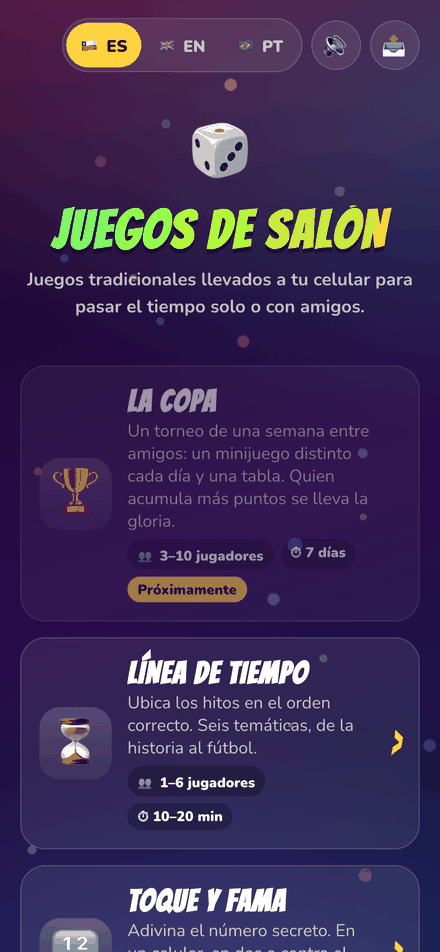</p>

## Juegos

| Juego | Jugadores | Modos | Estado |
|---|---|---|---|
| 👑 [Cuarto Rey / Fourth King](#-cuarto-rey) | 4 a 6 | Un celular en la mesa | v0.3 |
| 🔢 [Toque y Fama / Bulls and Cows](#-toque-y-fama) | 2 | Un celular · Dos celulares · Contra el celular | v0.4 |

---

## 👑 Cuarto Rey

El clásico de naipes para tomar. El celular hace de mazo: cada jugador saca una carta y la app dice qué hacer, nombra a quién le toca tomar, guía los mini-juegos (Cuenta Cuentos, Chancho Inflado, Cultura Chupística, Nunca Nunca), propone penitencias y cuenta los reyes. Con el cuarto rey, fondo y pantalla final.

<table>
  <tr>
    <td align="center">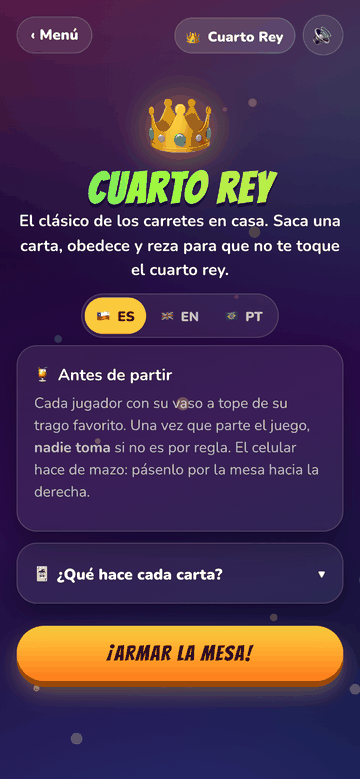<br><sub>Intro y reglas</sub></td>
    <td align="center">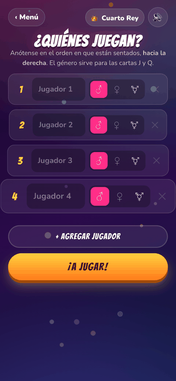<br><sub>Jugadores y género</sub></td>
    <td align="center"><br><sub>Toca para sacar carta</sub></td>
    <td align="center">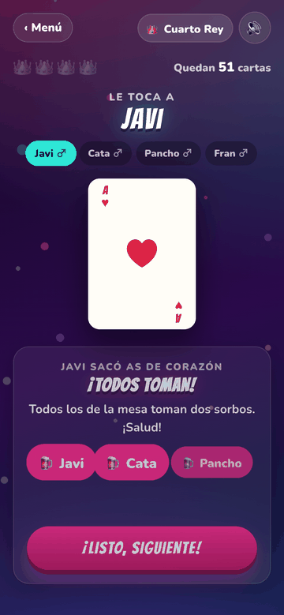<br><sub>Carta e instrucción</sub></td>
  </tr>
  <tr>
    <td align="center">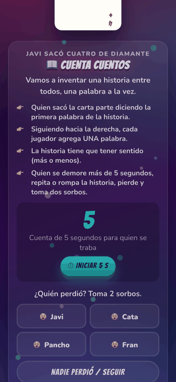<br><sub>Mini-juego con ayudas</sub></td>
    <td align="center">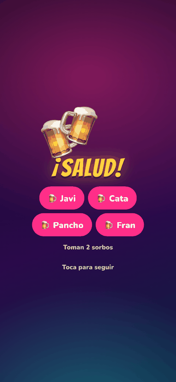<br><sub>¡Salud!</sub></td>
    <td align="center">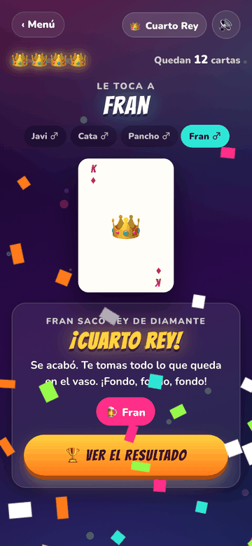<br><sub>¡Cuarto Rey!</sub></td>
    <td align="center">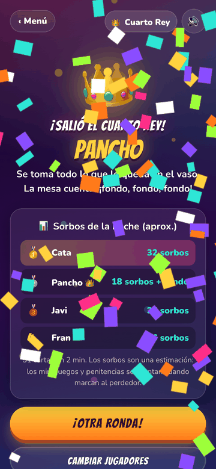<br><sub>Ranking de sorbos</sub></td>
  </tr>
</table>

Especificación: [docs/juegos/cuarto-rey.md](docs/juegos/cuarto-rey.md)

## 🔢 Toque y Fama

Cada jugador elige un número secreto de cifras distintas y trata de adivinar el del rival. Por cada intento, el celular responde solo: **fama** es cifra correcta en su lugar, **toque** es cifra correcta en otro lugar. Nadie cuenta a mano, nadie hace trampa.

- **📱 Un celular:** se pasan el celular; la pantalla se tapa entre turnos.
- **📡 Dos celulares:** sala con código de 4 letras y QR. Cada celular guarda su secreto y responde a los intentos del rival. Al final ambos revelan y se verifica todo.
- **🤖 Contra el celular:** duelo contra un solver que adivina en 5 a 6 intentos.

<table>
  <tr>
    <td align="center">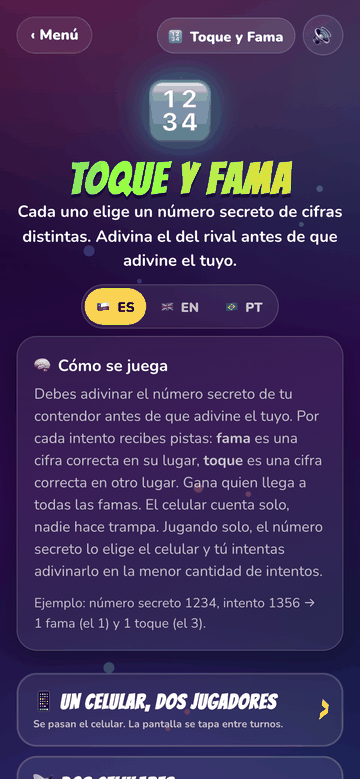<br><sub>Modos de juego</sub></td>
    <td align="center">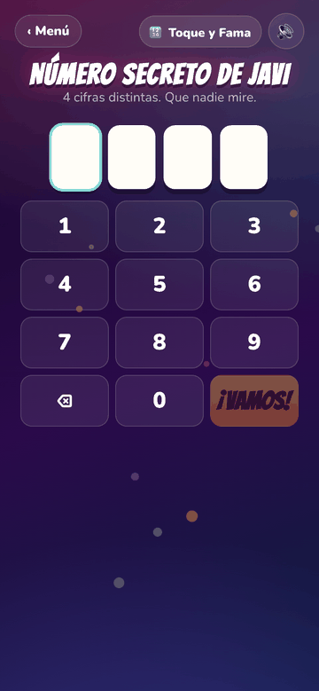<br><sub>Número secreto</sub></td>
    <td align="center">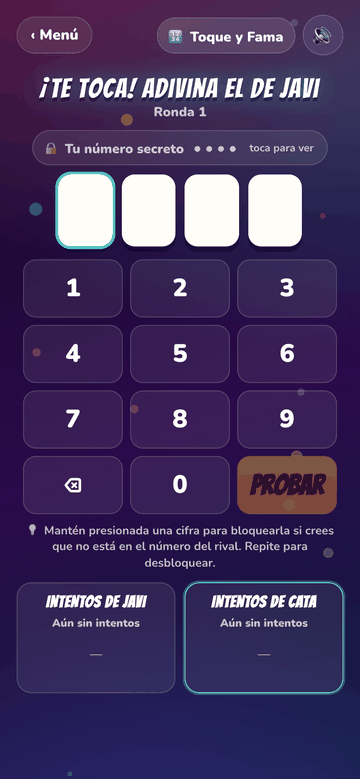<br><sub>Tablero y teclado</sub></td>
    <td align="center">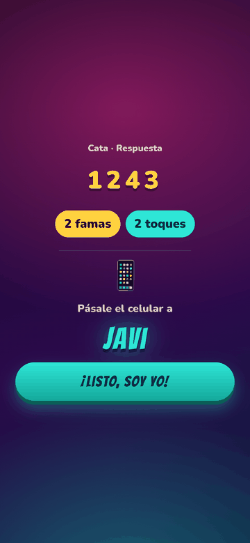<br><sub>Pásale el celular</sub></td>
  </tr>
  <tr>
    <td align="center"><br><sub>Sala con código y QR</sub></td>
    <td align="center">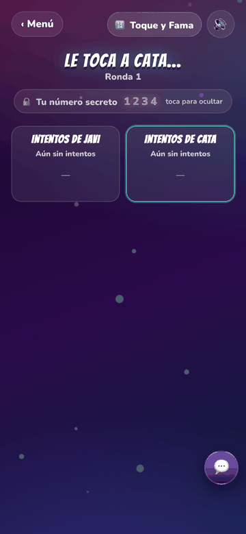<br><sub>Partida en dos celulares</sub></td>
    <td align="center">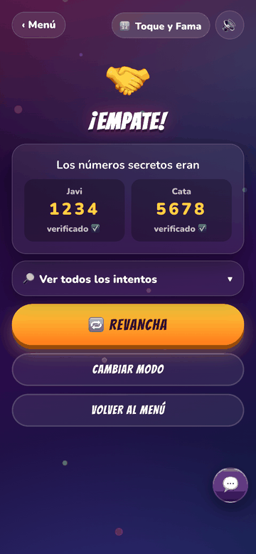<br><sub>Secretos verificados</sub></td>
    <td align="center">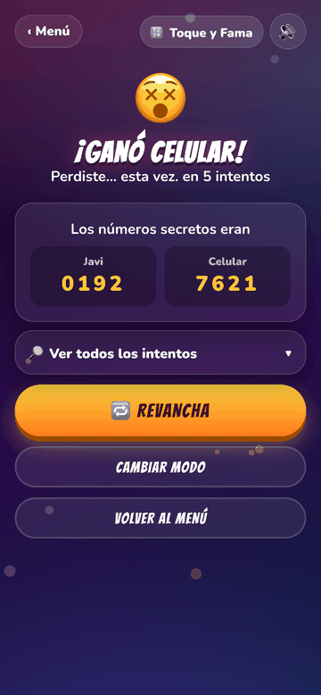<br><sub>Contra el celular</sub></td>
  </tr>
</table>

Especificación: [docs/juegos/toque-y-fama.md](docs/juegos/toque-y-fama.md) · Estudio de factibilidad: [docs/juegos/toque-y-fama-factibilidad.md](docs/juegos/toque-y-fama-factibilidad.md)

---

## Características comunes

- **Idiomas:** español (por defecto) e inglés. El toggle del menú guarda la elección en el dispositivo.
- **Sonido:** efectos sintetizados con Web Audio (sin archivos de audio). Botón 🔊/🔇 en cada pantalla.
- **Partidas guardadas:** cada juego guarda su estado en el dispositivo y ofrece continuar.
- **Instalable:** manifest PWA para agregar a la pantalla de inicio. La pantalla no se apaga mientras se juega.

## Stack

HTML, CSS y JavaScript puro (módulos ES), sin build ni dependencias de npm. Se publica como sitio estático en GitHub Pages desde la rama `main`. El modo de dos celulares usa **Firebase Realtime Database** (plan gratuito) como sala en tiempo real; ver [firebase/README.md](firebase/README.md).

## Correr en local

```bash
python3 -m http.server 8080
```

y abrir http://localhost:8080 (los módulos ES necesitan servirse por HTTP). Tests del motor de Toque y Fama:

```bash
node toque-y-fama/engine.test.mjs
```

## Estructura

```
index.html                  Menú principal (se genera desde assets/js/games.js)
assets/css/base.css         Estilos y animaciones compartidos (tema fiesta, transición entre turnos)
assets/js/games.js          Registro de juegos (textos por idioma)
assets/js/i18n.js           Idioma (ES/EN): toggle, persistencia y textos comunes
assets/js/sound.js          Efectos de sonido sintetizados y botón de silencio
assets/js/ui.js             Utilidades UI: confeti, vibración, wake lock, helpers DOM
assets/js/firebase-config.js Configuración pública de Firebase
cuarto-rey/                 Juego Cuarto Rey (index.html, game.js, rules.js, style.css)
toque-y-fama/               Juego Toque y Fama (engine.js + tests, game.js, transport/, rules.js)
firebase/                   Reglas de seguridad de Realtime Database y notas
docs/                       Requerimientos, decisiones, especificaciones y capturas
```

## Documentación

- [Requerimientos](docs/REQUERIMIENTOS.md)
- [Decisiones de diseño y arquitectura](docs/DECISIONES.md)
- [Cómo agregar un juego nuevo](docs/AGREGAR-JUEGO.md)
- [Especificación: Cuarto Rey](docs/juegos/cuarto-rey.md)
- [Especificación: Toque y Fama](docs/juegos/toque-y-fama.md)
- [Factibilidad: Toque y Fama con dos celulares](docs/juegos/toque-y-fama-factibilidad.md)
- [Changelog](CHANGELOG.md)
