# 🍻 Juegos de Salón

App web (mobile-first) con juegos de salón para el carrete. Se abre desde el celular o tablet, se elige un juego en el menú principal, se ingresan los jugadores y el celular guía la partida.

**Probar:** https://ellokojavi.github.io/juegos-de-salon/

## Capturas

<table>
  <tr>
    <td align="center">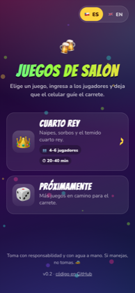<br><sub>Menú principal</sub></td>
    <td align="center">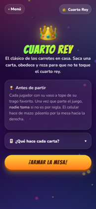<br><sub>Intro y reglas</sub></td>
    <td align="center">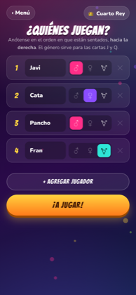<br><sub>Jugadores y género</sub></td>
    <td align="center">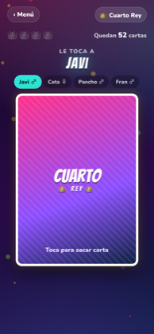<br><sub>Mesa: toca para sacar carta</sub></td>
  </tr>
  <tr>
    <td align="center">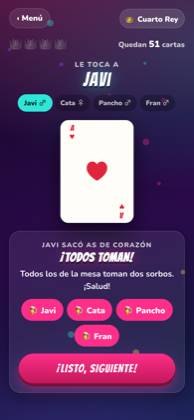<br><sub>Carta descubierta e instrucción</sub></td>
    <td align="center">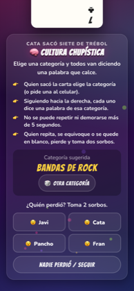<br><sub>Mini-juego con ayudas</sub></td>
    <td align="center">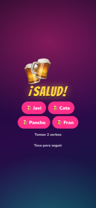<br><sub>Transición: ¡Salud!</sub></td>
    <td align="center">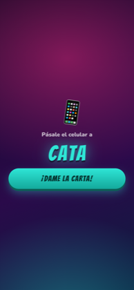<br><sub>Pásale el celular al siguiente</sub></td>
  </tr>
  <tr>
    <td align="center">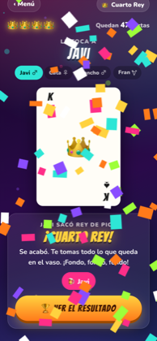<br><sub>¡Cuarto Rey!</sub></td>
    <td align="center"><br><sub>Final y ranking de sorbos</sub></td>
    <td align="center">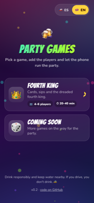<br><sub>Menú en inglés</sub></td>
    <td align="center">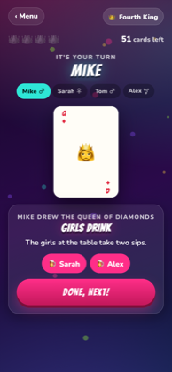<br><sub>Mesa en inglés</sub></td>
  </tr>
</table>

## Juegos disponibles

| Juego | Estado | Jugadores |
|---|---|---|
| 👑 [Cuarto Rey / Fourth King](cuarto-rey/) | v0.3 | 4 a 6 |
| 🔢 Toque y Fama / Bulls and Cows | [en estudio](docs/juegos/toque-y-fama-factibilidad.md) | 2 |

## Sonido

Efectos sintetizados con Web Audio (sin archivos de audio): volteo de carta, brindis, fanfarria de reyes, temporizador, dados y transición de turno. Botón 🔊/🔇 en el menú y en el juego; la elección se guarda en el dispositivo.

## Idiomas

Español (por defecto) e inglés. El toggle del menú guarda la elección en el dispositivo y aplica a todos los juegos.

## Stack

HTML, CSS y JavaScript puro (módulos ES), sin build ni dependencias. Se publica como sitio estático en GitHub Pages desde la rama `main`.

## Correr en local

```bash
python3 -m http.server 8080
```

y abrir http://localhost:8080 (los módulos ES necesitan servirse por HTTP, no funcionan con `file://`).

## Estructura

```
index.html              Menú principal (se genera desde assets/js/games.js)
assets/css/base.css     Estilos y animaciones compartidos (tema fiesta)
assets/js/games.js      Registro de juegos (textos por idioma)
assets/js/i18n.js       Idioma (ES/EN): toggle, persistencia y textos comunes
assets/js/sound.js      Efectos de sonido sintetizados y botón de silencio
assets/js/ui.js         Utilidades UI: confeti, vibración, wake lock, helpers DOM
cuarto-rey/             Juego Cuarto Rey (index.html, game.js, rules.js, style.css)
docs/                   Requerimientos, decisiones, especificaciones y capturas
```

## Documentación

- [Requerimientos](docs/REQUERIMIENTOS.md)
- [Decisiones de diseño y arquitectura](docs/DECISIONES.md)
- [Cómo agregar un juego nuevo](docs/AGREGAR-JUEGO.md)
- [Especificación: Cuarto Rey](docs/juegos/cuarto-rey.md)
- [Factibilidad: Toque y Fama (dos celulares)](docs/juegos/toque-y-fama-factibilidad.md)
- [Changelog](CHANGELOG.md)
