# 🎲 Juegos de Salón

Mobile-first web app with party games to play with friends: card games, drinking games, guessing games. Open it on a phone or tablet, pick a game from the menu, type in the players, and the phone runs the game. In Spanish, English and Portuguese.

**Play:** https://juegosdesalon.cl/

<!-- generado: capturas:portada · written by python3 tools/readme.py actualizar -->
<p align="center"></p>
<!-- /generado -->

> The app is Chilean and it is built in Spanish. This README is in English so anyone can read it. The rest of the documentation, linked at the end, is in Spanish, and the screenshots show the app in Spanish, which is its default language.

## Games

<!-- generado: juegos · written by python3 tools/readme.py actualizar -->
| Game | Players | Modes | Status |
|---|---|---|---|
| ⏳ [Timeline / Línea de Tiempo / Linha do Tempo](#-timeline-línea-de-tiempo) | 1 to 6 | One phone · Several phones · Play alone | v0.9 |
| 🔢 [Bulls and Cows / Toque y Fama / Toque e Fama](#-bulls-and-cows-toque-y-fama) | 1 to 2 | One phone · Two phones · Versus the phone | v0.4 |
| 🪢 [Hangman / El Ahorcado / Forca](#-hangman-el-ahorcado) | 1 to 6 | One phone · Several phones · Play alone | v0.26 |
| 🎲 [Liar's Dice / Dudo / Dado Mentiroso](#-liars-dice-dudo) | 1 to 6 | One phone · Several phones · Versus the phone | v0.32 |
| ⚓ [Battleship / Batalla Naval / Batalha Naval](#-battleship-batalla-naval) | 1 to 2 | One phone · Two phones · Versus the phone | v0.6 |
| 🍹 [Julep / Julepe / Paga o Bolo](#-julep-julepe) | 1 to 6 | One phone · Several phones · Versus the phone | v0.34 |
| 👑 [Fourth King / Cuarto Rey / Quarto Rei](#-fourth-king-cuarto-rey) | 4 to 6 | One phone | v0.27 |
<!-- /generado -->

---

## 👑 Fourth King (Cuarto Rey)

The classic drinking card game. The phone is the deck: each player draws a card and the app says what to do. It names who drinks, runs the mini-games (Cuenta Cuentos, Chancho Inflado, Cultura Chupística, Nunca Nunca), suggests dares and counts the kings. The fourth king ends the game: whoever draws it finishes their glass, and the last screen shows who it was, the sip ranking and, folded at the bottom, every card that came up and who drew it.

<!-- generado: capturas:cuarto-rey · written by python3 tools/readme.py actualizar -->
<table>
  <tr>
    <td align="center"><br><sub>Intro and rules</sub></td>
    <td align="center"><br><sub>Players and gender</sub></td>
    <td align="center"><br><sub>Tap to draw a card</sub></td>
    <td align="center"><br><sub>Card and instruction</sub></td>
  </tr>
  <tr>
    <td align="center"><br><sub>Mini-game with prompts</sub></td>
    <td align="center"><br><sub>Cheers!</sub></td>
    <td align="center"><br><sub>Pass the phone</sub></td>
    <td align="center"><br><sub>Fourth King!</sub></td>
  </tr>
  <tr>
    <td align="center"><br><sub>Sip ranking</sub></td>
    <td align="center">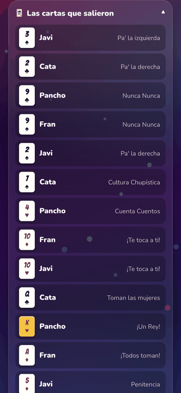<br><sub>Every card that came up</sub></td>
    <td></td>
    <td></td>
  </tr>
</table>
<!-- /generado -->

Spec: [docs/juegos/cuarto-rey.md](docs/juegos/cuarto-rey.md)

## 🔢 Bulls and Cows (Toque y Fama)

Each player picks a secret number with no repeated digits and tries to crack the other one. For every guess the phone answers on its own: **fama** is a right digit in the right place, **toque** is a right digit somewhere else. Nobody counts by hand, nobody cheats.

- **📱 One phone:** players pass the phone around, and the screen is covered between turns.
- **📡 Two phones:** a room with a 4-letter code and a QR. Each phone keeps its own secret and answers the rival's guesses. At the end both reveal and everything is verified.
- **🤖 Versus the phone:** a duel against a solver that cracks the number in 5 or 6 guesses.
- **💬 Room chat:** on two phones there is a chat to trash-talk while guessing, and it stays alive on the final screen to celebrate or ask for a rematch. New messages peek out next to the bubble.

<!-- generado: capturas:toque-y-fama · written by python3 tools/readme.py actualizar -->
<table>
  <tr>
    <td align="center"><br><sub>Game modes</sub></td>
    <td align="center"><br><sub>Secret number</sub></td>
    <td align="center"><br><sub>Board and keypad</sub></td>
    <td align="center"><br><sub>Answer and handoff on one screen</sub></td>
  </tr>
  <tr>
    <td align="center"><br><sub>Room with code and QR</sub></td>
    <td align="center"><br><sub>Game on two phones</sub></td>
    <td align="center"><br><sub>Verified secrets</sub></td>
    <td align="center"><br><sub>Versus the phone</sub></td>
  </tr>
  <tr>
    <td align="center"><br><sub>Room chat</sub></td>
    <td></td>
    <td></td>
    <td></td>
  </tr>
</table>
<!-- /generado -->

Spec: [docs/juegos/toque-y-fama.md](docs/juegos/toque-y-fama.md) · Feasibility study: [docs/juegos/toque-y-fama-factibilidad.md](docs/juegos/toque-y-fama-factibilidad.md)

## ⚓ Battleship (Batalla Naval)

Sink the fleet. Each player hides 5 ships on a 10×10 board and fires in turns: miss, hit or sunk. A hit lets you fire again. Ships are placed by tapping, with rotate, drag and "random". The phone answers on its own and keeps score.

- **📱 One phone:** your fleet is covered between turns. On a miss, the result and "pass the phone to X" share one screen.
- **📡 Two phones:** a room with a code and a QR. Each phone answers the shots against its own fleet, and at the end both fleets are revealed and verified.
- **🤖 Versus the phone:** an AI that hunts by parity and chases after a hit. It sinks a fleet in about 50 shots.

<!-- generado: capturas:batalla-naval · written by python3 tools/readme.py actualizar -->
<table>
  <tr>
    <td align="center"><br><sub>Game modes</sub></td>
    <td align="center"><br><sub>Placing the fleet</sub></td>
    <td align="center"><br><sub>Battle</sub></td>
    <td align="center"><br><sub>Result and handoff</sub></td>
  </tr>
  <tr>
    <td align="center"><br><sub>Room with code and QR</sub></td>
    <td align="center"><br><sub>Game on two phones</sub></td>
    <td align="center"><br><sub>Result with both fleets</sub></td>
    <td></td>
  </tr>
</table>
<!-- /generado -->

Spec and design: [docs/juegos/batalla-naval.md](docs/juegos/batalla-naval.md)

## ⏳ Timeline (Línea de Tiempo)

You get events with no date on them and place them in the right spot on a shared timeline. Get it right and the card stays. Get it wrong and it is discarded, and you draw another one. The first player to run out of cards wins. The round is always played to the end, and if more than one player runs out, the fastest answer wins. The theme is picked at the start, and adding a new one is just a data file. Cards do not repeat across back-to-back games: each phone remembers the ones it has already shown.

<!-- generado: tematicas · written by python3 tools/readme.py actualizar -->
| Theme | Cards | Years | What it covers |
|---|---|---|---|
| 📜 History | 98 | 2560 BC to 2022 | Milestones of humankind |
| 🎵 Music | 89 | 1600 to 2023 | From Beethoven to TikTok |
| 🇨🇱 Chile | 127 | 1520 to 2023 | From the 1960 quake to the uprising |
| 🍿 Pop culture | 110 | 1928 to 2023 | Movies, memes and video games |
| 🇧🇷 Brazil | 140 | 1500 to 2025 | From Cabral to COP30, telenovelas and carnival included |
| ⚽ Soccer | 123 | 1863 to 2025 | World Cups, clubs, goals and transfers |
| **Total** | **687** | | |
<!-- /generado -->

- **📱 One phone:** two to six players, passing the phone around.
- **📡 Several phones:** a room with a code and a QR, up to six players. The host starts the game once everyone is in, and each player sees their own hand.
- **🧍 Play alone:** empty your hand in as few tries as you can and beat your record for that theme.
- **🗂 All cards on the table (default):** twice the cards you need to win are dealt face up from the first turn (6, 10 or 14), and no new card enters for the rest of the game. Since the table only shrinks, the cards that are hard to place pile up for the end, on a timeline that by then is already crowded. The game gets harder on its own.
- **🃏 Shared pool:** the same 6 cards face up for everyone, refilled from the deck, and whoever places the agreed number of cards first wins. It can also be played with **🙋 your own hand**, each player with private cards.
- **💬 Room chat:** on several phones there is a chat to comment on the plays while waiting for your turn, and it stays alive on the final screen. New messages peek out for a few seconds next to the bubble.
- **Drag a card into place.** Pull a card down out of your hand and drop it where you think it goes. While it travels it is drawn large and above your finger: in the hand a card is 130px wide and its title sits at 11px, which is unreadable on a narrow phone exactly when you have to decide. A card you already placed can be picked up again and moved, or dropped outside the timeline to send it back to your hand. Dropping only **chooses** — the yellow button is still the one that places it, so nothing irreversible happens by accident, and tapping works exactly as before.

<!-- generado: capturas:linea-de-tiempo · written by python3 tools/readme.py actualizar -->
<table>
  <tr>
    <td align="center"><br><sub>Game modes</sub></td>
    <td align="center"><br><sub>Theme and players</sub></td>
    <td align="center"><br><sub>Hand and timeline</sub></td>
    <td align="center"><br><sub>Verdict and handoff</sub></td>
  </tr>
  <tr>
    <td align="center"><br><sub>Room with code and QR</sub></td>
    <td align="center"><br><sub>Game on several phones</sub></td>
    <td align="center"><br><sub>Result and ranking</sub></td>
    <td align="center"><br><sub>Room chat</sub></td>
  </tr>
  <tr>
    <td align="center"><br><sub>New message label</sub></td>
    <td align="center"><br><sub>Shared pool</sub></td>
    <td align="center"><br><sub>All cards on the table</sub></td>
    <td></td>
  </tr>
</table>
<!-- /generado -->

Spec and design: [docs/juegos/linea-de-tiempo.md](docs/juegos/linea-de-tiempo.md)

---

## 🪢 Hangman (El Ahorcado)

<!-- generado: capturas:ahorcado · written by python3 tools/readme.py actualizar -->
<table>
  <tr>
    <td align="center">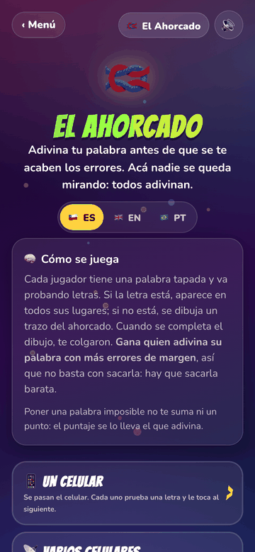<br><sub>Game modes</sub></td>
    <td align="center">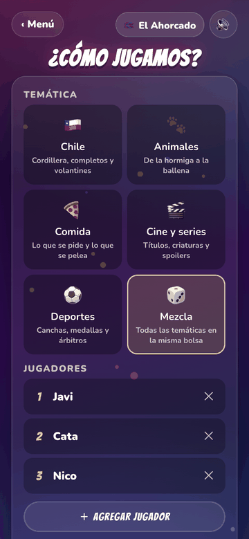<br><sub>Word, misses allowed and who plays</sub></td>
    <td align="center">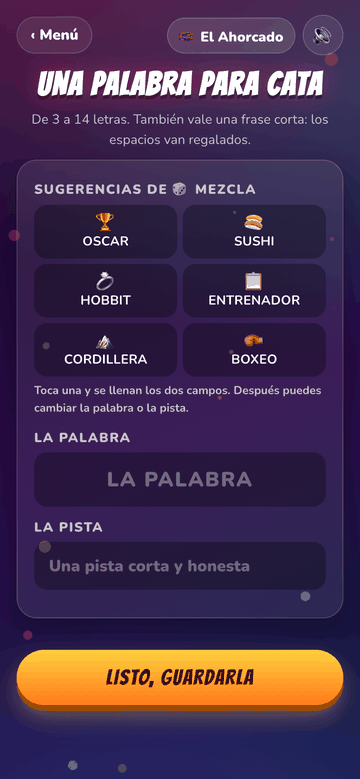<br><sub>Each player writes for the next</sub></td>
    <td align="center">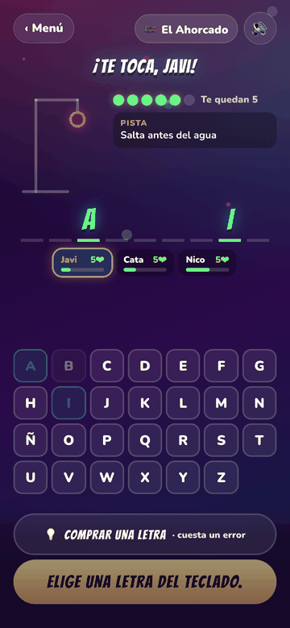<br><sub>Gallows, clue, word and keyboard</sub></td>
  </tr>
  <tr>
    <td align="center">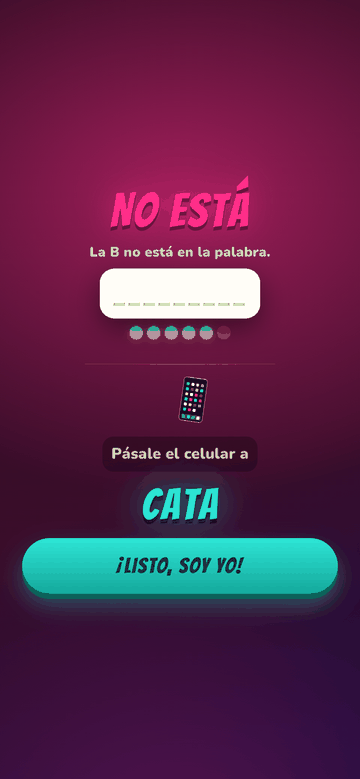<br><sub>The letter and the handoff together</sub></td>
    <td align="center">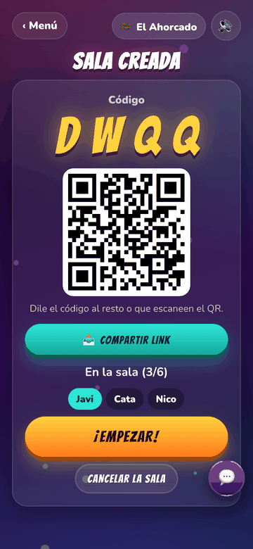<br><sub>Room with code and QR</sub></td>
    <td align="center">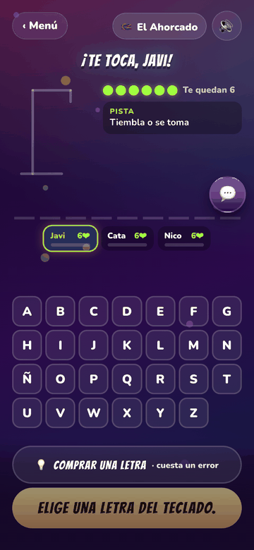<br><sub>Everyone guessing at once</sub></td>
    <td align="center">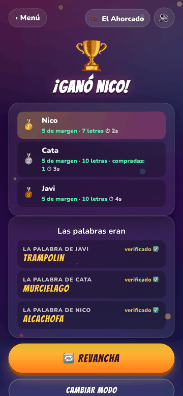<br><sub>Score and verified words</sub></td>
  </tr>
  <tr>
    <td align="center">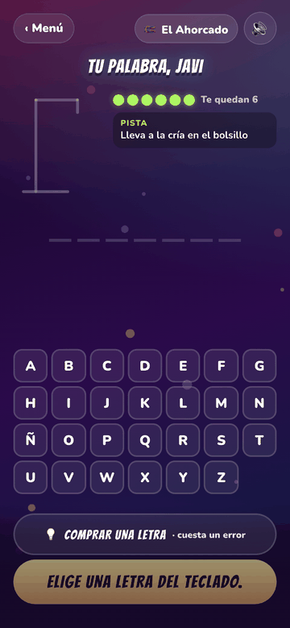<br><sub>Play alone: the app deals the word</sub></td>
    <td></td>
    <td></td>
    <td></td>
  </tr>
</table>
<!-- /generado -->

The classic word game, with the fix it has always needed: **nobody sits and watches**. Instead of one bored executioner and one guesser, every player writes the word for the next one, the last one writes for the first, and everyone guesses their own. Two players make a duel, six make a race. Your score is **the misses you had left over**, so cracking the word is not enough: you have to crack it cheap. Setting an impossible word earns nothing, and the player next to you writes yours anyway.

| | 🤝 Chain | 🎴 App deck |
|---|---|---|
| Who sets the word | Each player, for the next one, with a mandatory clue | The app, from the chosen theme |
| What the theme is for | It suggests six words to whoever writes, who can take them, edit them or ignore them | It is where the word comes from |
| The secret | It never travels: it is committed with a hash and verified at the end | There is none: it comes from the deck seed |

Five themes and a mix (Chile, Animals, Food, Film and TV, Sports), each with its own words and clues per language. They are not translations, because a translated word changes length and difficulty. Misses allowed are configurable (5, 6 or 8), and the last stroke of the drawing is always the X eyes. You can **buy a letter** 💡: the rarest missing one shows up and it costs you a miss.

Turns alternate: you try a letter and the phone moves to the next player. All boards advance at the same time, so seeing that your neighbour has one life left while you still have four lands exactly when it matters.

- **📱 One phone:** two to six players, with a covered screen for writing the word. After each letter, the result and "pass the phone to X" share one screen.
- **📡 Several phones:** a room with a code and a QR, up to six, taking turns one letter at a time so the sequence is visible (D-66). The rival strip shows lives and progress, never letters.
- **🧍 Play alone:** the app deals a word from the chosen theme with its clue, and you crack it. There is no rival: the phone does not guess. Since the word comes from the deck there is no secret to commit, so this is the only mode that works without https (D-65).

Spec and design: [docs/juegos/ahorcado.md](docs/juegos/ahorcado.md)

---

## 🎲 Liar's Dice (Dudo)

<!-- generado: capturas:dudo · written by python3 tools/readme.py actualizar -->
<table>
  <tr>
    <td align="center">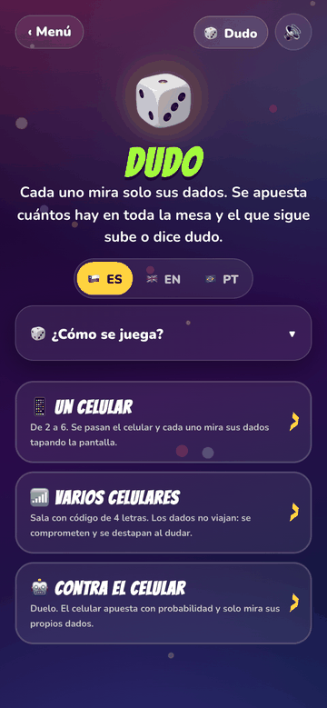<br><sub>Game modes</sub></td>
    <td align="center">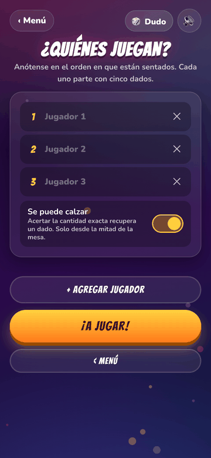<br><sub>Who plays and whether calzar is on</sub></td>
    <td align="center">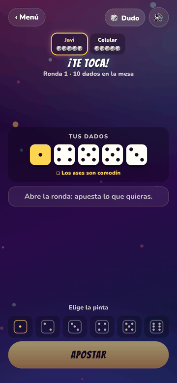<br><sub>Your dice and the table</sub></td>
    <td align="center">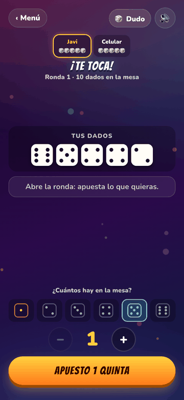<br><sub>Pick face and count</sub></td>
  </tr>
  <tr>
    <td align="center">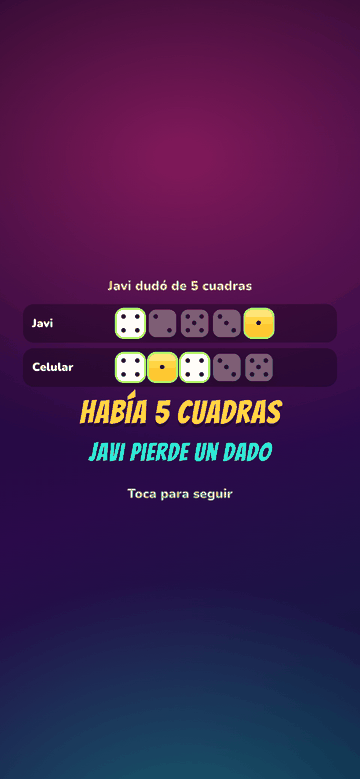<br><sub>The table opens up and counts</sub></td>
    <td align="center">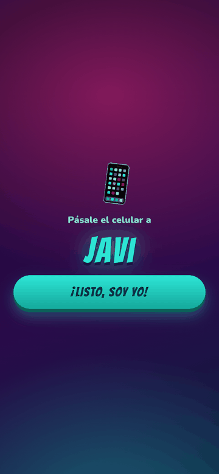<br><sub>Pass the phone</sub></td>
    <td align="center">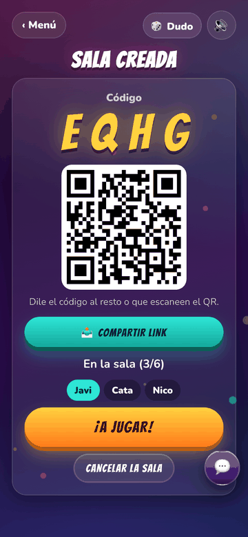<br><sub>Room with code and QR</sub></td>
    <td align="center">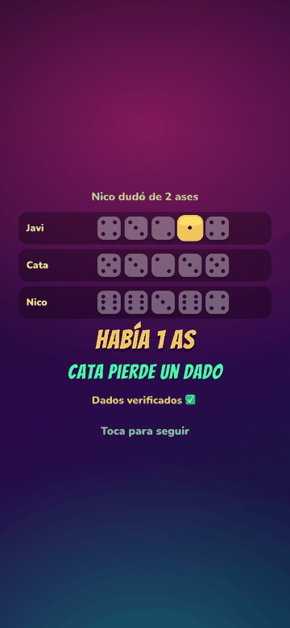<br><sub>The table opens up and verifies</sub></td>
  </tr>
  <tr>
    <td align="center">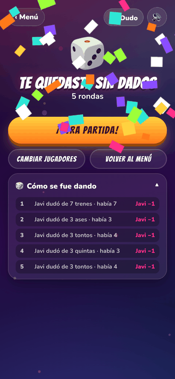<br><sub>Who won and how it went</sub></td>
    <td></td>
    <td></td>
    <td></td>
  </tr>
</table>
<!-- /generado -->

The classic dice game from bars and long dinners. Everyone rolls five dice and **only looks at their own**. You bet how many dice of one face are on **the whole table** ("four fives"), and the next player either raises or calls **dudo**. On a call everything is revealed and counted: if there were as many as claimed or more, the caller loses a die; if there were fewer, the bidder does. **Aces are wild**. A player with no dice left is out, and the last one with dice wins.

Here the phone does what a real table does badly: it rolls the dice, it **refuses illegal bids** (a raise is more dice, or the same number with a higher face, and aces count double in both directions), and it counts instantly, which is exactly what people argue about. **Calzar** means claiming the count is exact: get it right and you win a die back, get it wrong and you lose one. It is available from half the dice on the table and **only with three players or more**. In a duel there is a single hidden hand, so the exact count is arithmetic, not a risk (D-71).

In Spanish the faces are called the way they are called at a Chilean table (**ases, tontos, trenes, cuadras, quintas, sextas**), which is how the game is actually played here: "cuatro quintas", not "cuatro cincos". It ships on, and it can be turned off in settings to go back to numbers. In English and Portuguese the faces go by their number and the switch is not offered.

- **📱 One phone:** two to six players. The phone is passed around and each player sees their dice behind a handoff screen (C-9).
- **🤖 Versus the phone:** a duel. The app bets on probability and **only looks at its own dice**: the decision comes from how many unknown dice are left and how likely they are to cover the bid, not from peeking at yours.
- **📶 Several phones:** a room with a 4-letter code, a QR and chat, two to six players. Each phone rolls **its own** dice and publishes only the hash. On a call it reveals them and everyone verifies that nobody swapped them (C-10). This is why the dice are not derived from the shared seed like everything else this app deals: the code is public, and with a shared seed anyone could compute the rival's dice from the console (D-70).

Spec and design: [docs/juegos/dudo.md](docs/juegos/dudo.md)

---

## 🍹 Julep (Julepe)

<!-- generado: capturas:julepe · written by python3 tools/readme.py actualizar -->
<table>
  <tr>
    <td align="center">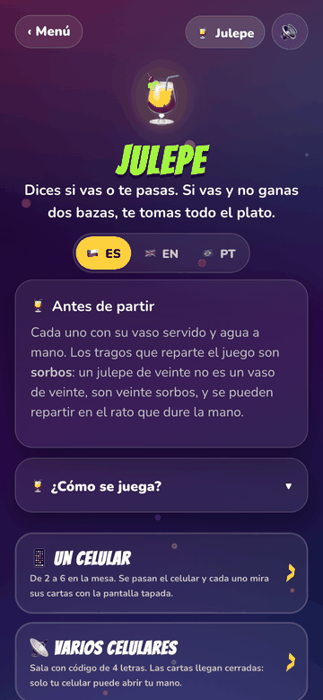<br><sub>Game modes</sub></td>
    <td align="center">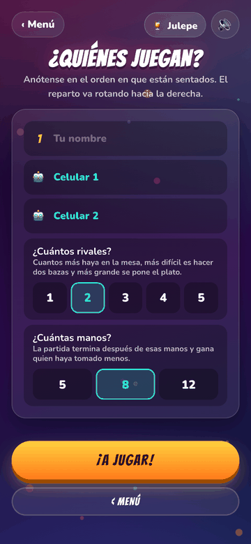<br><sub>How many rivals and how many hands</sub></td>
    <td align="center">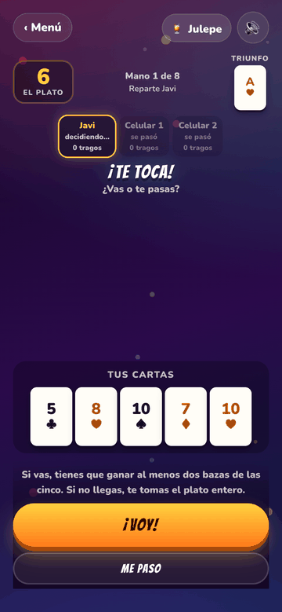<br><sub>In or out, in secret</sub></td>
    <td align="center">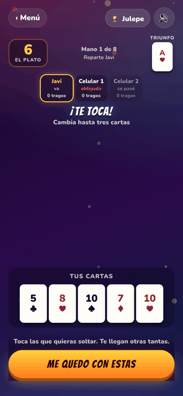<br><sub>Swap up to three cards</sub></td>
  </tr>
  <tr>
    <td align="center">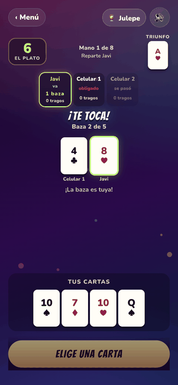<br><sub>Illegal cards are dimmed</sub></td>
    <td align="center">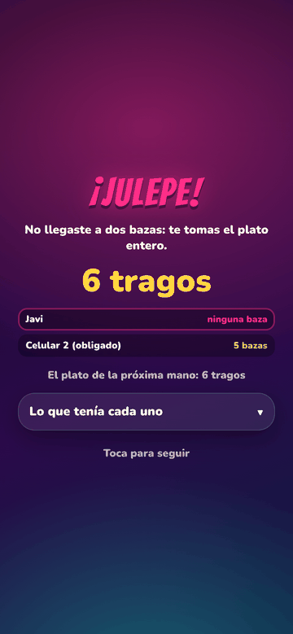<br><sub>A julep: drink the whole pot</sub></td>
    <td align="center">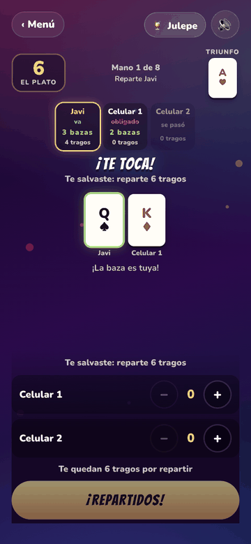<br><sub>Handing out the sips you won</sub></td>
    <td align="center">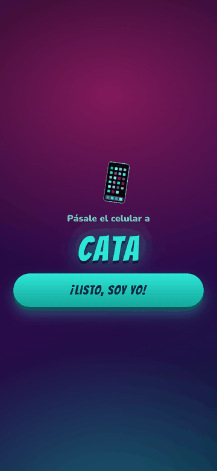<br><sub>Pass the phone</sub></td>
  </tr>
  <tr>
    <td align="center">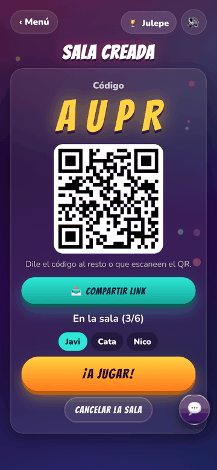<br><sub>Room with code and QR</sub></td>
    <td align="center">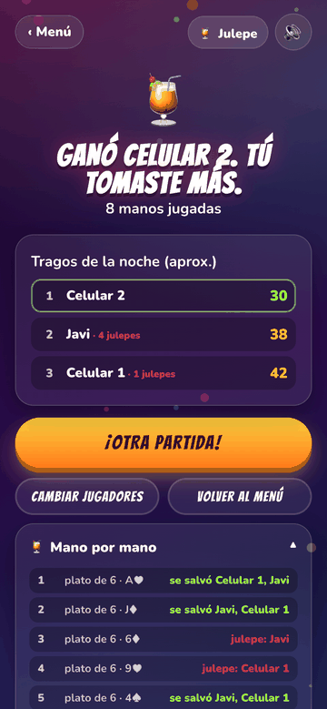<br><sub>Who drank the least</sub></td>
    <td></td>
    <td></td>
  </tr>
</table>
<!-- /generado -->

A trick-taking game from the Tute family, played for drinks. There is a **pot** of sips on the table. You look at your five cards and say, in secret, whether you are **in** or **out**. Going in means committing to win **two of the five tricks**: make it and you are safe, and you get to hand out two sips per trick to anyone you like; fall short and you **drink the whole pot**. That is a **julep**. Everything drunk goes straight back into the pot, so two juleps in a row leave twenty sips sitting there before anyone notices.

The phone does what a real table does badly. It deals, it keeps the pot, it remembers who owes whom, and above all it **refuses illegal cards**: you must follow the suit led, you must play higher if you can win the trick, and you must trump when you are out of the suit. Those three rules are what people argue about all night; here the cards that cannot be played are simply dimmed, with a line saying which rule is doing it. Nobody has to learn a rule by breaking it.

If only one player goes in, the hand would be no hand at all, so **the dealer is dragged in** and has to play it (D-83). Dealing is a risk too, which is exactly the story the table tells afterwards.

- **📱 One phone:** two to six players. The phone goes around the table for every declaration, every swap and every card, with the result of what just happened shown before each handoff (C-9).
- **📡 Several phones:** a room with a 4-letter code, a QR and chat, two to six players. The deal travels **sealed for each player**: every phone publishes a public key when it joins, and the dealer seals each hand with the key of the person it belongs to (D-81). Nobody else can open it, not even reading the room from the console. When the hand ends everyone reveals what they were dealt and the app checks that no one played a card they did not have: "Cards verified ✅" (C-10). It is also what the table wants to see anyway — what the player who got juleped was holding.
- **🤖 Versus the phone:** one to five phone rivals, however many you want at the table. They weigh their hand the way you would (how many trumps, how high, how many aces and kings), and they get more careful as the pot grows: risking twenty sips for the right to hand out four is not the same bet as risking six.

The name changes in each language, because a name only works if it is recognised (D-84): the English cousin of this game is *Loo*, which today reads as the toilet, so in English it is **Julep** — a real word, a drink, and one letter from the original. In Portuguese there is no relative to borrow from, but *o bolo* is what the pot is called in Brazil, so it is **Paga o Bolo**.

Spec and design: [docs/juegos/julepe.md](docs/juegos/julepe.md)

---

## What every game shares

- **Languages:** Spanish (default), English and Brazilian Portuguese. The menu toggle saves the choice on the device, and the browser language is never used to guess (D-47, D-48). See [Languages](#languages).
- **Sound:** effects synthesized with Web Audio, no audio files. A 🔊/🔇 button on every screen.
- **Saved games:** every game stores its state on the device and offers to continue.
- **Installable:** a PWA manifest to add it to the home screen. The screen stays awake while playing.

### Languages

The whole experience is translated: the menu and its footer lines, the six games with all their modes, the rooms, the chat, the transport errors, the "pass the phone" screens and the cards of every Timeline theme. Portuguese is the Brazilian one, informal, and the names are translated the same way as in English:

<!-- generado: idiomas · written by python3 tools/readme.py actualizar -->
| Español | English | Português |
|---|---|---|
| Juegos de Salón | Party Games | Jogos de Salão |
| Línea de Tiempo | Timeline | Linha do Tempo |
| Toque y Fama | Bulls and Cows | Toque e Fama |
| El Ahorcado | Hangman | Forca |
| Dudo | Liar's Dice | Dado Mentiroso |
| Batalla Naval | Battleship | Batalha Naval |
| Julepe | Julep | Paga o Bolo |
| Cuarto Rey | Fourth King | Quarto Rei |
<!-- /generado -->

How it is put together (canon C-3):

- `assets/js/i18n.js` keeps the language in `localStorage` (`juegos-de-salon:lang`), draws the
  🇨🇱 ES · 🇬🇧 EN · 🇧🇷 PT toggle and holds the shared text (`COMMON`): the menu, plus the room
  invitation, which is the same for every game that has rooms (D-73).
- Each game keeps its text in `LOCALES = { es, en, pt }` inside its `rules.js`. There is not a
  single literal string in `game.js`. Fixed HTML text is marked with `data-i18n`.
- The menu registry (`games.js`), the 100 footer lines (`frases.js`) and every Timeline card
  (`decks/*.js`) carry all three languages.
- **The three dictionaries have exactly the same keys.** `node assets/js/i18n.test.mjs` checks
  keys, list lengths, the `{braces}` in templates and that no text is empty. A missing string
  would show up as `undefined` on screen.
- Translations are adapted, not copied: in Portuguese the Santiago districts become bairros, the
  dare becomes a prenda and "fondo" becomes "vira, vira, vira".
- **The language can travel in the link** (D-74): `juegosdesalon.cl/?lang=pt` on any page, or the
  `juegosdesalon.cl/pt/` and `/en/` doors, which set the language and send you to the menu. It is
  applied, it is saved, and the parameter is removed from the address bar. **A room invitation
  carries it**, so whoever gets the link opens the app in the language it was sent in. This is not
  detection: somebody chose, for themselves or for the person getting the link.
- To add a language: add it to `LANGS` and to the toggle in `i18n.js`, then add the dictionary in
  `COMMON`, `games.js`, `frases.js`, the six `rules.js`, `decks/index.js` and every card. The
  parity test says what is missing.
- The owner dashboard is Spanish only (an exception recorded in `docs/PANEL.md`), and so is
  `manifest.webmanifest`, because there is one manifest for the whole app.

<!-- generado: capturas:idiomas · written by python3 tools/readme.py actualizar -->
<table>
  <tr>
    <td align="center"><br><sub>Menu in English</sub></td>
    <td align="center"><br><sub>Table in English</sub></td>
    <td></td>
    <td></td>
  </tr>
</table>
<!-- /generado -->

## Owner dashboard

`/panel/` is a private page that shows how much the app is played and from where: live rooms and
connected phones, games by title and mode, players per game, time zone, language and time of day.
You sign in with Google, and only the owner of the Firebase project can read it. These are
anonymized usage signals, not people: offline modes send counters only, and an IP, a secret or the
chat never leave the phone. A room also records the country of each phone and who won, which is
what the room log at the bottom of the dashboard shows.

One range selector drives the whole page: 7, 30, 60 or 90 days, one year, or the year so far. At
the bottom there is a **log of the rooms that were played** in that range, newest first and paged:
day and time, the players with the flag of their country, the game and who won. Test rooms run in
the development environment, so they are out by default.

It keeps no lists of its own. Games and modes are read from the registry in `assets/js/games.js`,
so a new game shows up there by itself, and anything it does not recognize yet is drawn anyway,
keyed by name instead of thrown away. See [docs/PANEL.md](docs/PANEL.md).

## Stack

Plain HTML, CSS and JavaScript (ES modules). No build step, no npm dependencies. It is published as a static site on GitHub Pages from the `main` branch. The two-phone mode uses **Firebase Realtime Database** (free plan) as a live room. See [firebase/README.md](firebase/README.md).

## Running it locally

```bash
python3 -m http.server 8765
```

Then open http://localhost:8765 (ES modules have to be served over HTTP). Tests for the engines, the languages and the shared modules:

<!-- generado: pruebas · written by python3 tools/readme.py actualizar -->
```bash
node ahorcado/engine.test.mjs
node batalla-naval/engine.test.mjs
node dudo/engine.test.mjs
node julepe/engine.test.mjs
node linea-de-tiempo/engine.test.mjs
node toque-y-fama/engine.test.mjs
node assets/js/arrastre.test.mjs
node assets/js/i18n.test.mjs
node assets/js/transport/cleanup.test.mjs
node assets/js/transport/dispose.test.mjs
node assets/js/transport/errors.test.mjs
node assets/js/transport/ratelimit.test.mjs
node assets/js/transport/stats.test.mjs
node panel/adapta.test.mjs
node panel/aggregate.test.mjs
```
<!-- /generado -->

## Looking at one screen

To check how a single screen turned out, without playing a whole game:

```bash
node tools/e2e/mirar.mjs ahorcado juego --ancho 320
node tools/e2e/mirar.mjs ahorcado resultado --idioma pt
node tools/e2e/mirar.mjs panel datos --ancho 900
```

It takes the screenshot and reports horizontal scroll, buttons under 44 px and anything that falls below the bottom edge, which is what the canon asks you to look at on every screen. The path to each screen is declared at the top of the file: adding one is adding an entry, not writing a new script.

To look at **all** the screenshots in this README at once, before publishing them, the contact sheet puts them side by side at the size they will be seen:

```bash
node tools/e2e/contacto.mjs cuarto-rey --salida /tmp/contacto
```

Retaking them is not reviewing them. Together they show what a single image hides. That is how we found the Cuarto Rey player list photographed halfway through its entrance animation, with rows at different widths, as if the grid were broken (D-76).

To try it on a real phone, and to hand the link to someone else, serve the working tree over Tailscale without publishing anything (D-67):

```bash
tailscale serve --bg 8765          # served at https://<machine>.<tailnet>.ts.net/
tailscale serve --https=443 off    # and this takes it down
```

It is the whole app over HTTPS, so the modes that need a secure context work too. This used to be a `lab/` folder with a mirror of each game. The mirrors went stale, and this covers the same ground better.

## Publishing a version

Before committing a new version, stamp it into the site (import maps and stylesheets carry `?v=`), so the browser never mixes old and new files:

```bash
python3 tools/set-version.py 0.4.6
```

## Keeping this README current

This file states things the code already knows (how many games there are, what modes each one has, how many cards each theme carries, which tests run) and shows screenshots of screens that change. None of that announces when it goes stale, so there is a tool:

```bash
python3 tools/readme.py revisar          # did anything fall behind the code?
python3 tools/readme.py actualizar       # rewrites the generated blocks
python3 tools/readme.py capturas <section> [--sin-red]   # retakes the screenshots
python3 tools/readme.py sellar           # "I have read it again against these facts"
```

- **Anything derivable is generated.** Everything between `<!-- generado: ... -->` and
  `<!-- /generado -->` is written by `actualizar` from [`tools/hechos.mjs`](tools/hechos.mjs),
  which imports the real modules (`games.js`, the `rules.js` files, `decks/index.js`). Nothing in
  there is edited by hand: the games table, the themes, the names per language, the tests, the
  document index and the screenshot galleries.
- **Prose is written by a person**, and the tool does not touch it. It reports on it instead.
  `revisar` compares today's facts against the last seal (`docs/hechos.json`) and names what
  changed and which section to read again. Once it has been read, `sellar` records that.
- **Screenshots are retaken automatically.** [`docs/capturas.json`](docs/capturas.json) says which
  script in [`tools/e2e/`](tools/e2e/README.md) each image comes from and which shot it is.
  `capturas` runs the scripts in headless Chrome, copies the PNGs and saves them at twice the width
  they are shown at. The ones that need a Firebase room are marked and skipped with `--sin-red`.
  Look at them before publishing: design problems are seen, not asserted (C-12).
- **The hook that makes it happen** is `set-version.py`, required before publishing (C-11). It runs
  `revisar` and refuses to stamp if the README fell behind. For an emergency, `--igual`.

To add a screen to this README: take the shot in the e2e script, add the entry to
`docs/capturas.json`, then run `capturas` and `actualizar`.

## Layout

```
index.html                  Main menu (generated from assets/js/games.js)
assets/css/base.css         Shared styles and animations (party theme, turn transitions)
assets/js/games.js          Game registry (text in es, en and pt)
assets/js/i18n.js           Language (ES/EN/PT): toggle, persistence and shared text; i18n.test.mjs checks parity
assets/js/frases.js         Footer lines for the menu, 100 per language
assets/js/sound.js          Synthesized sound effects and the mute button
assets/js/ui.js             UI helpers: confetti, vibration, wake lock, DOM helpers
assets/js/firebase-config.js Public Firebase configuration
cuarto-rey/                 Cuarto Rey (index.html, game.js, rules.js, style.css)
toque-y-fama/               Toque y Fama (engine.js + tests, game.js, rules.js)
batalla-naval/              Batalla Naval (engine.js + tests, game.js, rules.js)
linea-de-tiempo/            Línea de Tiempo (engine.js + tests, game.js, rules.js, decks/)
ahorcado/                   El Ahorcado (engine.js + tests, game.js, rules.js, decks/)
dudo/                       Dudo (engine.js + tests, game.js, rules.js)
assets/js/arrastre.js       Shared drag and drop: dropping chooses, a button confirms
assets/js/handoff.js        Shared transitions: pass the phone, covered screen
assets/js/chat.js           Shared room chat (multi-phone modes)
assets/js/session.js        Shared saved games (resume in any mode)
assets/js/transport/        Shared transports: local (same phone), firebase (room) and stats (usage signals)
panel/                      Private owner dashboard (Google sign-in; see docs/PANEL.md)
firebase/                   Realtime Database security rules and notes
manifest.webmanifest        PWA manifest (installable on the home screen)
tools/set-version.py        Stamps the version (import maps + stylesheets) to avoid a mixed cache
tools/readme.py             Keeps this README current: generated blocks, retaken screenshots, staleness report
tools/og.mjs                Social cards: the Open Graph tags of each page and their images
tools/hechos.mjs            The app's fact sheet (games, modes, themes, tests) read from the code
tools/e2e/                  Full games in headless Chrome; the screenshots come from here (see its README)
pt/ · en/                   Language doors: they set the language and send you to the menu
assets/og/                  The 1200×630 images shown when a link is shared
docs/capturas.json          Screenshot catalog: the caption and the script each one comes from
docs/                       Requirements, decisions, specs and screenshots
```

## Documentation

These documents are in Spanish, like the rest of the project.

<!-- generado: documentacion · written by python3 tools/readme.py actualizar -->
- [Cánones y estándares de Juegos de Salón](docs/CANONES.md)
- [Requerimientos](docs/REQUERIMIENTOS.md)
- [Decisiones de diseño y arquitectura](docs/DECISIONES.md)
- [Cómo agregar un juego nuevo](docs/AGREGAR-JUEGO.md)
- [Panel del dueño](docs/PANEL.md)
- [Pruebas de punta a punta (Chrome headless por CDP)](tools/e2e/README.md)
- [Firebase](firebase/README.md)
- [Diseño: El Ahorcado](docs/juegos/ahorcado.md)
- [Diseño: Batalla Naval](docs/juegos/batalla-naval.md)
- [Especificación: Cuarto Rey](docs/juegos/cuarto-rey.md)
- [Diseño: Dudo](docs/juegos/dudo.md)
- [Diseño: Julepe](docs/juegos/julepe.md)
- [Diseño: Línea de Tiempo](docs/juegos/linea-de-tiempo.md)
- [Toque y Fama: estudio de factibilidad y propuesta de mecánica](docs/juegos/toque-y-fama-factibilidad.md)
- [Especificación: Toque y Fama](docs/juegos/toque-y-fama.md)
- [Changelog](CHANGELOG.md)
<!-- /generado -->
