# 🎲 Juegos de Salón

App web (mobile-first) con juegos de salón para jugar con amigos: de naipes, de tomar, de deducción. Se abre desde el celular o tablet, se elige un juego en el menú principal, se ingresan los jugadores y el celular guía la partida. En español, inglés y portugués.

**Jugar:** https://juegosdesalon.cl/

<!-- generado: capturas:portada · lo reescribe python3 tools/readme.py actualizar -->
<p align="center"></p>
<!-- /generado -->

## Juegos

<!-- generado: juegos · lo reescribe python3 tools/readme.py actualizar -->
| Juego | Jugadores | Modos | Estado |
|---|---|---|---|
| 👑 [Cuarto Rey / Fourth King / Quarto Rei](#-cuarto-rey) | 4 a 6 | Un celular | v0.2 |
| 🔢 [Toque y Fama / Bulls and Cows / Toque e Fama](#-toque-y-fama) | 1 a 2 | Un celular · Dos celulares · Contra el celular | v0.4 |
| ⏳ [Línea de Tiempo / Timeline / Linha do Tempo](#-línea-de-tiempo) | 1 a 6 | Un celular · Varios celulares · Jugar solo | v0.9 |
| ⚓ [Batalla Naval / Battleship / Batalha Naval](#-batalla-naval) | 1 a 2 | Un celular · Dos celulares · Contra el celular | v0.6 |
<!-- /generado -->

---

## 👑 Cuarto Rey

El clásico de naipes para tomar. El celular hace de mazo: cada jugador saca una carta y la app dice qué hacer, nombra a quién le toca tomar, guía los mini-juegos (Cuenta Cuentos, Chancho Inflado, Cultura Chupística, Nunca Nunca), propone penitencias y cuenta los reyes. Con el cuarto rey, fondo y pantalla final.

<!-- generado: capturas:cuarto-rey · lo reescribe python3 tools/readme.py actualizar -->
<table>
  <tr>
    <td align="center"><br><sub>Intro y reglas</sub></td>
    <td align="center"><br><sub>Jugadores y género</sub></td>
    <td align="center"><br><sub>Toca para sacar carta</sub></td>
    <td align="center"><br><sub>Carta e instrucción</sub></td>
  </tr>
  <tr>
    <td align="center"><br><sub>Mini-juego con ayudas</sub></td>
    <td align="center"><br><sub>¡Salud!</sub></td>
    <td align="center">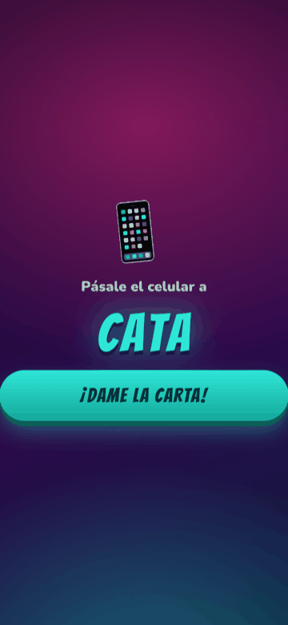<br><sub>Pásale el celular</sub></td>
    <td align="center"><br><sub>¡Cuarto Rey!</sub></td>
  </tr>
  <tr>
    <td align="center"><br><sub>Ranking de sorbos</sub></td>
    <td></td>
    <td></td>
    <td></td>
  </tr>
</table>
<!-- /generado -->

Especificación: [docs/juegos/cuarto-rey.md](docs/juegos/cuarto-rey.md)

## 🔢 Toque y Fama

Cada jugador elige un número secreto de cifras distintas y trata de adivinar el del rival. Por cada intento, el celular responde solo: **fama** es cifra correcta en su lugar, **toque** es cifra correcta en otro lugar. Nadie cuenta a mano, nadie hace trampa.

- **📱 Un celular:** se pasan el celular; la pantalla se tapa entre turnos.
- **📡 Dos celulares:** sala con código de 4 letras y QR. Cada celular guarda su secreto y responde a los intentos del rival. Al final ambos revelan y se verifica todo.
- **🤖 Contra el celular:** duelo contra un solver que adivina en 5 a 6 intentos.
- **💬 Chat de la sala:** en dos celulares hay un chat para picarse mientras adivinan, que sigue vivo en la pantalla final para celebrar o pedir revancha. Los mensajes nuevos se asoman al lado de la burbuja.

<!-- generado: capturas:toque-y-fama · lo reescribe python3 tools/readme.py actualizar -->
<table>
  <tr>
    <td align="center"><br><sub>Modos de juego</sub></td>
    <td align="center"><br><sub>Número secreto</sub></td>
    <td align="center"><br><sub>Tablero y teclado</sub></td>
    <td align="center"><br><sub>Pásale el celular</sub></td>
  </tr>
  <tr>
    <td align="center"><br><sub>Sala con código y QR</sub></td>
    <td align="center"><br><sub>Partida en dos celulares</sub></td>
    <td align="center"><br><sub>Secretos verificados</sub></td>
    <td align="center"><br><sub>Contra el celular</sub></td>
  </tr>
  <tr>
    <td align="center">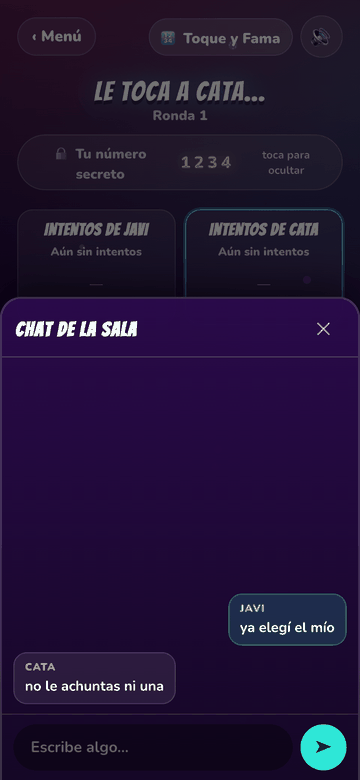<br><sub>Chat de la sala</sub></td>
    <td></td>
    <td></td>
    <td></td>
  </tr>
</table>
<!-- /generado -->

Especificación: [docs/juegos/toque-y-fama.md](docs/juegos/toque-y-fama.md) · Estudio de factibilidad: [docs/juegos/toque-y-fama-factibilidad.md](docs/juegos/toque-y-fama-factibilidad.md)

## ⚓ Batalla Naval

El clásico de hundir la flota. Cada jugador esconde 5 barcos en un tablero de 10×10 y dispara por turnos: agua, tocado o hundido. Si aciertas, sigues disparando. Colocación por toque con girar, arrastrar y "al azar"; el celular responde solo y lleva el marcador.

- **📱 Un celular:** tu flota queda tapada entre turnos; al fallar, el resultado y "Pásale el celular a X" en una sola pantalla.
- **📡 Dos celulares:** sala con código y QR. Cada celular responde los disparos contra su propia flota; al final ambas flotas se revelan y verifican.
- **🤖 Contra el celular:** IA con cacería por paridad y persecución al acertar (hunde una flota en unos 50 disparos).

<!-- generado: capturas:batalla-naval · lo reescribe python3 tools/readme.py actualizar -->
<table>
  <tr>
    <td align="center">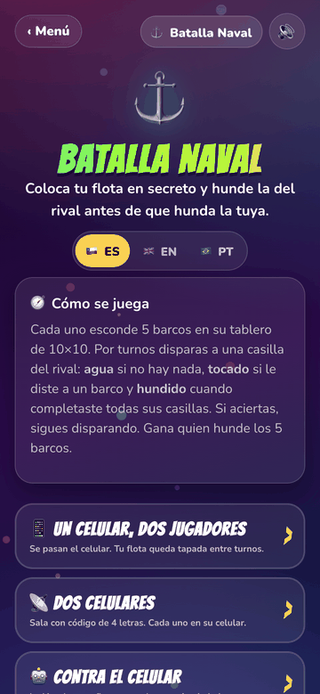<br><sub>Modos de juego</sub></td>
    <td align="center">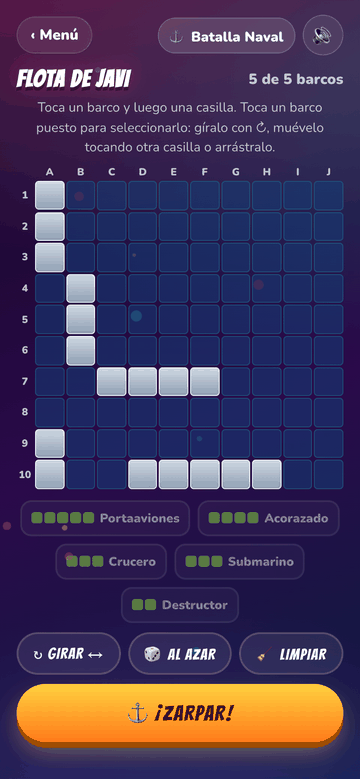<br><sub>Colocar la flota</sub></td>
    <td align="center">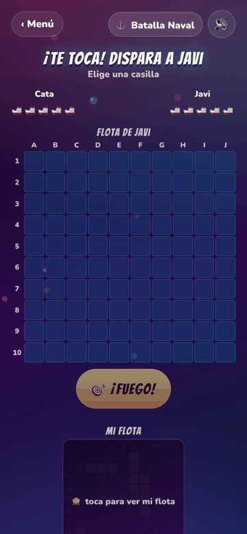<br><sub>Batalla</sub></td>
    <td align="center">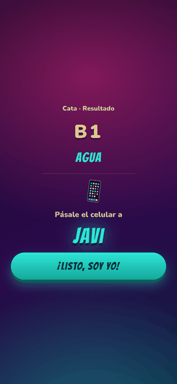<br><sub>Resultado y pase</sub></td>
  </tr>
  <tr>
    <td align="center">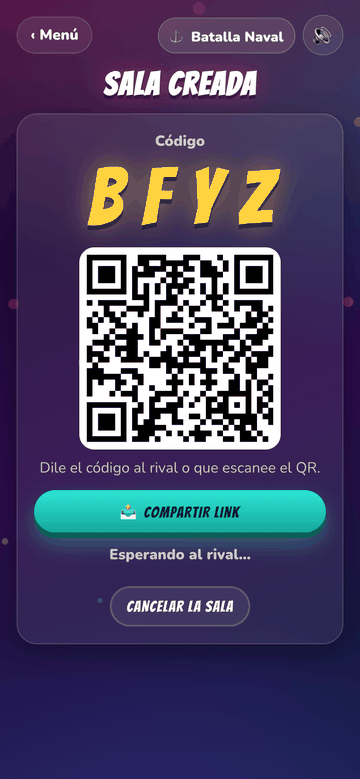<br><sub>Sala con código y QR</sub></td>
    <td align="center">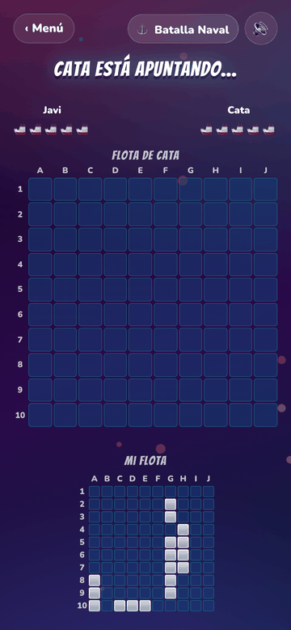<br><sub>Partida en dos celulares</sub></td>
    <td align="center">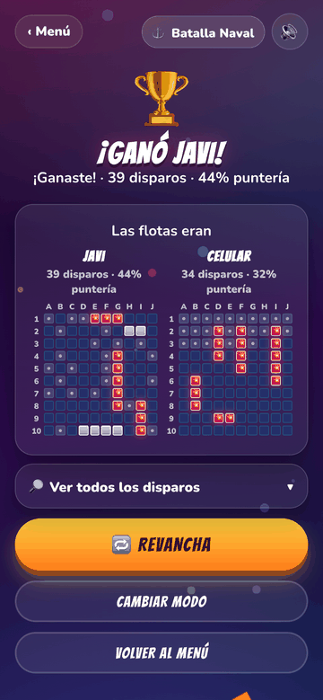<br><sub>Resultado con flotas</sub></td>
    <td></td>
  </tr>
</table>
<!-- /generado -->

Especificación y diseño: [docs/juegos/batalla-naval.md](docs/juegos/batalla-naval.md)

## ⏳ Línea de Tiempo

Recibes hitos sin fecha y los ubicas en el lugar correcto de una línea de tiempo común. Si aciertas, la carta se queda; si fallas, se descarta y robas otra. Gana quien se queda sin cartas: la ronda se juega completa, y si más de uno queda sin cartas gana el que respondió más rápido. Se elige la temática al empezar y agregar una nueva es solo un archivo de datos. Las cartas no se repiten entre partidas seguidas: cada celular recuerda las que ya mostró.

<!-- generado: tematicas · lo reescribe python3 tools/readme.py actualizar -->
| Temática | Cartas | Años | De qué va |
|---|---|---|---|
| 📜 Historia | 98 | 2560 a. C. a 2022 | Hitos de la humanidad |
| 🎵 Música | 89 | 1600 a 2023 | De Beethoven a TikTok |
| 🇨🇱 Chile | 127 | 1520 a 2023 | Del terremoto del 60 al estallido |
| 🍿 Cultura pop | 110 | 1928 a 2023 | Cine, memes y videojuegos |
| 🇧🇷 Brasil | 140 | 1500 a 2025 | De Cabral a la COP30, con novelas y carnaval |
| ⚽ Fútbol | 123 | 1863 a 2025 | Mundiales, clubes, goles y fichajes |
| **Total** | **687** | | |
<!-- /generado -->

- **📱 Un celular:** de dos a seis jugadores, pasando el celular por turnos.
- **📡 Varios celulares:** sala con código y QR, hasta seis jugadores. El anfitrión abre la partida cuando están todos, y cada uno ve su propia mano.
- **🧍 Jugar solo:** vacía tu mano en la menor cantidad de intentos y supera tu récord por temática.
- **🗂 Todas a la vista (por defecto):** se despliega el doble de las cartas que hay que colocar para ganar —6, 10 o 14— desde el primer turno, y no entra ninguna carta nueva en toda la partida. Como la mesa solo se achica, las cartas difíciles de situar van quedando para el final, sobre una línea que para entonces ya está llena: el juego se pone más difícil solo.
- **🃏 Pozo común:** las mismas 6 cartas a la vista para todos, reponiéndose desde el mazo, y gana quien coloque primero las cartas acordadas. También se puede jugar con **🙋 mano propia**, cada uno con sus cartas y en privado.
- **💬 Chat de la sala:** en varios celulares hay un chat para comentar las jugadas mientras se espera el turno, que sigue vivo en la pantalla final. Los mensajes nuevos se asoman unos segundos al lado de la burbuja.

<!-- generado: capturas:linea-de-tiempo · lo reescribe python3 tools/readme.py actualizar -->
<table>
  <tr>
    <td align="center">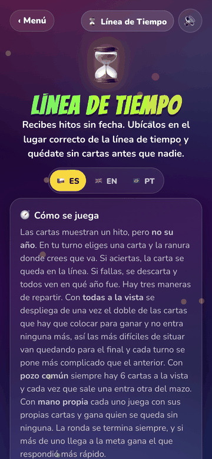<br><sub>Modos de juego</sub></td>
    <td align="center">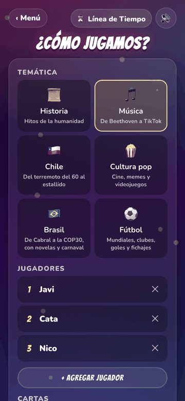<br><sub>Temática y jugadores</sub></td>
    <td align="center">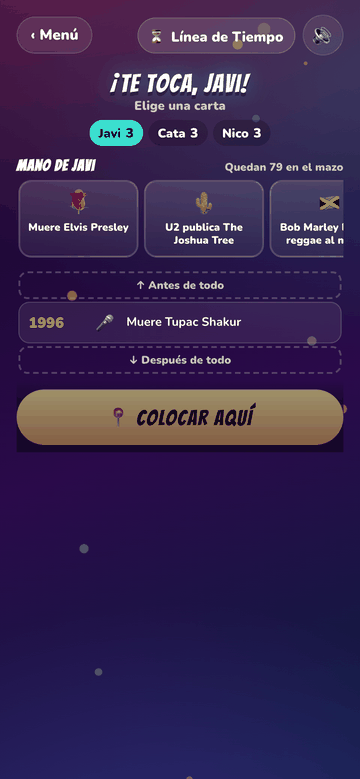<br><sub>Mano y línea de tiempo</sub></td>
    <td align="center">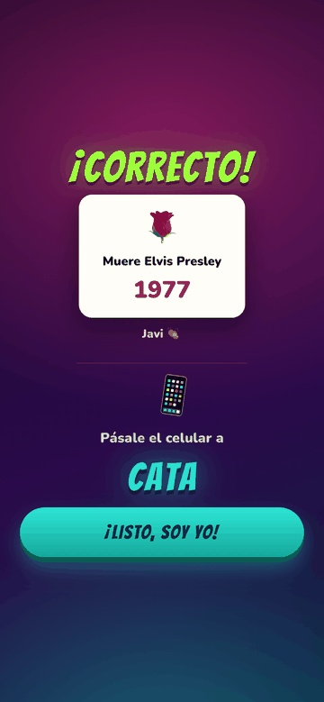<br><sub>Veredicto y pase</sub></td>
  </tr>
  <tr>
    <td align="center">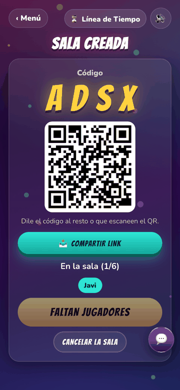<br><sub>Sala con código y QR</sub></td>
    <td align="center">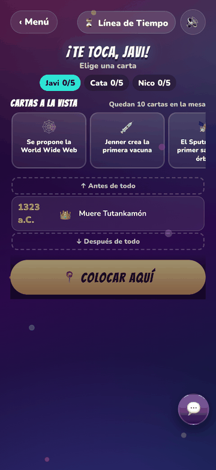<br><sub>Partida en varios celulares</sub></td>
    <td align="center">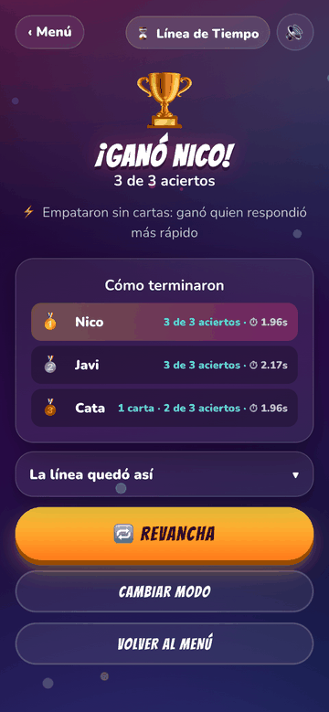<br><sub>Resultado y ranking</sub></td>
    <td align="center">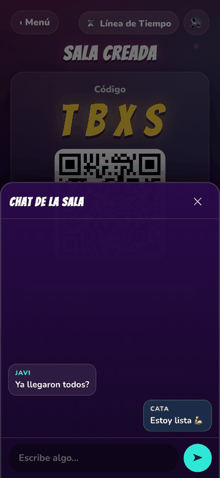<br><sub>Chat de la sala</sub></td>
  </tr>
  <tr>
    <td align="center">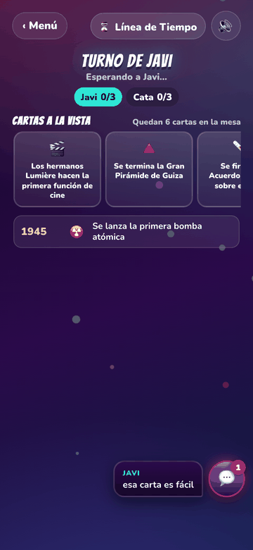<br><sub>Aviso de mensaje nuevo</sub></td>
    <td align="center">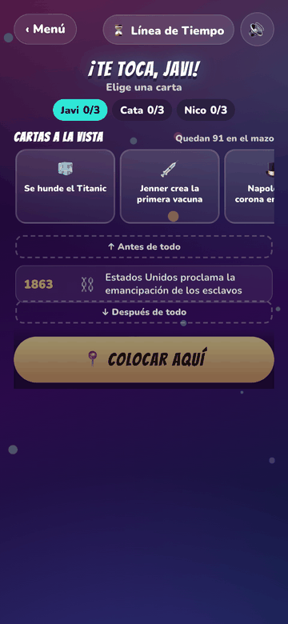<br><sub>Pozo común</sub></td>
    <td align="center">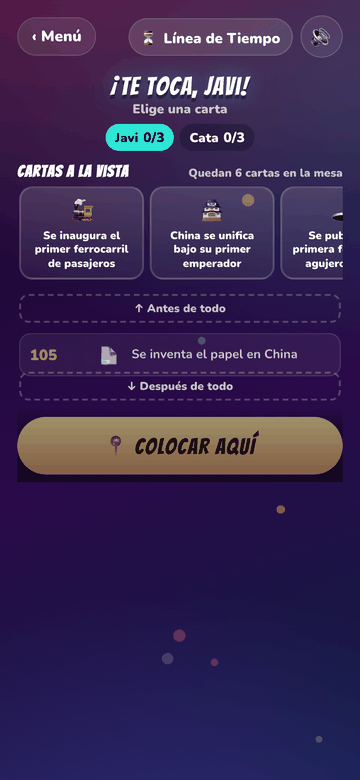<br><sub>Todas a la vista</sub></td>
    <td></td>
  </tr>
</table>
<!-- /generado -->

Especificación y diseño: [docs/juegos/linea-de-tiempo.md](docs/juegos/linea-de-tiempo.md)

---

## Características comunes

- **Idiomas:** español (por defecto), inglés y portugués de Brasil. El toggle del menú guarda la elección en el dispositivo; nunca se detecta el idioma del navegador (D-47, D-48). Ver [Idiomas](#idiomas).
- **Sonido:** efectos sintetizados con Web Audio (sin archivos de audio). Botón 🔊/🔇 en cada pantalla.
- **Partidas guardadas:** cada juego guarda su estado en el dispositivo y ofrece continuar.
- **Instalable:** manifest PWA para agregar a la pantalla de inicio. La pantalla no se apaga mientras se juega.

### Idiomas

Toda la experiencia va en el idioma elegido: el menú y sus frases del pie, los cuatro juegos
con todos sus modos, las salas, el chat, los errores de transporte, las pantallas de "pásale
el celular" y las cartas de todos los mazos de Línea de Tiempo. El portugués es el de
Brasil, informal, y los nombres se traducen igual que en inglés:

<!-- generado: idiomas · lo reescribe python3 tools/readme.py actualizar -->
| Español | English | Português |
|---|---|---|
| Juegos de Salón | Party Games | Jogos de Salão |
| Cuarto Rey | Fourth King | Quarto Rei |
| Toque y Fama | Bulls and Cows | Toque e Fama |
| Línea de Tiempo | Timeline | Linha do Tempo |
| Batalla Naval | Battleship | Batalha Naval |
<!-- /generado -->

Cómo está armado (canon C-3):

- `assets/js/i18n.js` guarda el idioma en `localStorage` (`juegos-de-salon:lang`), dibuja el
  toggle 🇨🇱 ES · 🇬🇧 EN · 🇧🇷 PT y tiene los textos comunes del menú (`COMMON`).
- Cada juego tiene sus textos en `LOCALES = { es, en, pt }` de su `rules.js`; `game.js` no
  tiene ninguna cadena literal. Los textos fijos del HTML llevan `data-i18n`.
- El registro del menú (`games.js`), las 100 frases del pie (`frases.js`) y cada carta de
  Línea de Tiempo (`decks/*.js`) llevan los tres idiomas.
- **Los tres diccionarios tienen exactamente las mismas claves.** Lo verifica
  `node assets/js/i18n.test.mjs`: claves, largo de las listas, `{llaves}` de las plantillas
  y que no haya textos vacíos. Un texto que falta se vería como `undefined` en pantalla.
- Las traducciones se adaptan, no se calcan: en portugués las comunas de Santiago son
  bairros, la penitencia es una prenda y el "fondo" es "vira, vira, vira".
- Para agregar un idioma: sumarlo a `LANGS` y al toggle en `i18n.js`, y agregar el
  diccionario en `COMMON`, `games.js`, `frases.js`, los cuatro `rules.js`, `decks/index.js` y
  cada carta. El test de paridad dice qué falta.
- El panel del dueño es solo en español (excepción anotada en `docs/PANEL.md`) y el
  `manifest.webmanifest` también, porque es uno solo para toda la app.

<!-- generado: capturas:idiomas · lo reescribe python3 tools/readme.py actualizar -->
<table>
  <tr>
    <td align="center">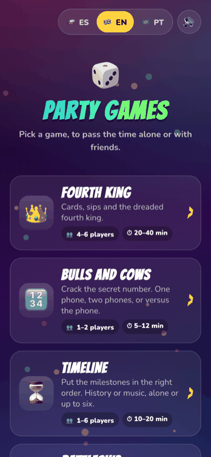<br><sub>Menú en inglés</sub></td>
    <td align="center">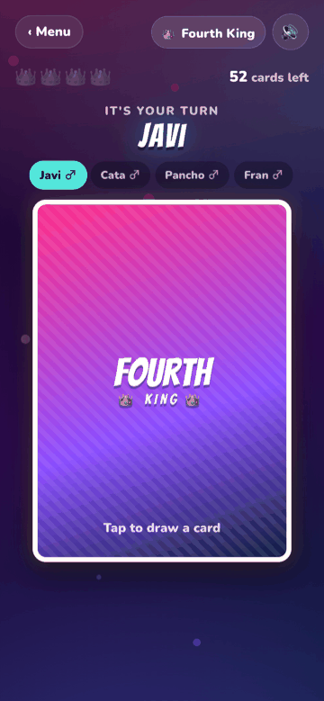<br><sub>Mesa en inglés</sub></td>
    <td></td>
    <td></td>
  </tr>
</table>
<!-- /generado -->

## Panel del dueño

`/panel/` es una página privada que muestra cuánto y desde dónde se juega: salas vivas y
celulares conectados, partidas por juego y modo, jugadores por partida, zona horaria, idioma
y hora del día. Entra con Google y solo lee el dueño del proyecto de Firebase. Son señales de
uso anonimizadas, no personas: de los modos sin red salen solo contadores, y nunca una IP, un
secreto, el chat ni quién ganó. Ver [docs/PANEL.md](docs/PANEL.md).

## Stack

HTML, CSS y JavaScript puro (módulos ES), sin build ni dependencias de npm. Se publica como sitio estático en GitHub Pages desde la rama `main`. El modo de dos celulares usa **Firebase Realtime Database** (plan gratuito) como sala en tiempo real; ver [firebase/README.md](firebase/README.md).

## Correr en local

```bash
python3 -m http.server 8765
```

y abrir http://localhost:8765 (los módulos ES necesitan servirse por HTTP). Tests de los motores, de los idiomas y de los módulos compartidos:

<!-- generado: pruebas · lo reescribe python3 tools/readme.py actualizar -->
```bash
node batalla-naval/engine.test.mjs
node linea-de-tiempo/engine.test.mjs
node toque-y-fama/engine.test.mjs
node assets/js/i18n.test.mjs
node assets/js/transport/cleanup.test.mjs
node assets/js/transport/dispose.test.mjs
node assets/js/transport/errors.test.mjs
node assets/js/transport/ratelimit.test.mjs
node assets/js/transport/stats.test.mjs
node panel/aggregate.test.mjs
```
<!-- /generado -->

## Laboratorio: probar interfaz sin tocar la app

`lab/` es un ambiente de pruebas con **URL propia** que no modifica ningún archivo de la app publicada. Sirve para mirar un cambio de aspecto en un celular de verdad —y pasarle el enlace a alguien— antes de decidir si va.

- Local: http://localhost:8765/lab/
- Publicado: https://juegosdesalon.cl/lab/

Las páginas del laboratorio **espejan** el menú y los juegos que haga falta, pero importan los módulos reales (`game.js`, `rules.js`, `engine.js`, `assets/js/*`): no hay lógica duplicada y un arreglo en un juego se ve ahí solo. Lo único propio es la presentación.

El experimento se escribe en **`lab/lab.css`**, que se carga *después* de `base.css` y solo agrega. La prueba de que está bien aislado: borrar ese archivo tiene que dejar las páginas funcionando con el aspecto actual de la app. En reposo el archivo está vacío y el laboratorio se ve idéntico al sitio.

```bash
python3 tools/lab.py espejar batalla-naval   # sumar un juego al laboratorio
python3 tools/lab.py revisar                 # ¿los espejos están al día?
python3 tools/lab.py promover                # llevar el experimento a producción
```

Cada bloque de `lab.css` declara con `/* @destino <ruta> */` adónde va el día que se apruebe, y `promover` lo mueve solo: los estilos a su archivo, las imágenes a `assets/img/` con la versión en el nombre y las rutas de `url()` reescritas según dónde caiga cada bloque. Lo que es criterio —fundir reglas duplicadas, repasar los cuatro juegos— lo deja anotado en una lista al terminar.

`revisar` ataja lo más peligroso del laboratorio: que el espejo de un juego quede viejo respecto del juego real y uno crea que está probando algo que ya no existe. Conviene correrlo antes de publicar, junto con los tests de motor.

Un cambio que solo toca `lab/` **no corre `set-version.py`** ni sube el número de versión: no cambió ningún archivo versionado. A cambio, GitHub Pages cachea `lab.css` diez minutos, así que al cambiarlo hay que subirle la marca de revisión (`lab.css?r=N`) en las dos páginas que lo cargan.

Ojo: comparte origen con la app, así que comparte `localStorage` (memoria de partida, idioma, nombre) y las salas de Firebase.

Detalle completo —cómo empezar un experimento, cómo espejar otro juego y qué hacer cuando uno se aprueba— en **[lab/README.md](lab/README.md)**, y el porqué en [D-42](docs/DECISIONES.md).

## Publicar una versión

Antes de hacer commit de una versión nueva, estampa la versión en el sitio (import maps y estilos con `?v=`), así el navegador no mezcla archivos viejos y nuevos:

```bash
python3 tools/set-version.py 0.4.6
```

## Mantener este README al día

Este archivo cuenta cosas que el código ya sabe —cuántos juegos hay, qué modos tiene cada
uno, cuántas cartas trae cada temática, qué tests corren— y muestra capturas de pantallas
que cambian. Nada de eso avisa cuando queda viejo, así que hay una herramienta:

```bash
python3 tools/readme.py revisar          # ¿quedó algo atrás del código?
python3 tools/readme.py actualizar       # reescribe los bloques generados
python3 tools/readme.py capturas <seccion> [--sin-red]   # rehace las capturas
python3 tools/readme.py sellar           # "ya lo releí con estos hechos"
```

- **Lo derivable se genera.** Todo lo que está entre `<!-- generado: ... -->` y
  `<!-- /generado -->` lo escribe `actualizar` desde [`tools/hechos.mjs`](tools/hechos.mjs),
  que importa los módulos de verdad (`games.js`, los `rules.js`, `decks/index.js`). Ahí
  adentro no se edita a mano: la tabla de juegos, las temáticas, los nombres por idioma, los
  tests, el índice de documentos y las galerías de capturas.
- **Lo que es prosa la escribe una persona**, y la herramienta no la toca: la delata.
  `revisar` compara los hechos de hoy contra los del último sello (`docs/hechos.json`) y
  nombra qué cambió y qué sección hay que releer. Cuando ya se releyó, `sellar` lo anota.
- **Las capturas se rehacen solas.** [`docs/capturas.json`](docs/capturas.json) dice de qué
  guion de [`tools/e2e/`](tools/e2e/README.md) y de qué toma sale cada imagen; `capturas`
  corre los guiones en Chrome headless, copia los PNG y los deja al doble del ancho con que
  se muestran. Las que necesitan una sala de Firebase van marcadas y se saltan con
  `--sin-red`. Hay que mirarlas antes de publicar: los problemas de diseño se ven (C-12).
- **El gancho para que pase siempre** es `set-version.py`, obligatorio antes de publicar
  (C-11): corre `revisar` y se planta si el README quedó atrás. Para una urgencia, `--igual`.

Agregar una pantalla al README: sacar la toma en el guion de e2e, sumar la entrada a
`docs/capturas.json`, y correr `capturas` y `actualizar`.

## Estructura

```
index.html                  Menú principal (se genera desde assets/js/games.js)
assets/css/base.css         Estilos y animaciones compartidos (tema fiesta, transición entre turnos)
assets/js/games.js          Registro de juegos (textos en es, en y pt)
assets/js/i18n.js           Idioma (ES/EN/PT): toggle, persistencia y textos comunes; i18n.test.mjs revisa la paridad
assets/js/frases.js         Frases del pie del menú, 100 por idioma
assets/js/sound.js          Efectos de sonido sintetizados y botón de silencio
assets/js/ui.js             Utilidades UI: confeti, vibración, wake lock, helpers DOM
assets/js/firebase-config.js Configuración pública de Firebase
cuarto-rey/                 Juego Cuarto Rey (index.html, game.js, rules.js, style.css)
toque-y-fama/               Juego Toque y Fama (engine.js + tests, game.js, rules.js)
batalla-naval/              Juego Batalla Naval (engine.js + tests, game.js, rules.js)
linea-de-tiempo/            Juego Línea de Tiempo (engine.js + tests, game.js, rules.js, decks/)
assets/js/handoff.js        Transiciones compartidas: pásale el celular, pantalla tapada
assets/js/chat.js           Chat de sala compartido (modos de varios celulares)
assets/js/session.js        Memoria de partida compartida (retomar en cualquier modo)
assets/js/transport/        Transportes compartidos: local (mismo celular), firebase (sala) y stats (señales de uso)
panel/                      Panel privado del dueño (entrada con Google; ver docs/PANEL.md)
lab/                        Ambiente de pruebas de interfaz, con URL propia (ver lab/README.md)
firebase/                   Reglas de seguridad de Realtime Database y notas
manifest.webmanifest        Manifest PWA (instalable en la pantalla de inicio)
tools/set-version.py        Estampa la versión (import maps + estilos) para evitar caché mezclada
tools/lab.py                Laboratorio: espejar juegos, revisar que esté sano y promover un experimento
tools/readme.py             README al día: bloques generados, capturas rehechas y aviso de lo que cambió
tools/hechos.mjs            La hoja de hechos de la app (juegos, modos, temáticas, tests) leída del código
tools/e2e/                  Partidas completas en Chrome headless; de ahí salen las capturas (su README)
docs/capturas.json          Catálogo de las capturas: pie de foto y de qué guion sale cada una
docs/                       Requerimientos, decisiones, especificaciones y capturas
```

## Documentación

<!-- generado: documentacion · lo reescribe python3 tools/readme.py actualizar -->
- [Cánones y estándares de Juegos de Salón](docs/CANONES.md)
- [Requerimientos](docs/REQUERIMIENTOS.md)
- [Decisiones de diseño y arquitectura](docs/DECISIONES.md)
- [Cómo agregar un juego nuevo](docs/AGREGAR-JUEGO.md)
- [Laboratorio](lab/README.md)
- [Panel del dueño](docs/PANEL.md)
- [Pruebas de punta a punta (Chrome headless por CDP)](tools/e2e/README.md)
- [Firebase](firebase/README.md)
- [Diseño: Batalla Naval](docs/juegos/batalla-naval.md)
- [Especificación: Cuarto Rey](docs/juegos/cuarto-rey.md)
- [Diseño: Línea de Tiempo](docs/juegos/linea-de-tiempo.md)
- [Toque y Fama — estudio de factibilidad y propuesta de mecánica](docs/juegos/toque-y-fama-factibilidad.md)
- [Especificación: Toque y Fama](docs/juegos/toque-y-fama.md)
- [Changelog](CHANGELOG.md)
<!-- /generado -->
