# 🎲 Juegos de Salón

Mobile-first web app with party games to play with friends: card games, drinking games, guessing games. Open it on a phone or tablet, pick a game from the menu, type in the players, and the phone runs the game. In Spanish, English, Portuguese and German.

The menu can be filtered by kind of game (words, logic, trivia, cards and dice); how many are playing is chosen inside each game. The filter lives in the link, so going back from a game keeps it and a filtered menu can be shared. Each game card has a ☆ in its corner to mark it as a favorite; once there is one, a ⭐ **Favorites** chip at the start of the kinds (or just above them, on a narrow phone) shows only those. Favorites stay in that browser, with no account (D-238). A 🎲 **Random game** button rolls a 3D die over the menu, one game per face, and opens whichever lands on top: never The Cup, and only the filtered kind if a filter is on (D-188). At the top, 📅 **One a Day** shares a row with The Cup, each in a half-width card: it opens today's game, a surprise game every day, the same challenge for everyone (D-230, D-239; see below). The games The Cup is made of (Connections, Bulls and Cows: Word, What Year?, Where Is It?, Queens, Tango, Zip and Untangle) are on the menu too, as games like any other: one player, in all four languages (D-198).

**Play:** https://juegosdesalon.cl/

<!-- generado: capturas:portada · written by python3 tools/release/readme.py actualizar -->
<p align="center">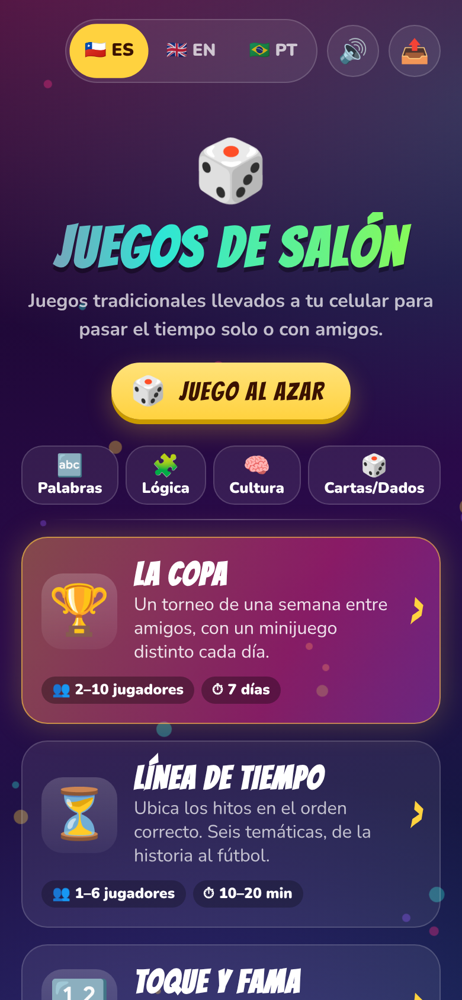&nbsp;&nbsp;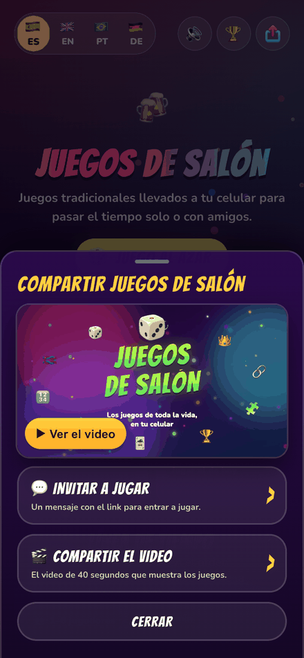</p>
<!-- /generado -->

> The app is Chilean and it is built in Spanish. This README is in English so anyone can read it. The rest of the documentation, linked at the end, is in Spanish, and the screenshots show the app in Spanish, which is its default language.

## Games

The games with their own section below come first; after them, the one-player games that also make up The Cup, each opening on its own page.

<!-- generado: juegos · written by python3 tools/release/readme.py actualizar -->
| Game | Players | Modes | Status |
|---|---|---|---|
| 🏆 [The Cup / La Copa / A Copa](#-the-cup-la-copa) | 2 to 10 | Each on their own phone | v0.83 |
| ⏳ [Timeline / Línea de Tiempo / Linha do Tempo](#-timeline-línea-de-tiempo) | 1 to 6 | One phone · Several phones · Play alone | v0.9 |
| 🔢 [Bulls and Cows / Toque y Fama / Toque e Fama](#-bulls-and-cows-toque-y-fama) | 1 to 2 | One phone · Two phones · Play alone | v0.4 |
| 🪢 [Hangman / El Ahorcado / Forca](#-hangman-el-ahorcado) | 1 to 6 | One phone · Several phones · Play alone | v0.26 |
| 🎲 [Liar's Dice / Dudo / Dado Mentiroso](#-liars-dice-dudo) | 1 to 6 | One phone · Several phones · Versus the phone | v0.32 |
| 📝 [Generala / General](#-generala) | 1 to 6 | One phone · Several phones · Play solo | 🔜 coming soon |
| ⚓ [Battleship / Batalla Naval / Batalha Naval](#-battleship-batalla-naval) | 1 to 2 | One phone · Two phones · Versus the phone | v0.6 |
| 🍹 [Julep / Julepe / Paga o Bolo](#-julep-julepe) | 1 to 6 | One phone · Several phones · Versus the phone | ⏸ paused |
| 👑 [Fourth King / Cuarto Rey / Quarto Rei](#-fourth-king-cuarto-rey) | 4 to 6 | One phone | v0.27 |
| 🔗 [Connections / Conexiones / Conexões](https://juegosdesalon.cl/connections/) | 1 | Play alone | Also in The Cup |
| 🔤 [Bulls and Cows: Word / Toque y Fama: Palabra / Toque e Fama: Palavra](https://juegosdesalon.cl/word/) | 1 | Play alone | Also in The Cup |
| 📅 [What Year? / ¿En qué año? / Em que ano?](https://juegosdesalon.cl/year/) | 1 | Play alone | Also in The Cup |
| 👑 [Queens / Reinas / Rainhas](https://juegosdesalon.cl/queens/) | 1 | Play alone | Also in The Cup |
| ☀️ [Tango](https://juegosdesalon.cl/tango/) | 1 | Play alone | Also in The Cup |
| 〰️ [Zip](https://juegosdesalon.cl/zip/) | 1 | Play alone | Also in The Cup |
| 🧶 [Untangle / Desenredo / Desenrola](https://juegosdesalon.cl/untangle/) | 1 | Play alone | Also in The Cup |
| 📍 [Where Is It? / ¿Dónde queda? / Onde fica?](https://juegosdesalon.cl/where/) | 1 | Play alone | Also in The Cup |
| 🔍 [The Case / El caso / O Caso](https://juegosdesalon.cl/case/) | 1 | Play alone | 🧪 lab |
<!-- /generado -->

---

## 👑 Fourth King (Cuarto Rey)

The classic drinking card game. The phone is the deck: each player draws a card and the phone says what to do. It names who drinks, runs the minigames (Cuenta Cuentos, Chancho Inflado, Cultura Chupística, Nunca Nunca), suggests dares and counts the kings. The fourth king ends the game: whoever draws it drinks everything left in their glass, and the last screen shows who it was, the sip ranking and, folded at the bottom, every card that came up and who drew it. After each card, who drinks and "pass the phone to X" share one screen, and only the next player's button moves on.

<!-- generado: capturas:cuarto-rey · written by python3 tools/release/readme.py actualizar -->
<table>
  <tr>
    <td align="center">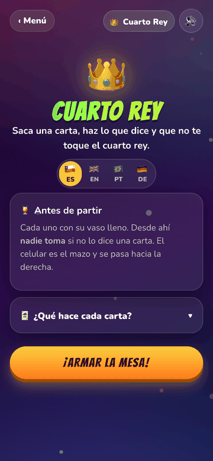<br><sub>Intro and rules</sub></td>
    <td align="center">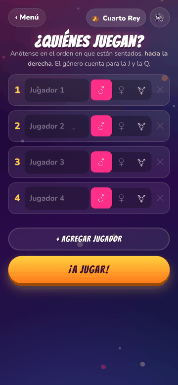<br><sub>Players and gender</sub></td>
    <td align="center">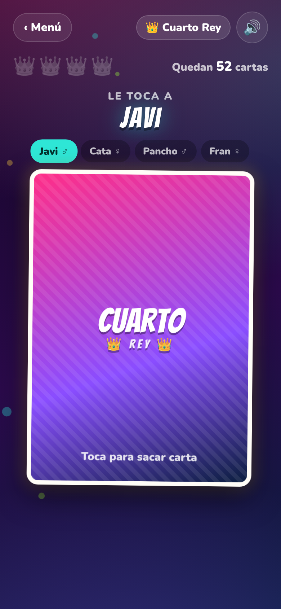<br><sub>Tap to draw a card</sub></td>
    <td align="center">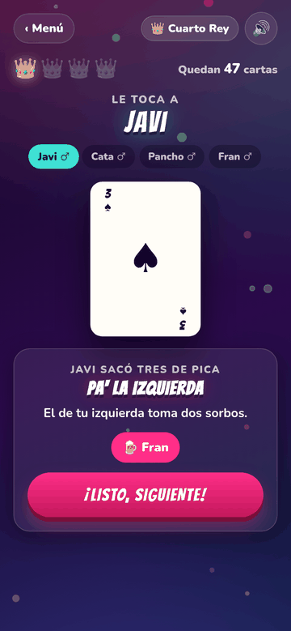<br><sub>Card and instruction</sub></td>
  </tr>
  <tr>
    <td align="center">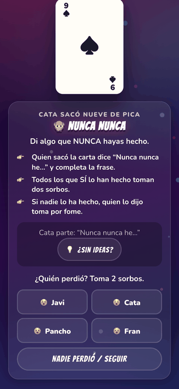<br><sub>Minigame with prompts</sub></td>
    <td align="center">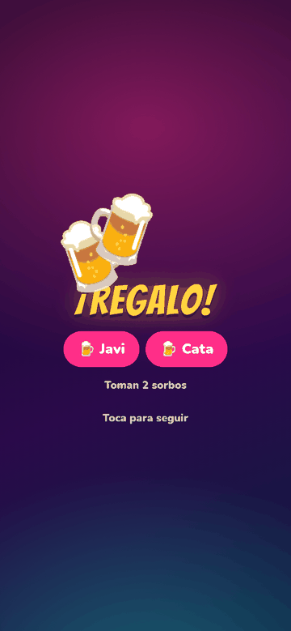<br><sub>Who drinks</sub></td>
    <td align="center">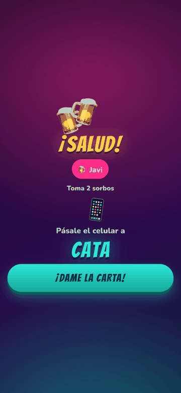<br><sub>Pass the phone</sub></td>
    <td align="center">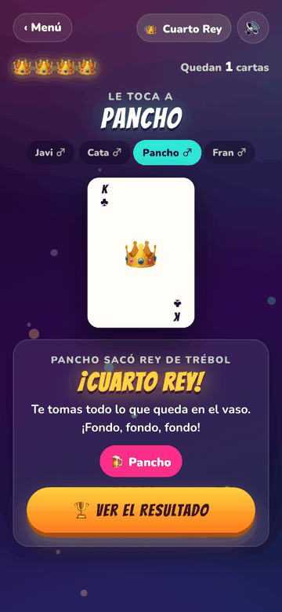<br><sub>Fourth King!</sub></td>
  </tr>
  <tr>
    <td align="center">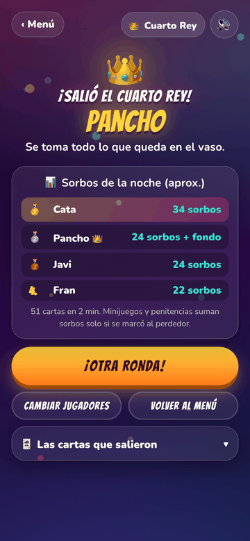<br><sub>Sip ranking</sub></td>
    <td align="center">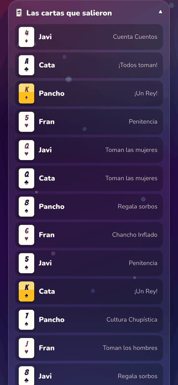<br><sub>Every card that came up</sub></td>
    <td></td>
    <td></td>
  </tr>
</table>
<!-- /generado -->

Spec: [docs/games/fourth-king.md](docs/games/fourth-king.md)

## 🔢 Bulls and Cows (Toque y Fama)

Each player picks a secret number with no repeated digits and tries to crack the other one, or you play alone against a number the phone picks. For every guess the phone answers on its own: **fama** is a right digit in the right place, **toque** is a right digit somewhere else. Nobody counts by hand, nobody cheats.

- **📱 One phone:** players pass the phone around, and the screen is covered between turns.
- **📡 Two phones:** a room with a 4-letter code and a QR. Each phone keeps its own secret and answers the rival's guesses. At the end both reveal and everything is verified.
- **🧍 Play alone:** The Cup's number game. The phone picks a 4-digit number and you get 10 guesses: 100 points on the first one and 10 less for each extra guess, with a clock and a record for your best score. Clues are spelled out in full ("2 famas, 1 toque").
- **💬 Room chat:** on two phones there is a chat to trash-talk while guessing, and it stays alive on the final screen to celebrate or ask for a rematch. New messages peek out next to the bubble.

<!-- generado: capturas:toque-y-fama · written by python3 tools/release/readme.py actualizar -->
<table>
  <tr>
    <td align="center">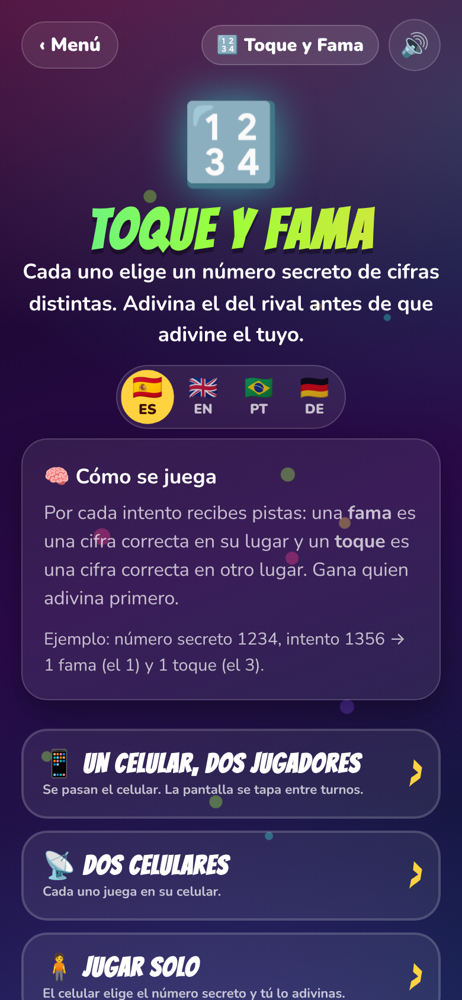<br><sub>Game modes</sub></td>
    <td align="center">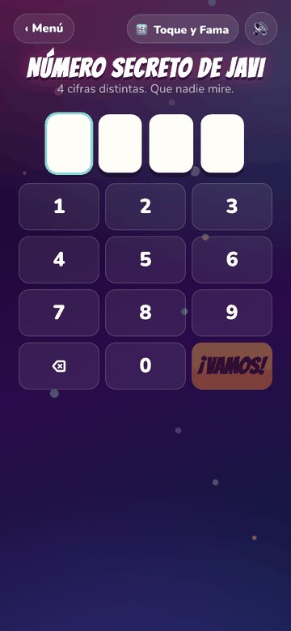<br><sub>Secret number</sub></td>
    <td align="center">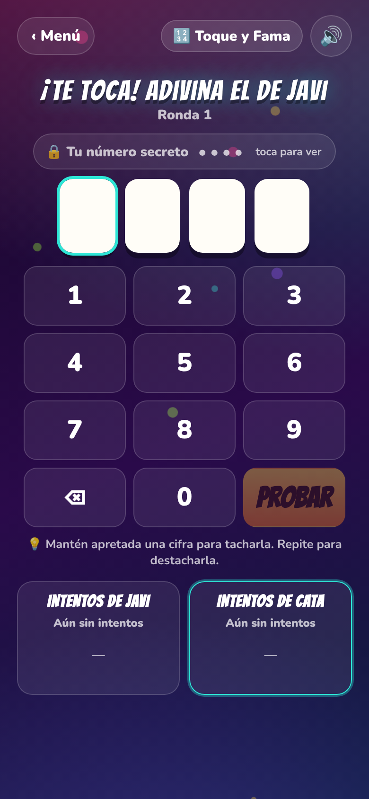<br><sub>Board and keypad</sub></td>
    <td align="center">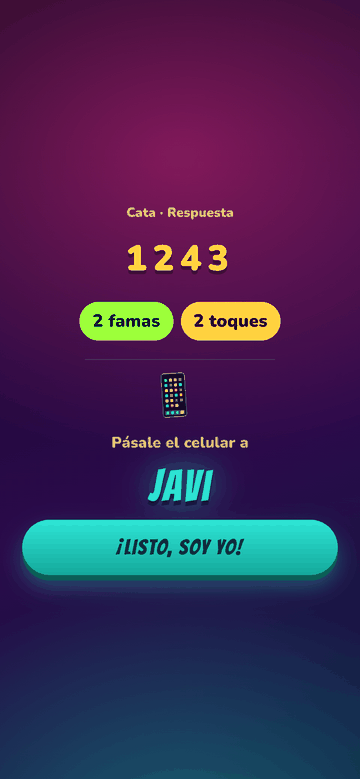<br><sub>Answer and handoff on one screen</sub></td>
  </tr>
  <tr>
    <td align="center">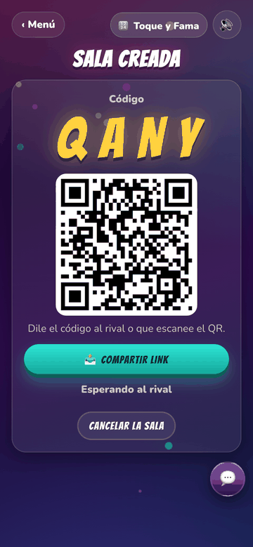<br><sub>Room with code and QR</sub></td>
    <td align="center">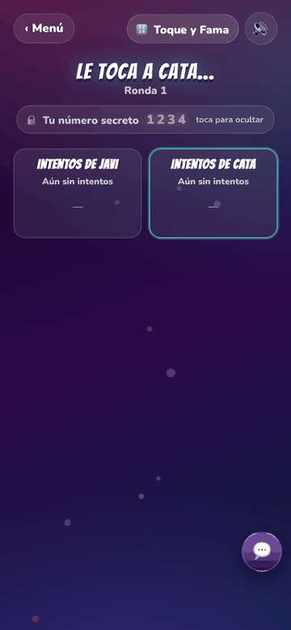<br><sub>Game on two phones</sub></td>
    <td align="center">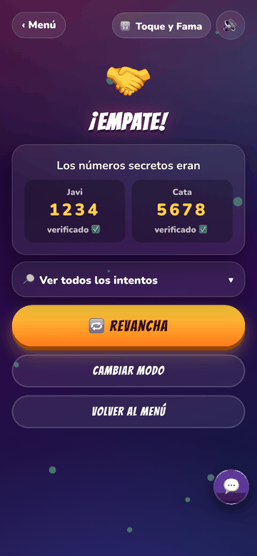<br><sub>Verified secrets</sub></td>
    <td align="center">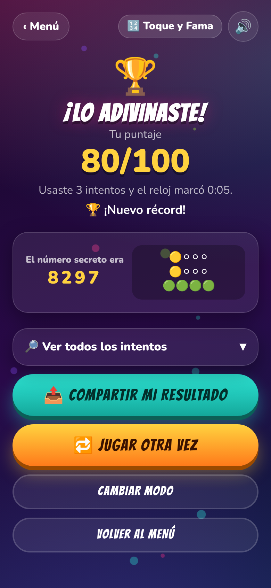<br><sub>Playing alone: a new record</sub></td>
  </tr>
  <tr>
    <td align="center">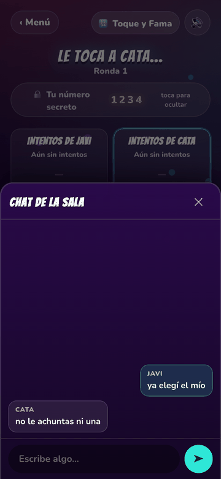<br><sub>Room chat</sub></td>
    <td></td>
    <td></td>
    <td></td>
  </tr>
</table>
<!-- /generado -->

Spec: [docs/games/bulls-and-cows.md](docs/games/bulls-and-cows.md) · Feasibility study: [docs/games/bulls-and-cows-factibilidad.md](docs/games/bulls-and-cows-factibilidad.md)

## ⚓ Battleship (Batalla Naval)

Sink the fleet. Each player hides 5 ships on a 10×10 board and fires in turns: miss, hit or sunk. A hit lets you fire again. Ships are placed by tapping or by dragging them from the list onto the board, with rotate and "random". The phone answers on its own and keeps score.

The fleet is drawn in **pixel art, seen from above** (D-91): every square paints one 16×16 piece — stern, middle sections, bow — and together they make the ship, so a carrier is a flight deck with a jet parked on it and a submarine is a thin hull with its periscope up. Every ship begins and ends in a point, and turning one is the same drawing rotated 90°. The sea is a single tile repeated in every square. The art lives in `public/battleship/flota.js`, **generated** by `python3 tools/generators/flota.py`: to change a ship you edit the script and run it again.

Sinking a ship **takes a second and a half** (D-93): a flash on the cell you fired at, fire running
along the hull one square at a time out from the hit, the whole hull slipping under once the fire
has run, and four bubbles rising just as the sound plays its own. It is the one moment the rival's
board draws the hull — you already knew the squares, since sinking means hitting all of them, but
not the ship — and it used to happen in a single repaint.

Whose turn it is is said **four times over, and never only in words** (D-92): the status bar fills
lime with a 🎯 when it is yours and stays grey with an ⏳ when it is not, the rival's board glows
while you can fire and dims when you cannot, tapping it out of turn shakes it and tells you why, and
a chime, a buzz and the tab title announce your turn when the phone is face down.

- **📱 One phone:** your fleet is covered between turns. On a miss, the result and "pass the phone to X" share one screen.
- **📡 Two phones:** a room with a code, a QR and chat. Each phone answers the shots against its own fleet, and at the end both fleets are revealed and verified. The chat steps aside while you place your own fleet, which fills the whole screen, and comes back with its unread badge once you are waiting for the rival (D-138).
- **🤖 Versus the phone:** an AI that hunts by parity and chases after a hit. It sinks a fleet in about 50 shots.

<!-- generado: capturas:batalla-naval · written by python3 tools/release/readme.py actualizar -->
<table>
  <tr>
    <td align="center">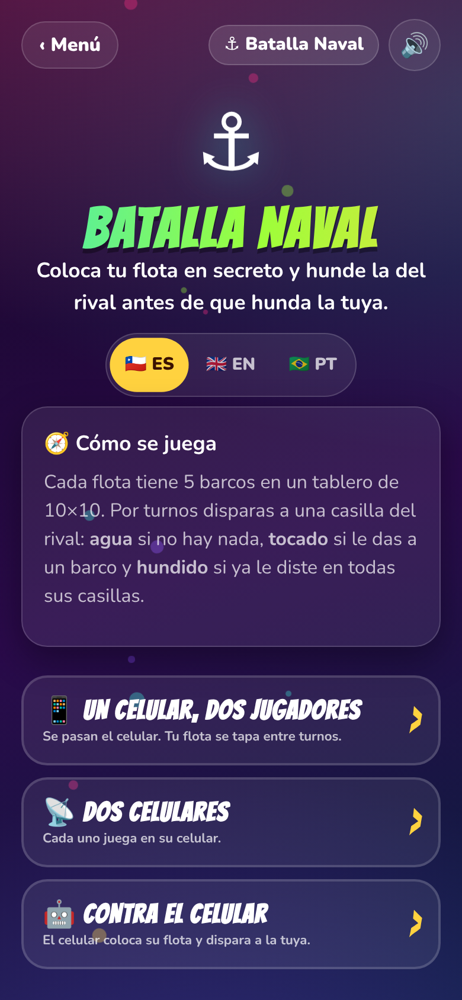<br><sub>Game modes</sub></td>
    <td align="center">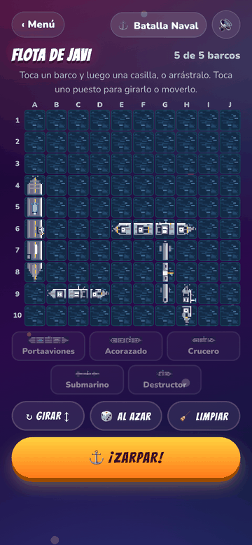<br><sub>Placing the fleet</sub></td>
    <td align="center">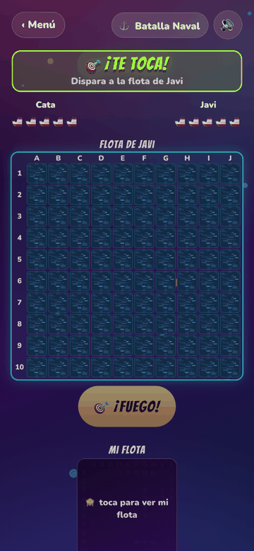<br><sub>Battle</sub></td>
    <td align="center">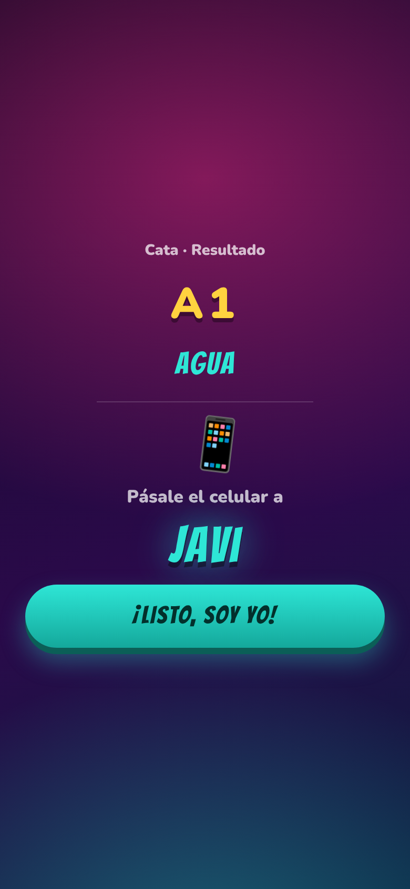<br><sub>Result and handoff</sub></td>
  </tr>
  <tr>
    <td align="center">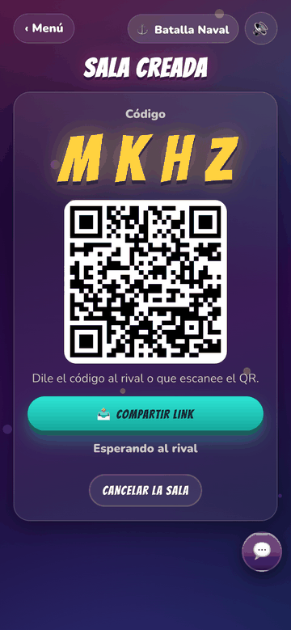<br><sub>Room with code and QR</sub></td>
    <td align="center">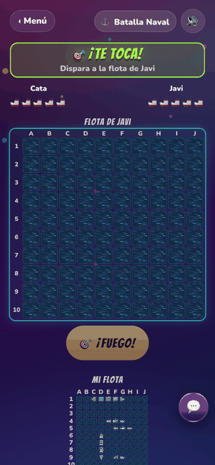<br><sub>Game on two phones</sub></td>
    <td align="center">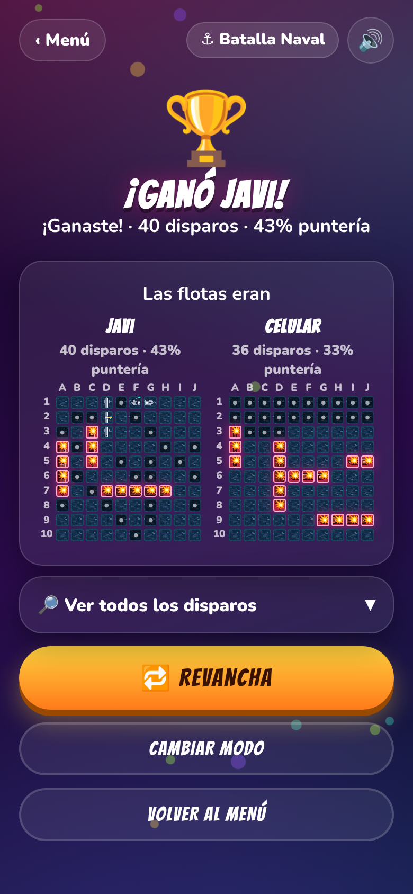<br><sub>Result with both fleets</sub></td>
    <td></td>
  </tr>
</table>
<!-- /generado -->

Spec and design: [docs/games/battleship.md](docs/games/battleship.md)

## ⏳ Timeline (Línea de Tiempo)

You get events with no date on them and place them in the right spot on a shared timeline. Get it right and the card stays. Get it wrong and it is discarded (with your own hand, you draw another one). The first player to correctly place the cards needed to win takes the game; with your own hand, the first to run out of cards. The round is always played to the end, and on a tie the fastest player wins. The rules on the game's front page are folded, one tap away (D-177). The theme is picked at the start, and adding a new one is just a data file. Cards do not repeat across back-to-back games: each phone remembers the ones it has already shown.

<!-- generado: tematicas · written by python3 tools/release/readme.py actualizar -->
| Theme | Cards | Years | What it covers |
|---|---|---|---|
| 📜 History | 98 | 2560 BC to 2022 | Milestones of humankind |
| 🎵 Music | 89 | 1600 to 2023 | From Beethoven to TikTok |
| 🇨🇱 Chile | 127 | 1520 to 2023 | From the 1960 quake to the uprising |
| 🍿 Pop culture | 110 | 1928 to 2023 | Movies, memes and video games |
| 🇧🇷 Brazil | 140 | 1500 to 2025 | From Cabral to COP30, telenovelas and carnival included |
| ⚽ Soccer | 123 | 1863 to 2025 | World Cups, clubs, goals and transfers |
| **Total** | **687** | | |
<!-- /generado -->

- **📱 One phone:** two to six players, passing the phone around.
- **📡 Several phones:** a room with a code and a QR, up to six players. The host starts the game once everyone is in, and each player sees their own hand.
- **🧍 Play alone:** The Cup's Timeline Flash. Pick a theme and get ten events: the first one is already on the timeline and you place the other nine in any order. A wrong card lands in its right spot marked in red, and you keep going. You score 0 to 100 for the share you got right, with a clock and a record for your best score in each theme.
- **🗂 All cards on the table (default):** twice the cards you need to win are dealt face up from the first turn (6, 10 or 14), and no new card enters for the rest of the game. Since the table only shrinks, the cards that are hard to place pile up for the end, on a timeline that by then is already crowded. The game gets harder on its own.
- **🃏 Shared pool:** the same 6 cards face up for everyone, refilled from the deck, and whoever places the agreed number of cards first wins. It can also be played with **🙋 your own hand**, each player with private cards.
- **💬 Room chat:** on several phones there is a chat to comment on the plays while waiting for your turn, and it stays alive on the final screen. New messages peek out for a few seconds next to the bubble.
- **Drag a card into place.** Pull a card down out of your hand and drop it where you think it goes. While it travels it is drawn large and above your finger: in the hand a card is 130px wide and its title sits at 11px, which is unreadable on a narrow phone exactly when you have to decide. A card you already placed can be picked up again and moved, or dropped outside the timeline to send it back to your hand. Dropping only **chooses** — the yellow button is still the one that places it, so nothing irreversible happens by accident, and tapping works exactly as before.

<!-- generado: capturas:linea-de-tiempo · written by python3 tools/release/readme.py actualizar -->
<table>
  <tr>
    <td align="center">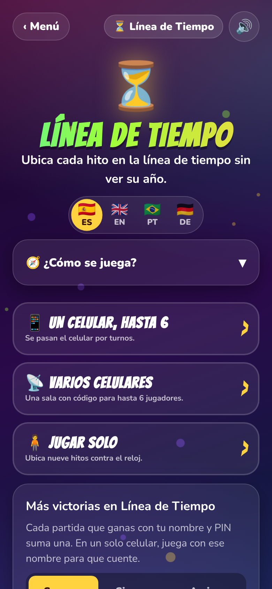<br><sub>Game modes</sub></td>
    <td align="center">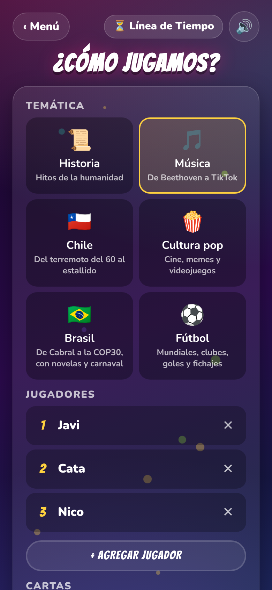<br><sub>Theme and players</sub></td>
    <td align="center">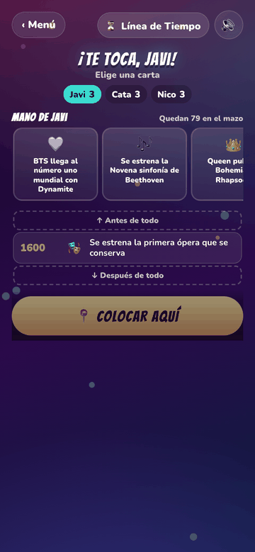<br><sub>Hand and timeline</sub></td>
    <td align="center">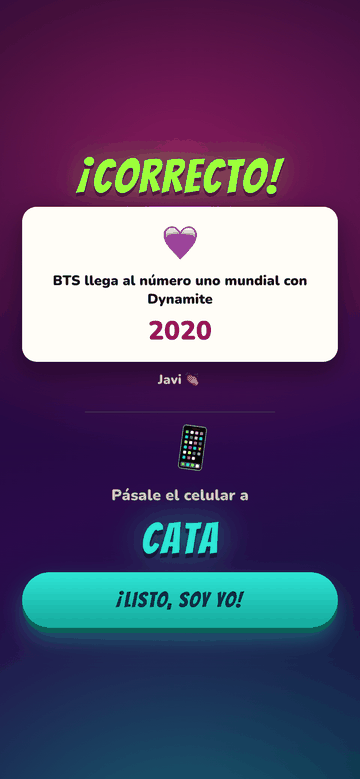<br><sub>Verdict and handoff</sub></td>
  </tr>
  <tr>
    <td align="center">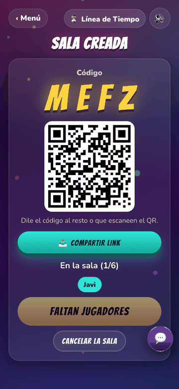<br><sub>Room with code and QR</sub></td>
    <td align="center">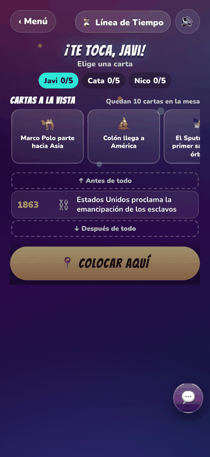<br><sub>Game on several phones</sub></td>
    <td align="center">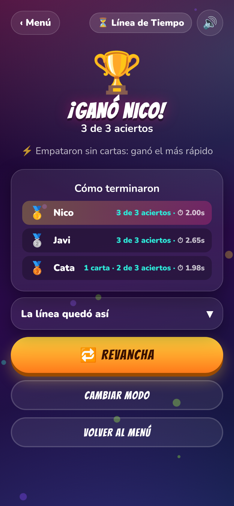<br><sub>Result and ranking</sub></td>
    <td align="center">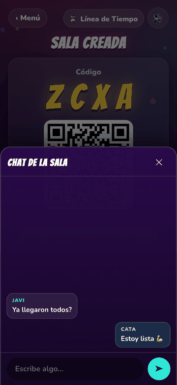<br><sub>Room chat</sub></td>
  </tr>
  <tr>
    <td align="center">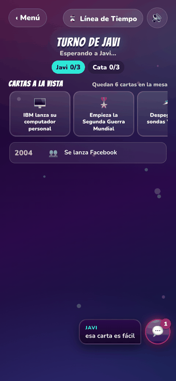<br><sub>New message label</sub></td>
    <td align="center">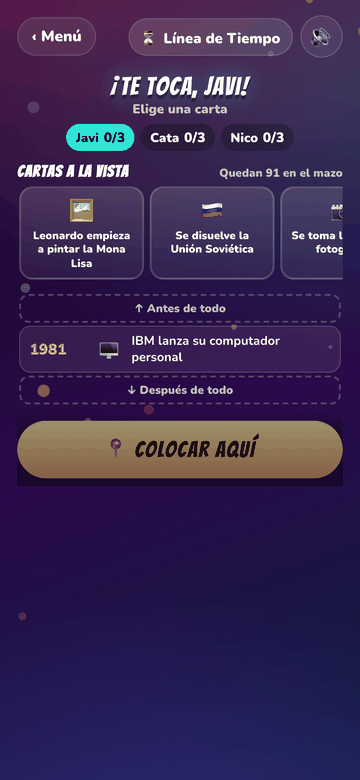<br><sub>Shared pool</sub></td>
    <td align="center">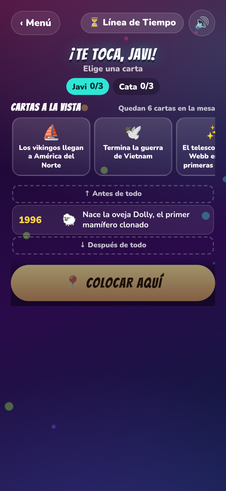<br><sub>All cards on the table</sub></td>
    <td></td>
  </tr>
</table>
<!-- /generado -->

Spec and design: [docs/games/timeline.md](docs/games/timeline.md)

---

## 🪢 Hangman (El Ahorcado)

<!-- generado: capturas:ahorcado · written by python3 tools/release/readme.py actualizar -->
<table>
  <tr>
    <td align="center">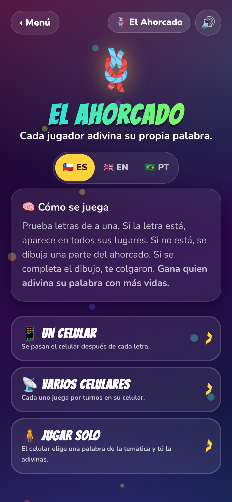<br><sub>Game modes</sub></td>
    <td align="center">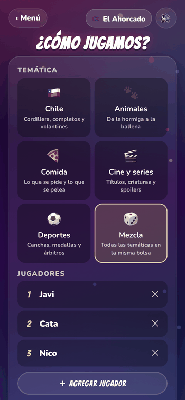<br><sub>Word, lives and who plays</sub></td>
    <td align="center">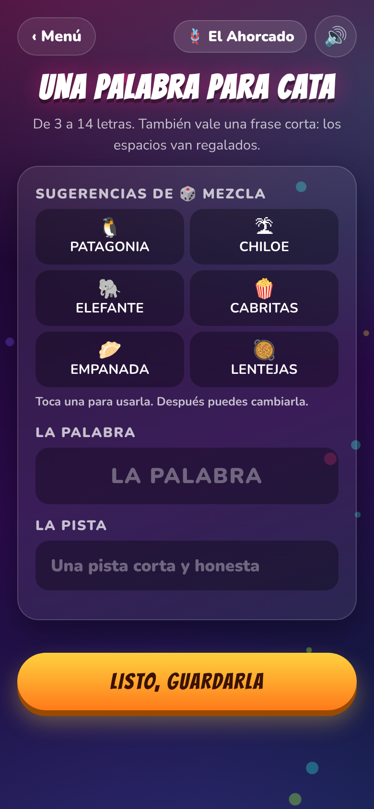<br><sub>Each player writes for the next</sub></td>
    <td align="center">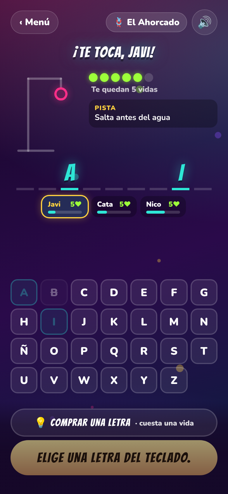<br><sub>Gallows, clue, word and keyboard</sub></td>
  </tr>
  <tr>
    <td align="center">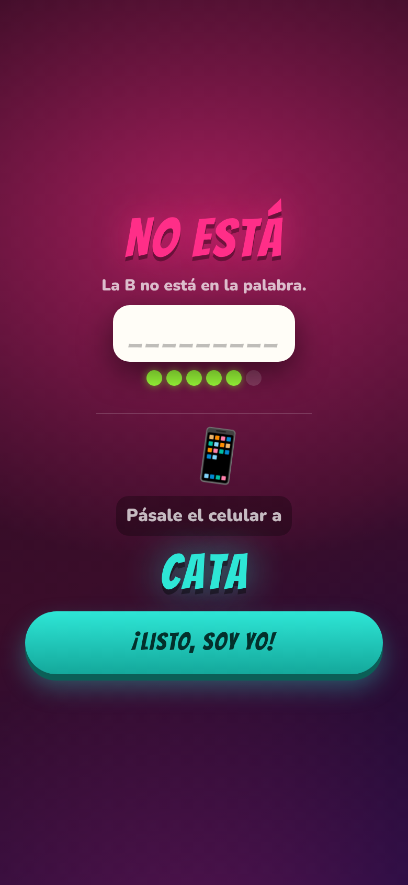<br><sub>The letter and the handoff together</sub></td>
    <td align="center">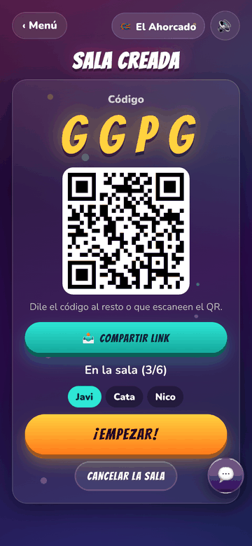<br><sub>Room with code and QR</sub></td>
    <td align="center">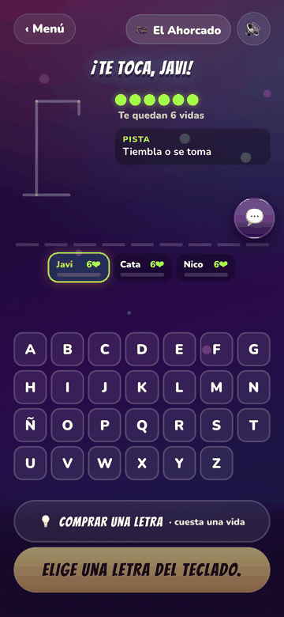<br><sub>Each on their own phone, taking turns</sub></td>
    <td align="center">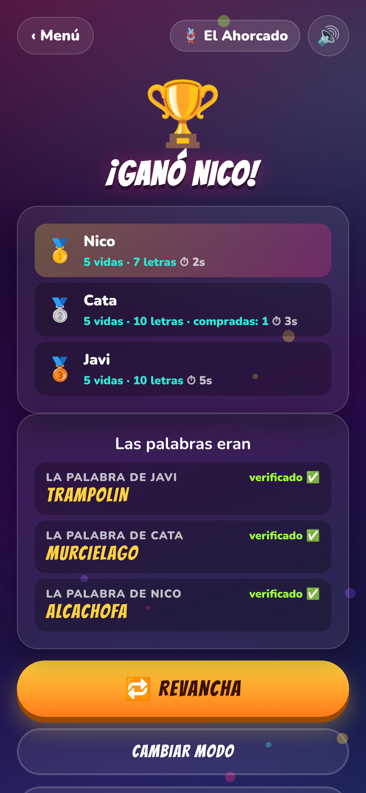<br><sub>Score and verified words</sub></td>
  </tr>
  <tr>
    <td align="center">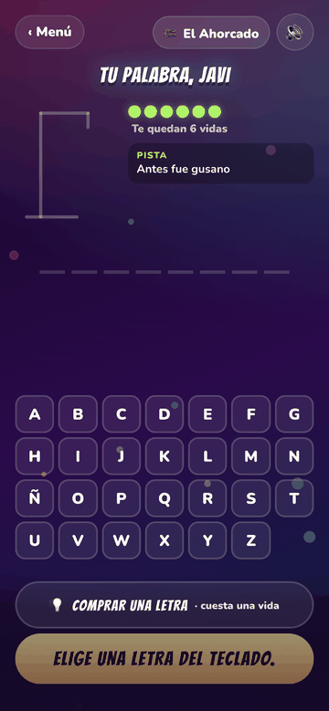<br><sub>Play alone: the phone deals the word</sub></td>
    <td></td>
    <td></td>
    <td></td>
  </tr>
</table>
<!-- /generado -->

The classic word game, with the fix it has always needed: **nobody sits and watches**. Instead of one bored executioner and one guesser, every player writes the word for the next one, the last one writes for the first, and everyone guesses their own. Two players make a duel, six make a race. Your score is **the lives you had left**, so cracking the word is not enough: you have to crack it cheap. Setting an impossible word earns nothing, and the player next to you writes yours anyway.

| | 🤝 Chain | 🎴 Phone's deck |
|---|---|---|
| Who sets the word | Each player, for the next one, with a mandatory clue | The phone, from the chosen theme |
| What the theme is for | It suggests six words to whoever writes, who can take them, edit them or ignore them | It is where the word comes from |
| The secret | It never travels: it is committed with a hash and verified at the end | There is none: it comes from the deck seed |

Five themes and a mix (Chile, Animals, Food, Film and TV, Sports), each with its own words and clues per language. They are not translations, because a translated word changes length and difficulty. Lives are configurable (5, 6 or 8), each miss costs one, and the last stroke of the drawing is always the X eyes. You can **buy a letter** 💡: the rarest missing one shows up and it costs you a life.

Turns alternate: you try a letter and the turn moves to the next player. All boards advance together, so seeing that your neighbour has one life left while you still have four lands exactly when it matters.

- **📱 One phone:** two to six players, with a covered screen for writing the word. After each letter, the result and "pass the phone to X" share one screen.
- **📡 Several phones:** a room with a code and a QR, up to six, taking turns one letter at a time so the sequence is visible (D-66). The rival strip shows lives and progress, never letters.
- **🧍 Play alone:** the phone deals a word from the chosen theme with its clue, and you crack it. There is no rival: the phone does not guess. Since the word comes from the deck there is no secret to commit, so this is the only mode that works without https (D-65).

Spec and design: [docs/games/hangman.md](docs/games/hangman.md)

---

## 🎲 Liar's Dice (Dudo)

<!-- generado: capturas:dudo · written by python3 tools/release/readme.py actualizar -->
<table>
  <tr>
    <td align="center">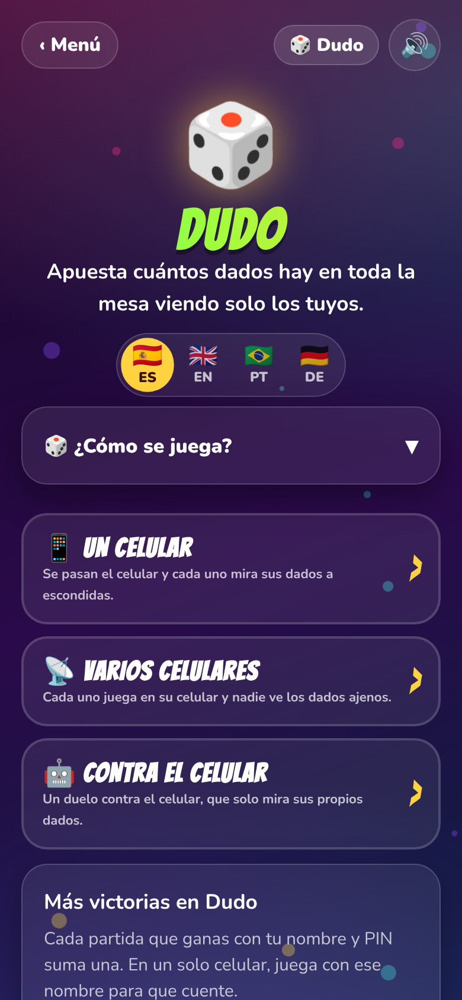<br><sub>Game modes</sub></td>
    <td align="center">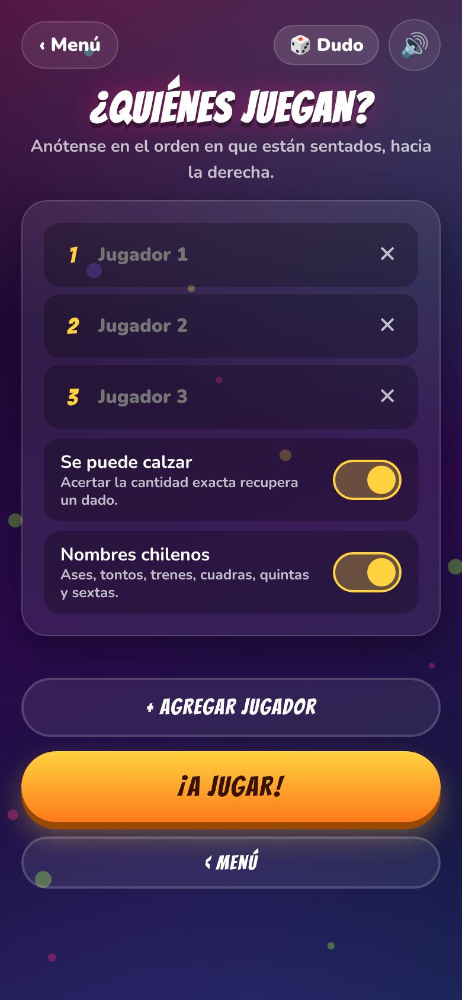<br><sub>Who plays and whether calzar is on</sub></td>
    <td align="center">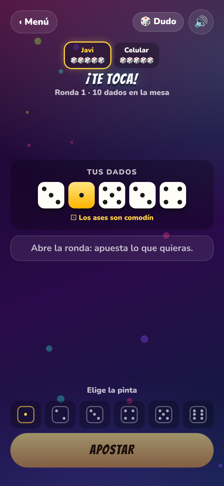<br><sub>Your dice and the table</sub></td>
    <td align="center">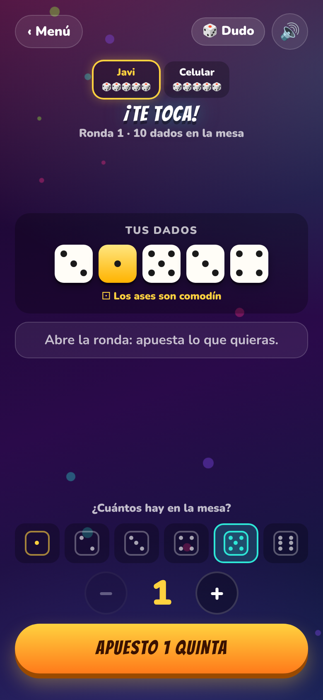<br><sub>Pick face and count</sub></td>
  </tr>
  <tr>
    <td align="center">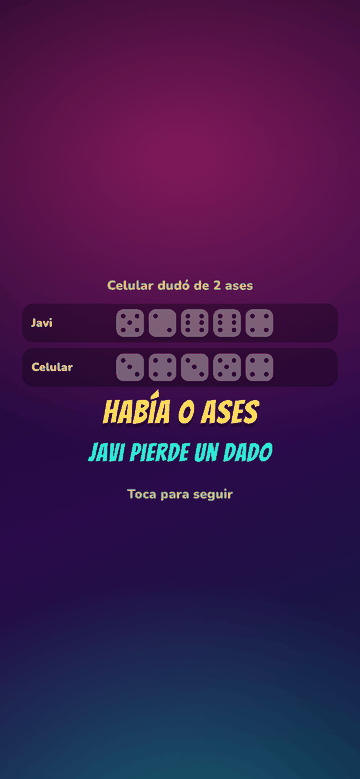<br><sub>The table opens up and counts</sub></td>
    <td align="center">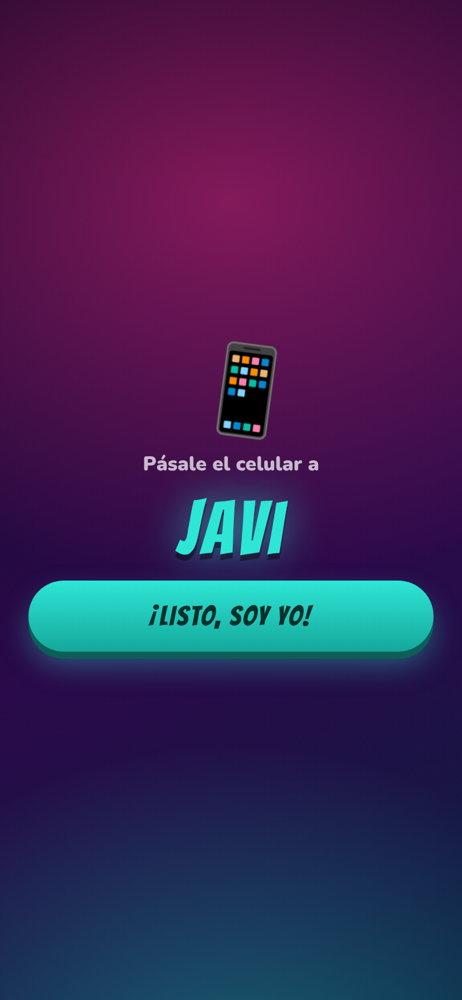<br><sub>Pass the phone</sub></td>
    <td align="center">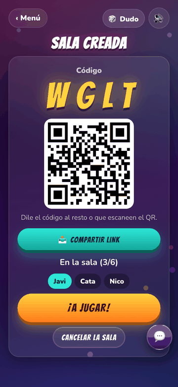<br><sub>Room with code and QR</sub></td>
    <td align="center">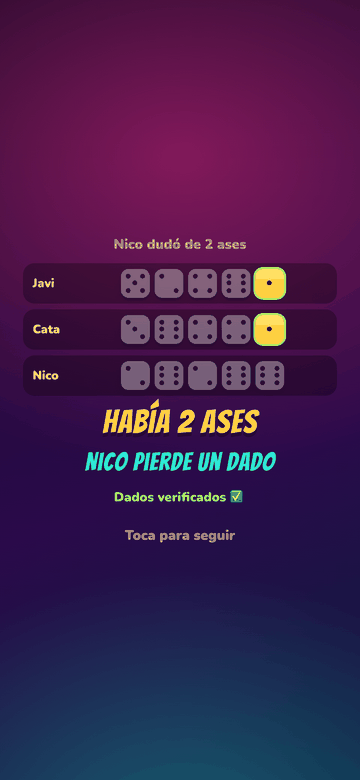<br><sub>The table opens up and verifies</sub></td>
  </tr>
  <tr>
    <td align="center">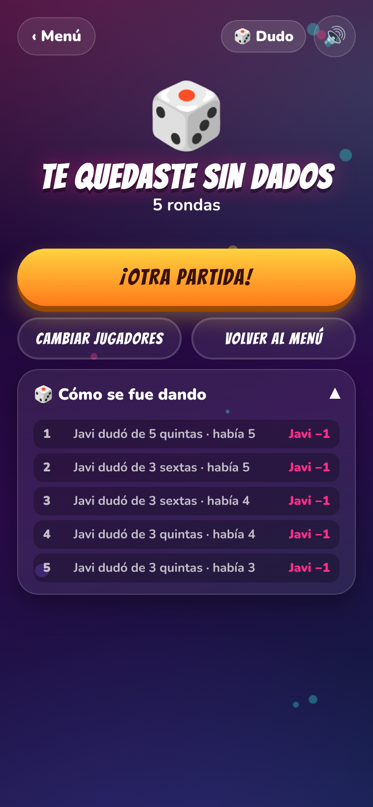<br><sub>Who won and how it went</sub></td>
    <td></td>
    <td></td>
    <td></td>
  </tr>
</table>
<!-- /generado -->

The classic dice game from bars and long dinners. Everyone rolls five dice and **only looks at their own**. You bet how many dice of one face are on **the whole table** ("four fives"), and the next player either raises or calls **dudo**. On a call everything is revealed and counted: if there were as many as claimed or more, the caller loses a die; if there were fewer, the bidder does. **Aces are wild**. A player with no dice left is out, and the last one with dice wins.

Here the phone does what a real table does badly: it rolls the dice, it **refuses illegal bids** (a raise is more dice, or the same number with a higher face, and aces count double in both directions), and it counts instantly, which is exactly what people argue about. **Calzar** means claiming the count is exact: get it right and you win a die back, get it wrong and you lose one. It is available from half the dice on the table and **only with three players or more**. In a duel there is a single hidden hand, so the exact count is arithmetic, not a risk (D-71).

In Spanish the faces are called the way they are called at a Chilean table (**ases, tontos, trenes, cuadras, quintas, sextas**), which is how the game is actually played here: "cuatro quintas", not "cuatro cincos". It ships on, and it can be turned off in settings to go back to numbers. In English and Portuguese the faces go by their number and the switch is not offered.

- **📱 One phone:** two to six players. The phone is passed around and each player sees their dice behind a handoff screen (C-9).
- **🤖 Versus the phone:** a duel. The phone bets on probability and **only looks at its own dice**: the decision comes from how many unknown dice are left and how likely they are to cover the bid, not from peeking at yours.
- **📡 Several phones:** a room with a 4-letter code, a QR and chat, two to six players. Each phone rolls **its own** dice and publishes only the hash. On a call it reveals them and everyone verifies that nobody swapped them (C-10). This is why the dice are not derived from the shared seed like everything else this app deals: the code is public, and with a shared seed anyone could compute the rival's dice from the console (D-70).

Spec and design: [docs/games/liars-dice.md](docs/games/liars-dice.md)

---

## 📝 Generala

<!-- generado: capturas:generala · written by python3 tools/release/readme.py actualizar -->
<table>
  <tr>
    <td align="center">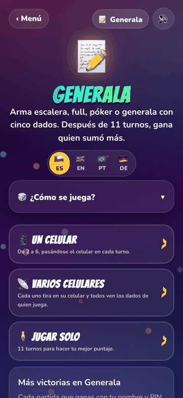<br><sub>Game modes</sub></td>
    <td align="center">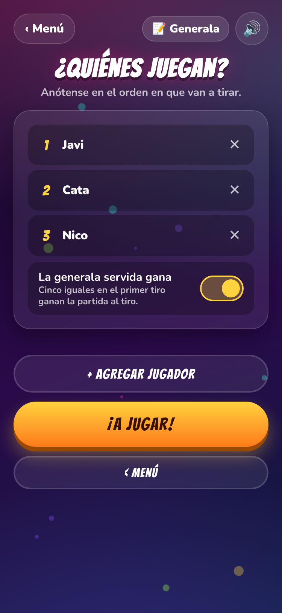<br><sub>Who plays and whether a rolled generala wins</sub></td>
    <td align="center">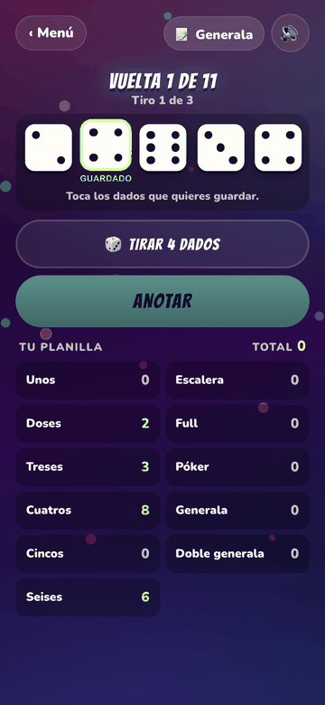<br><sub>Keep dice and pick a box</sub></td>
    <td align="center">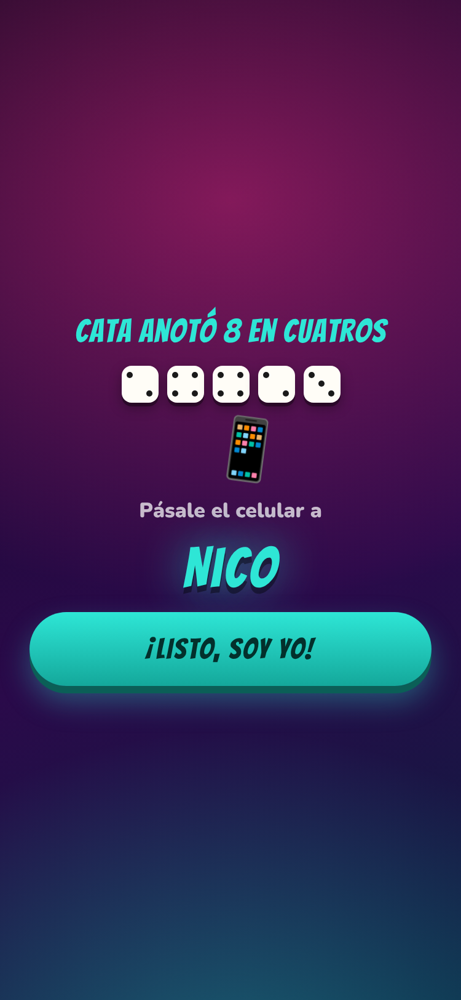<br><sub>What was scored, then pass the phone</sub></td>
  </tr>
  <tr>
    <td align="center">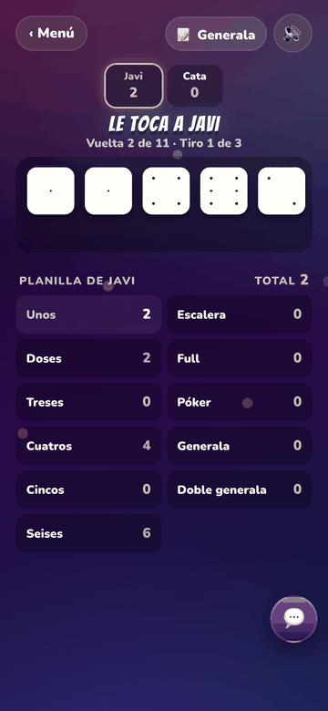<br><sub>Several phones: watching who rolls</sub></td>
    <td align="center">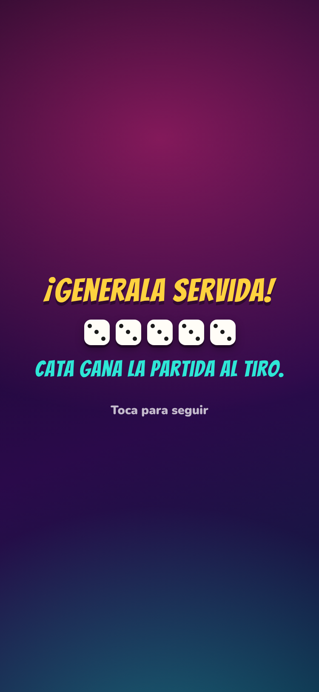<br><sub>Generala on the first roll wins</sub></td>
    <td align="center">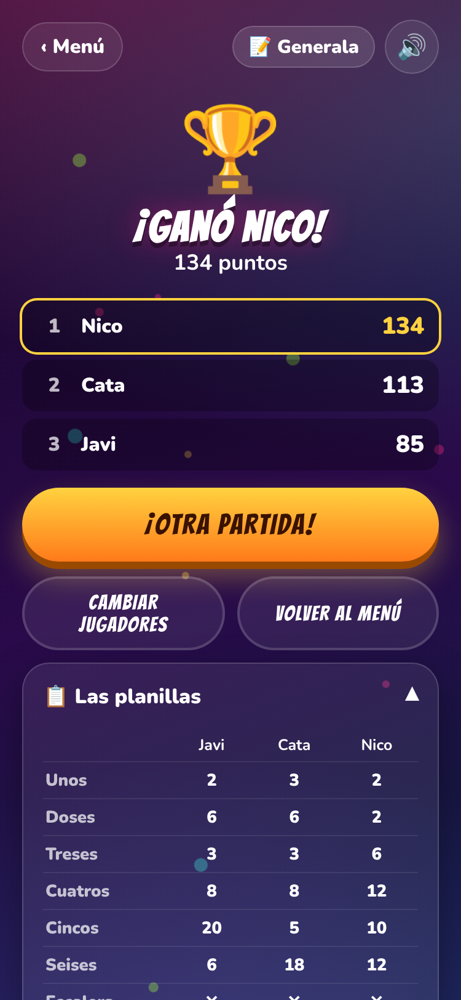<br><sub>Standings and every score card</sub></td>
    <td align="center">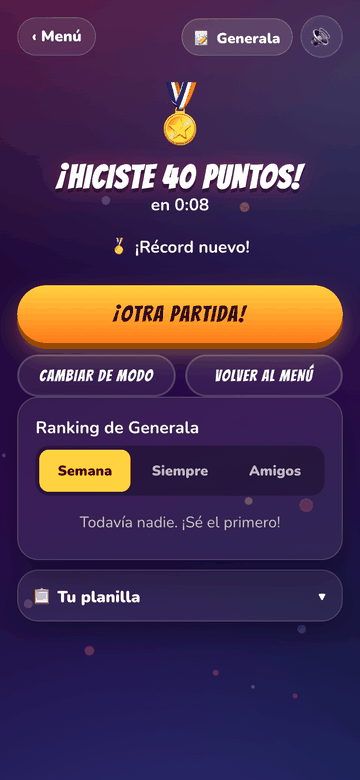<br><sub>Solo score and record</sub></td>
  </tr>
</table>
<!-- /generado -->

The dice game of every Latin American after-dinner table. On your turn you roll five dice **up to three times**, tapping the ones you want to keep between rolls, and then you score the result in a free box of your card, or cross one out with a 0. There are eleven boxes, so there are eleven turns, and the highest total wins: ones to sixes add up their face, a straight is worth 20, a full house 30, four of a kind 40 (five more if they come on the first roll), a generala 50 and a double generala 100. A **generala on the first roll wins the game on the spot**; that rule ships on and can be turned off before starting.

The phone does what the table does badly: it adds up, it shows what every free box would be worth with the dice you have now, and it will not let you score twice in the same box or roll a fourth time. Nothing comes preselected: you tap a box and the button says what it does ("Score 30 in Full house").

- **📱 One phone:** two to six players. Before each handoff you see what the last player scored, with their dice (C-9).
- **📡 Several phones:** a room with a 4-letter code, a QR and chat, two to six players. Each player rolls on their own phone and everyone watches the dice and the card of whoever is playing. There is nothing hidden in this game, so the dice travel in the clear; they are not derived from the shared seed either, because with the public code that would let anyone compute their next rolls (D-246).
- **🧍 Play solo:** eleven turns for your best score, with a record on the phone and, signed in, the `generala_solo` leaderboard.

**Coming soon:** the home page announces it at the end of the list, without opening it yet (D-248); the page works in full for anyone with the link. It is the first group game that also works **without playing at the same time**: everyone fills their own card. When it opens it joins **One a Day**, where every roll comes from the day's seed, so whoever keeps the same dice gets the same dice (D-247). In Portuguese it is called General, as in Brazil; Kniffel and Yahtzee are trademarks and a slightly different game.

Spec and design: [docs/games/generala.md](docs/games/generala.md)

---

## 🍹 Julep (Julepe)

<!-- generado: capturas:julepe · written by python3 tools/release/readme.py actualizar -->
<table>
  <tr>
    <td align="center">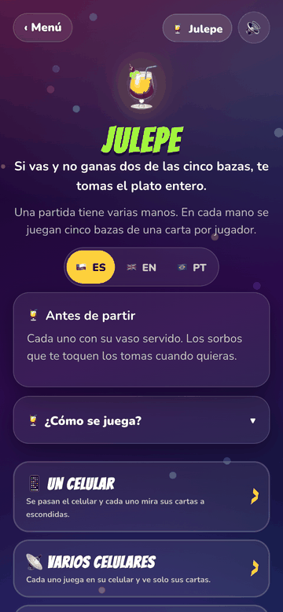<br><sub>Game modes</sub></td>
    <td align="center">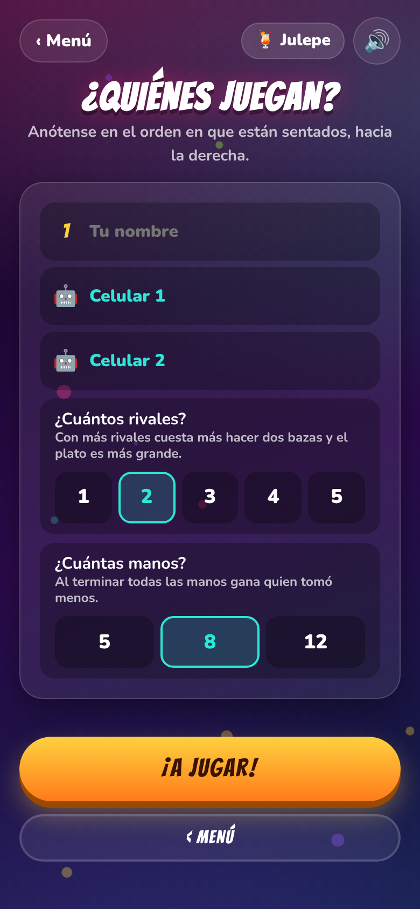<br><sub>How many rivals and how many hands</sub></td>
    <td align="center">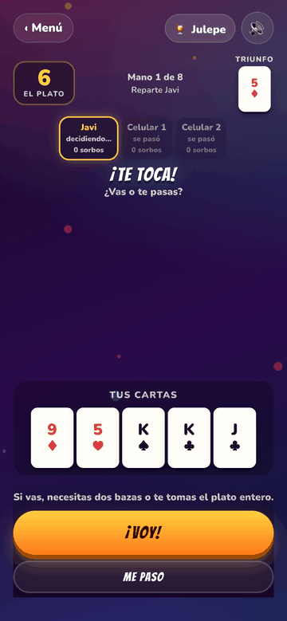<br><sub>In or out, taking turns</sub></td>
    <td align="center">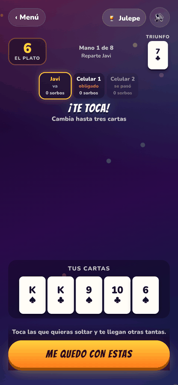<br><sub>Swap up to three cards</sub></td>
  </tr>
  <tr>
    <td align="center">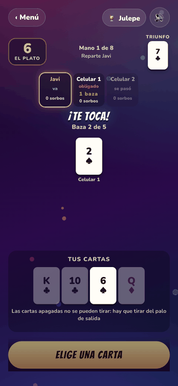<br><sub>Illegal cards are dimmed</sub></td>
    <td align="center">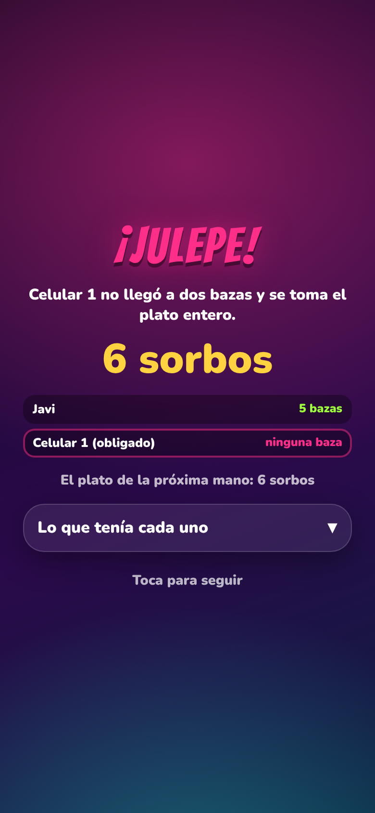<br><sub>A julep: drink the whole pot</sub></td>
    <td align="center">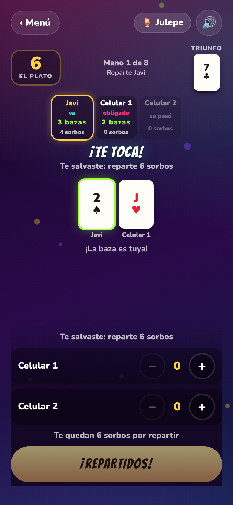<br><sub>Handing out the sips you won</sub></td>
    <td align="center">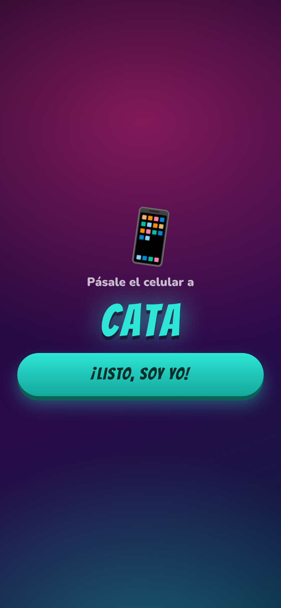<br><sub>Pass the phone</sub></td>
  </tr>
  <tr>
    <td align="center">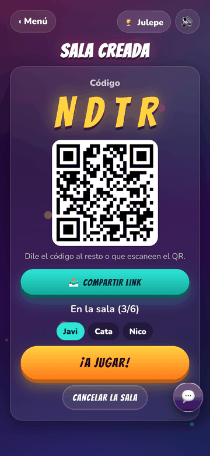<br><sub>Room with code and QR</sub></td>
    <td align="center">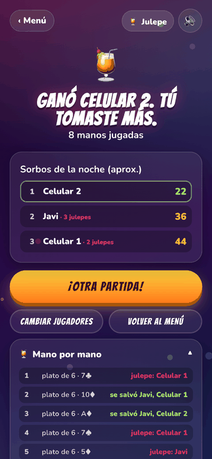<br><sub>Who drank the least</sub></td>
    <td></td>
    <td></td>
  </tr>
</table>
<!-- /generado -->

> **Paused for now.** Several rounds of rewriting the rules text still did not make the game land
> — not even for the person writing them. The home page shows it as "Coming soon", at the end of the
> list, without opening it, while the rules get reworked into something a new player can actually
> follow (D-88, D-142). The game itself is untouched and still
> works at [`/julep/`](https://juegosdesalon.cl/julep/).

A trick-taking game from the Tute family, played for sips. There is a **pot** of sips on the table. You look at your five cards and, taking turns from the dealer's right, say whether you are **in** or **out**. Going in means committing to win **two of the five tricks**: make it and you are safe, and you get to hand out two sips per trick among the others; fall short and you **drink the whole pot**. That is a **julep**. The pot carries over to the next hand once for every player who got juleped, so two juleps in the same hand double it before anyone notices.

The phone does what a real table does badly. It deals, it keeps the pot, it remembers who owes whom, and above all it **refuses illegal cards**: you must follow the suit led, you must play higher than the highest card of that suit on the table if you can, and you must trump when you are out of the suit. Those three rules are what people argue about all night; here the cards that cannot be played are simply dimmed, with a line saying which rule is doing it. Nobody has to learn a rule by breaking it.

If only one player goes in, the hand would be no hand at all, so **the dealer is dragged in** and has to play it (D-83). Dealing is a risk too, which is exactly the story the table tells afterwards.

- **📱 One phone:** two to six players. The phone goes around the table for every declaration, every swap and every card, with the result of what just happened shown before each handoff (C-9).
- **📡 Several phones:** a room with a 4-letter code, a QR and chat, two to six players. The deal travels **sealed for each player**: every phone publishes a public key when it joins, and the dealer seals each hand with the key of the person it belongs to (D-81). Nobody else can open it, not even reading the room from the console. When the hand ends everyone reveals what they were dealt and the app checks that no one played a card they did not have: "Cards verified ✅" (C-10). It is also what the table wants to see anyway — what the player who got juleped was holding.
- **🤖 Versus the phone:** one to five phone rivals, however many you want at the table. They weigh their hand the way you would (how many trumps, how high, how many aces and kings), and they get more careful as the pot grows: risking twenty sips for the right to hand out four is not the same bet as risking six.

The name changes in each language, because a name only works if it is recognised (D-84): the English cousin of this game is *Loo*, which today reads as the toilet, so in English it is **Julep** — a real word, a drink, and one letter from the original. In Portuguese there is no relative to borrow from, but *o bolo* is what the pot is called in Brazil, so it is **Paga o Bolo**.

Spec and design: [docs/games/julep.md](docs/games/julep.md)

---

## 🏆 The Cup (La Copa)

<!-- generado: capturas:copa · written by python3 tools/release/readme.py actualizar -->
<table>
  <tr>
    <td align="center">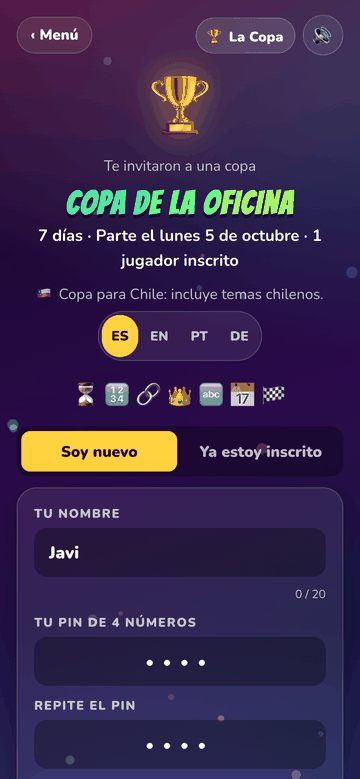<br><sub>The invite: your name and a 4-digit PIN</sub></td>
    <td align="center">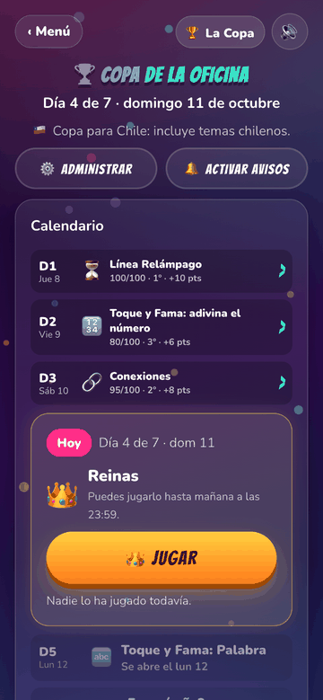<br><sub>Your days: past ones done, today open</sub></td>
    <td align="center">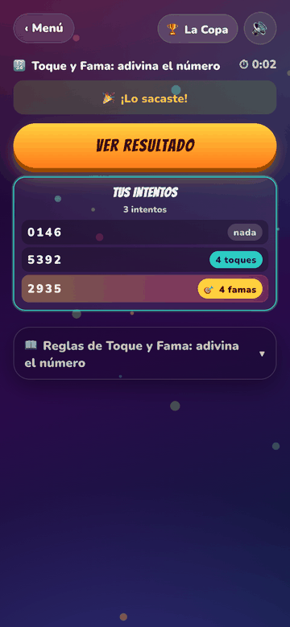<br><sub>Day 2: Bulls and Cows, guess the number</sub></td>
    <td align="center">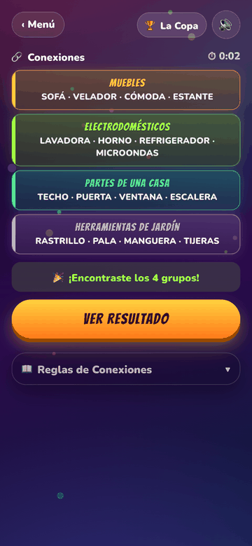<br><sub>Day 3: Connections, with red herrings</sub></td>
  </tr>
  <tr>
    <td align="center">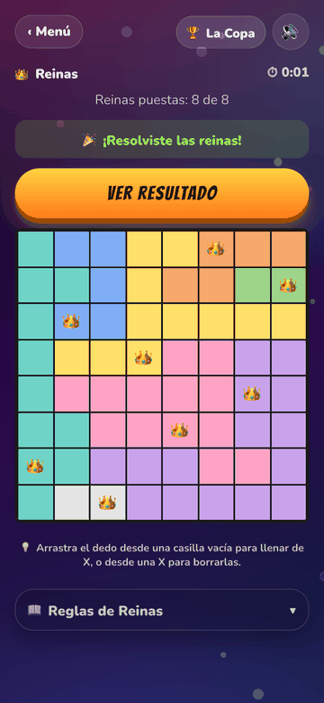<br><sub>Day 4: Queens</sub></td>
    <td align="center">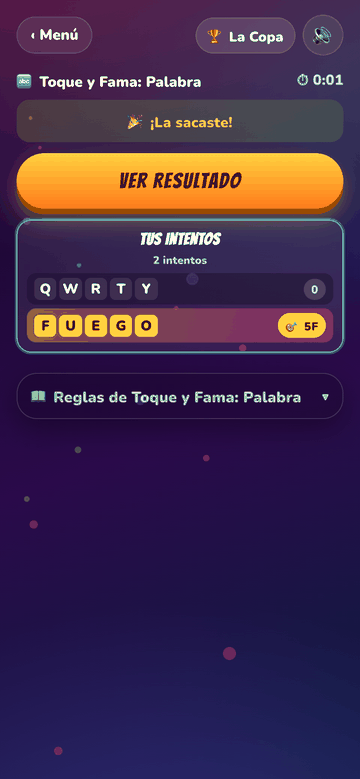<br><sub>Day 5: Bulls and Cows: Word</sub></td>
    <td align="center">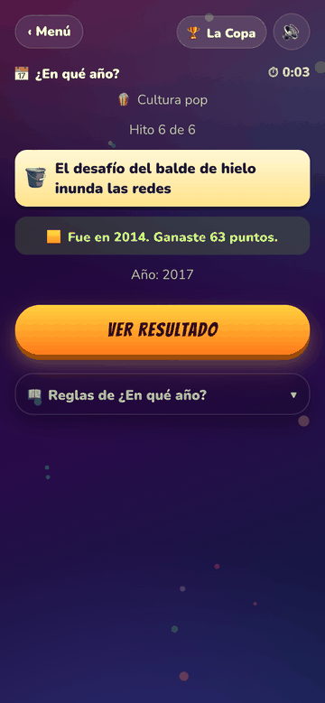<br><sub>Day 6: What year was it?</sub></td>
    <td align="center">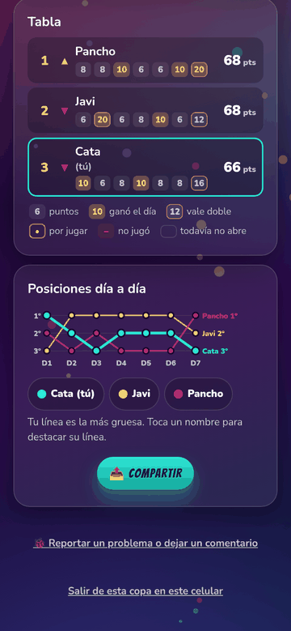<br><sub>Everyone's place, day by day</sub></td>
  </tr>
  <tr>
    <td align="center">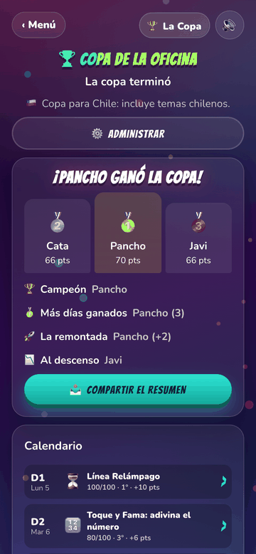<br><sub>Podium and medals</sub></td>
    <td align="center">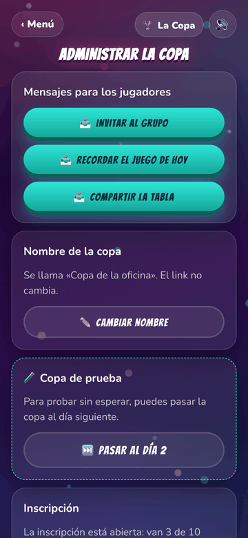<br><sub>The admin shares messages with the group</sub></td>
    <td align="center">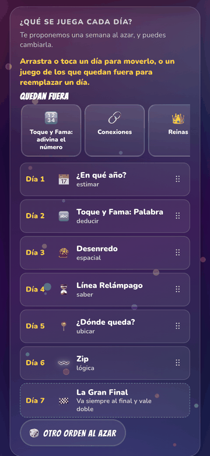<br><sub>Creating a cup: drag the games into the week</sub></td>
    <td></td>
  </tr>
</table>
<!-- /generado -->

**On the menu since D-175**, after a stint in the lab (D-101). The 3-day cup, for testing with close friends, is offered with `?tres` in the link. A 🐞 button sends bug reports and comments with their context, no login needed.

Not a game but a **tournament that lasts a week**. Someone creates a cup and shares the link with the group; everyone joins with their name and a 4-digit PIN, from any phone or computer. Every day a different game opens, **the same one for everybody**, and it can be played **once**. Your score only matters against the others: the day hands out points by position (10, 8, 6, 5, 4, 3, 2, 1), so every day weighs the same (and every game scores 0 to 100 anyway, D-113) and one crushing day does not decide the cup (D-94). The final day is worth double, everyone gets one ×2 wildcard, and whoever has the most points on day 7 lifts the cup.

It borrows what makes daily puzzles work (Wordle, Connections): same challenge for everyone, once a day, comparable scores, little luck, and a **share card** that shows how you did without giving the answer away. The games reuse the engines, decks and screens this app already had where it can.

**The admin picks the week** (D-163): when creating the cup, which games go in and in what order, starting from a random proposal (no two days of the same skill in a row) for anyone who would rather not think about it. It is Timeline's hand and line: drag a day to another spot in the week, or drag a game from the hand onto the day it replaces. There are ten to choose from: the six below plus Zip, Tango, Where is it? and Untangle. The Grand Final always closes the cup and does not change. Without a choice, this is the classic week:

| Day | Game | Skill |
|---|---|---|
| 1 | ⏳ Timeline Flash: 10 milestones, played from a hand with the Timeline drag and drop | knowledge |
| 2 | 🔢 Bulls and Cows: guess the number, with the Bulls and Cows keypad and notes | deduction |
| 3 | 🔗 Connections: 16 words, 4 groups, with red herrings | association |
| 4 | 👑 Queens: one per row, column and color region, never touching; a tap cycles queen → X → empty, dragging fills X (or erases them, starting on an X), and 🧹 Clear all starts over; scored by solve time, mistakes are free, and you can give up (D-166 to D-169) | logic |
| 5 | 🔤 Bulls and Cows: Word: a 5-letter word, each letter colored by its clue (green for a bull, yellow for a cow, like Wordle); every letter you pin down scores, so getting close counts | deduction |
| 6 | 📅 What year was it?: closer is better, older gets more slack | estimation |
| 7 | 🏁 The Grand Final: five short rounds, one of each, worth double | everything |

The other four are **〰️ Zip**, **☀️ Tango**, **📍 Where is it?** and **🧶 Untangle**. Untangle is Simon Tatham's puzzle, where you drag knots until no thread crosses another, in ten levels of 6 to 15 knots against a four-minute clock, like Zip. The tangle is built from an untangled drawing, so it always has a solution, and a thread running over a knot counts as a crossing, so piling the knots up doesn't help (D-179). 🔄 Restart level puts the knots back where the level began: like Clear all in Queens and Zip, the first tap arms it, the second does it, and the clock keeps running. Where is it? gives you five cities, each with its country, and you drop a pin on a satellite-image globe with no names on it (NASA's Blue Marble, so deserts, jungles and ice look like themselves), which spins endlessly as you drag it: every city is worth up to 100 points, minus 4 per 100 km off. The cities are the capitals of every UN country and its two observers, plus famous and second-tier ones (529 in all), and the borders used to check them come from Natural Earth via `tools/generators/mapa.mjs` (D-155, D-159). **The games also play on their own from the main menu** (D-142), one player and no cup: Timeline Flash and the number game are the *play alone* modes of Timeline and Bulls and Cows, in all three languages, and the other eight (all but the final) have their own card, Where is it? included since D-174 and Untangle since D-190, open at `/<slug>/` like any other game (`/queens/`, `/tango/`…; no "cup" in a link that has nothing to do with one, D-149, D-198) and play in the player's language. Each of those pages is generated by `tools/release/og.mjs` with its own social card, so a link pasted in WhatsApp shows the game, not the cup (D-162). **🔍 The Case** is ready as a cup game but still in the lab (D-257): a deduction mystery in the style of *Clues by Sam*, with 20 suspects and clues that always tell the truth, generated so you never have to guess; if you get stuck, 💡 Hint tells you whom to look at and which clues to put together, for 15 points (D-263). It plays at `/case/` in all four languages, with an animated cover of cards flipping under a magnifying glass, but a cup can't pick it until it leaves the lab. The cup does not invent its own UX (D-102): the timeline, the drag and drop and the keypad are the ones Timeline and Bulls and Cows already use, shared from `public/assets/`.

- **Everything comes from a seed** (`code:day`), so everyone plays exactly the same content with no server (D-97).
- **A day stays open until the next midnight** (a grace day), except the final. **Late sign-ups** are open until the final unless the admin closes them or the cup is full (ten players); a late player gets 0 for the days already closed, and the warning shows from day 3 on, because on day 2 day 1 is still in its grace day (D-177). Time only breaks ties, and it is *active* time: it pauses while the screen is hidden (D-95).
- **Results stay hidden until you play**: the table and the progress chart only add up the days you can already see, so they cannot spoil today.
- **Accounts are a name and a PIN inside one cup**, backed by Firebase anonymous auth. The PIN hash lives where nobody can read it, and the rules only let a device write for a player if it sends the same hash (D-96). With a leaderboard player signed in, **Your cups** on The Cup's front page follows you to any phone: a cup you play on another one shows up too, and opening it has your name already picked, so only that cup's PIN is missing (D-220). Finished cups are tagged **Finished** and stay out of the list until you switch on **Show finished cups**, which starts off every time (D-234).
- **The admin plays too**, and can rename, remove or re-PIN players and share ready-made messages with the group: the invite, **today's reminder** (with who is still missing), the partial table and the final summary (D-99). The invite stays in the admin screen for as long as someone new can still join (sign-ups open and fewer than ten players), and once the cup is under way it says which day it is on instead of when it starts (D-176). The table goes out the same from everywhere — the chart, the admin, the podium — as the image, with a short text that only adds what the image does not show (who is still missing, or the medals) (D-171); each day's result also goes out with its own image, headed with the cup and the day (D-165).
- **The admin can end the cup early** (D-161), say when last place is not going to play the final: nobody plays after that, the table as it stands becomes final and the podium shows up; days that had not opened yet are dropped. Once a cup is over, the admin can **export the final table**: the shareable image with everyone's place day by day, or a CSV spreadsheet (final table, place after each day and every day's detail) for Excel or Google Sheets.
- **Every day has a practice round first** (D-103): same mechanics, different content, shorter, and it does not count, which the screen says right under its button and again in its folded rules (D-177). Starting the real one shows a **3-to-1 countdown**: the board appears on "¡A jugar!" (D-105), and the clock starts only once that message is gone and the board is in plain view, so the countdown is never playing time (D-258). When you finish, the result **explains how the score was calculated**, line by line (D-106).
- **A new cup opens on the admin screen** with a short guide: share the invite, wait for people to join (they can before it starts), close sign-ups if you like, and move the start to today or tomorrow while nobody has played yet (D-110). The lab has **ten live demos** of the cup, as a player and as the admin.
- **A cup can have its own link** (D-121): `juegosdesalon.cl/cup/?pirata` instead of a 5-letter code. It is an alias, unique while the cup lasts and free again a week after it ends.
- **Bug reports need no account** (D-104): the 🐞 form posts straight to `feedback/` and remembers your name on that device; `node tools/firebase/reportes.mjs` reads them back.
- **Many languages, one rule** (D-170): what is personal follows your language, what belongs to the group follows the cup's. The screen (rules, board, scoring breakdown) follows each player's toggle; the cup's language, chosen when it is created, sets the words of Connections and Bulls and Cows: Word, so everyone plays the same ones, and every message shared with the group, with its link. Word content is written per language, not translated: Connections grids and secret words in English, Portuguese and German, plus country and city names for Where is it?.
- **Who it's for** (D-186, D-187): when creating a cup, the admin picks its audience: 🌎 Global, 🇨🇱 Chile or 🇧🇷 Brazil. Content that people only know in one of those countries is tagged with it: Timeline's Chile and Brazil themes and a few local cards, the Connections grids with Chilean or Brazilian words, a few Chilean secret words, and Chilean and Brazilian cities that aren't capitals (Rio and São Paulo count as global). A global cup leaves out both countries' topics; a Chilean or Brazilian cup adds its own and leaves out the other's. Cups created before keep their content.
- **Phone notifications** (D-223, D-224, open to everyone since D-228): a 🔔 bell in each cup turns them on. The offer shows up after you play a day, before the cup starts, or when you open the cup from the installed app; the system permission is only asked after a tap, and a confirmation notification arrives at once. On iPhone, the bell first walks you through adding the app to the home screen. A scheduled GitHub workflow checks every 15 minutes and tells you when a day opens, when your time to play it is running out, about The Grand Final and who won ([docs/PWA-NOTIFICACIONES.md](docs/PWA-NOTIFICACIONES.md)).
- A 3-day cup exists for testing with `?tres` (D-100), and `?prueba` plays a cup with no Firebase, which is what the demos (`?prueba&demo=<scene>`, no longer linked from the lab since D-262), the README screenshots and the end-to-end scripts use.

Spec and design: [docs/games/cup.md](docs/games/cup.md)

---

## What every game shares

- **Languages:** Spanish (default), English, Brazilian Portuguese and German. The menu toggle saves the choice on the device, and the browser language is never used to guess (D-47, D-48). See [Languages](#languages).
- **Sound:** effects synthesized with Web Audio, no audio files. A 🔊/🔇 button on every screen.
- **Sharing the app:** a share button at the top right of the menu, next to sound and 🏅 rankings
  (the language toggle sits on the left, in a block of its own), drawn with
  the system share icon (a box with an arrow pointing up, D-242) in the page's colors: a cyan
  box and a pink arrow, each with the drop shadow of the page's buttons (D-243). In Spanish, the
  language of the promo video, it opens a sheet with the video and two options (D-253); in English,
  Portuguese and German it shares the app's message straight away, as before, until there is a
  video in that language (D-254). The video shows as its thumbnail with "▶ Watch the
  video" and only loads from `youtube-nocookie.com` when tapped, so opening the sheet downloads
  nothing from YouTube. **Invite to play** is the app's own message: on a phone it opens the share
  sheet with the menu's social card **as an image** and a short text — a header with how many games
  there are, one line each for The Cup, playing in a group, playing alone and needing no account —
  ending with the link to the front door of the language you are reading in: `/`, `/en/`, `/pt/` or
  `/de/`, card included (D-74, D-226). **Share the video** sends a short text ending with the
  video's YouTube link, and the chat builds the preview from its thumbnail. On a computer either
  option just copies the text and the link; nothing is downloaded. Which video is shown, per
  language, is `TRAILERS` in `public/assets/js/compartir-portada.js`, changed whenever a new
  version goes up on YouTube; a video in another language is one more entry there.
- **One standard for everything that gets shared** (D-165), built for WhatsApp, in
  `public/assets/js/compartir.js`. Every message opens with a header — `{emoji} *{title}* · {context}`,
  like "🏆 *La Copa: Valdenenas* · Día 3 de 7" or "🃏 *Julepe* · Sala WFBN" —, says one thing
  per line, and ends with the link on its own line. A result or a table always goes out as an
  **image plus its text**, from whichever button: the image carries the same header on top and
  the same link at the bottom, so forwarded on its own it still says which cup, which day or
  which game it is. **The text never repeats the image** (D-171): it carries the header, only what the image cannot say (who is still missing, the medals, the dare) and the link. Invitations to a room or a cup go as text only: the link brings its own
  social card. Results of playing a game alone (on its own page, or in Bulls and Cows and
  Timeline) share the same result image, with a "can you beat me?" and the game's link. With no
  share sheet (a computer), the image is downloaded and the text copied.
- **Leaderboards** (D-212, open to everyone since D-217): signing in is optional and needs no account — a name and a 4-digit
  PIN, the same idea as The Cup, that works on any phone. Until you do, a card with a **Sign in** button sits right under each game's Start and Back to menu buttons, under your score when you finish and, in One a Day, above the result's buttons (D-249). Signed in, every game played alone on its
  own page keeps your best score and counts your games. Each game's page shows its leaderboard
  (this week, all time, friends and The Cup), with your neighbours when you are below the top ten.
  `/records/` (🏆 on the menu) adds the All-Rounder, the sum of your best score in every game, and
  The Cup's medal table; it opens with the overall ranking and the most games played, then a Games | Cups switch, and every name carries its country's flag (D-219). Group games keep a table of wins each (D-215) — in a room by your seat, against
  the phone as the human, on one phone if you play under your own name — and Bulls and Cows alone and
  Timeline Flash (one per theme) keep their 0–100 records. Two people may share a name; with
  different PINs they are different players. Tapping **Playing as** on any page that shows it opens **Change PIN**, with a line on what the PIN
  is for, and **Sign out**; `/records/` lists **Your games**, how many times you played each one (D-236).
- **One a Day** (D-230, open to everyone since v0.121.0; One a Day #1 was 6 October 2026): every day, at the player's own midnight, a new game and its content come out of the date, the same for everyone, and the Random game die rolls onto it. The deck holds every game that can be played alone — the seven solo games, Hangman with the phone's deck, and Battleship and Liar's Dice against the phone — and none repeats within a week; each scores 0–100. [`/today/`](https://juegosdesalon.cl/today/) keeps your streak (a 🧊 freeze for every 7 days in a row, up to 2), a calendar and how you do in each game. Signed in, you get the day's, the week's and the streaks leaderboards, and you can invite a friend to the same challenge: when they finish their first day, you earn a freeze. The shared result never names the game, so it does not spoil it. If you ask for them, notifications remind you every day at the hour you pick, warn you when your streak is about to break and sum up your week ([docs/UNO-AL-DIA.md](docs/UNO-AL-DIA.md)).
- **Saved games:** every game stores its state on the device and offers to continue.
- **Installable:** a PWA manifest, PNG icons for Android and iPhone and a service worker, so the browser offers to install it on the home screen from any game (D-221). On a phone, a bubble on the menu invites you to add it to the home screen and shows the steps for that phone's browser (Safari or Chrome on iPhone, Chrome or Samsung Internet on Android); its ✕ hides it for good (D-232). The service worker caches nothing yet: there is no offline mode. The screen stays awake while playing.

### Languages

The whole experience is translated: the menu and its footer lines, every game with all its modes, the rooms, the chat, the transport errors, the "pass the phone" screens and the cards of every Timeline theme. Portuguese is the Brazilian one, informal; German is standard German for Germany, Austria and Switzerland (D-194). The names are translated the same way in every language:

<!-- generado: idiomas · written by python3 tools/release/readme.py actualizar -->
| Español | English | Português | Deutsch |
|---|---|---|---|
| Juegos de Salón | Party Games | Jogos de Salão | Salonspiele |
| La Copa | The Cup | A Copa | Der Pokal |
| Línea de Tiempo | Timeline | Linha do Tempo | Zeitstrahl |
| Toque y Fama | Bulls and Cows | Toque e Fama | Bullen und Kühe |
| El Ahorcado | Hangman | Forca | Galgenmännchen |
| Dudo | Liar's Dice | Dado Mentiroso | Lügenwürfel |
| Generala | Generala | General | Generala |
| Batalla Naval | Battleship | Batalha Naval | Schiffe versenken |
| Julepe | Julep | Paga o Bolo | Julepe |
| Cuarto Rey | Fourth King | Quarto Rei | Der vierte König |
| Conexiones | Connections | Conexões | Verbindungen |
| Toque y Fama: Palabra | Bulls and Cows: Word | Toque e Fama: Palavra | Bullen und Kühe: Wort |
| ¿En qué año? | What Year? | Em que ano? | Welches Jahr? |
| Reinas | Queens | Rainhas | Damen |
| Tango | Tango | Tango | Tango |
| Zip | Zip | Zip | Zip |
| Desenredo | Untangle | Desenrola | Entwirren |
| ¿Dónde queda? | Where Is It? | Onde fica? | Wo liegt das? |
| El caso | The Case | O Caso | Der Fall |
<!-- /generado -->

How it is put together (canon C-3):

- `public/assets/js/i18n.js` keeps the language in `localStorage` (`juegos-de-salon:lang`), draws the
  🇪🇸 ES · 🇬🇧 EN · 🇧🇷 PT · 🇩🇪 DE toggle and holds the shared text (`COMMON`): the menu and what goes out
  when somebody shares the app, plus the strings every game repeats word for word — the room
  invitation (D-173, D-165), the "or" between creating a room and joining one, and the shared
  result of playing a game alone.
- Each game keeps its text in `LOCALES = { es, en, pt, de }` inside its `rules.js`. There is not a
  single literal string in `game.js`. Fixed HTML text is marked with `data-i18n`.
- The menu registry (`games.js`), the 100 footer lines (`frases.js`) and every Timeline card
  (`decks/*.js`) carry all four languages.
- **The four dictionaries have exactly the same keys.** `node public/assets/js/i18n.test.mjs` checks
  keys, list lengths, the `{braces}` in templates and that no text is empty. A missing string
  would show up as `undefined` on screen.
- **Every screen is tested in every language** (D-199). Each game has a
  `tools/e2e/<folder>/idiomas.mjs` that walks its screens in each language of `LANGS` and compares
  them with the Spanish ones: nothing left in Spanish, nothing half-built (`undefined`, a
  `{placeholder}`) and no button that the longer German text pushes off the screen. A new
  language is tested the day it arrives.
- Translations are adapted, not copied: in Portuguese the Santiago districts become bairros, the
  dare becomes a prenda and "fondo" becomes "vira, vira, vira".
- **The language can travel in the link** (D-74): `juegosdesalon.cl/?lang=pt` on any page, or the
  `juegosdesalon.cl/pt/`, `/en/` and `/de/` doors, which set the language and send you to the menu. It is
  applied, it is saved, and the parameter is removed from the address bar. **A room invitation
  carries it**, so whoever gets the link opens the app in the language it was sent in. This is not
  detection: somebody chose, for themselves or for the person getting the link.
- To add a language: add it to `IDIOMAS` and to the toggle in `i18n.js`, then add the dictionary in
  `COMMON`, `games.js`, `frases.js`, the eight `rules.js`, `decks/index.js` and every card. The
  parity test says what is missing.
- **A new language starts in the lab** (D-191): listed in `EN_LABS`, it is only offered on a device
  that came in through `/labs/<lang>/`, where every "‹ Menu" leads back to the lab and a 🐞 button
  sends comments, so native speakers can review the draft before everyone sees it. **German** went
  through it and is now offered to everyone (D-197).
  Its glossary is in [docs/ALEMAN.md](docs/ALEMAN.md).
- In The Cup, the screen follows each player's language, but the words of Connections and Word, the
  messages shared with the group and their link follow the language picked when the cup is created
  (D-170).
- The owner dashboard is Spanish only (an exception recorded in `docs/PANEL.md`). The installed
  app, instead, is named in the player's language: there is one manifest per language, and
  `instalable.js` picks it, along with the iPhone's `apple-mobile-web-app-title` (D-222).

<!-- generado: capturas:idiomas · written by python3 tools/release/readme.py actualizar -->
<table>
  <tr>
    <td align="center">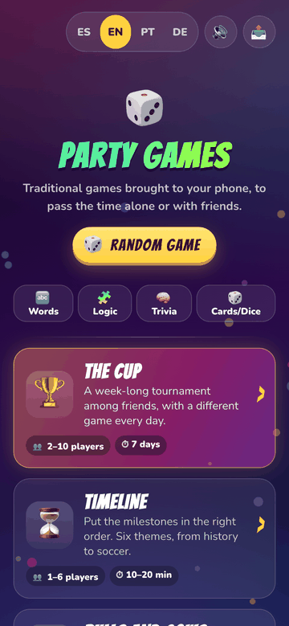<br><sub>Menu in English</sub></td>
    <td align="center">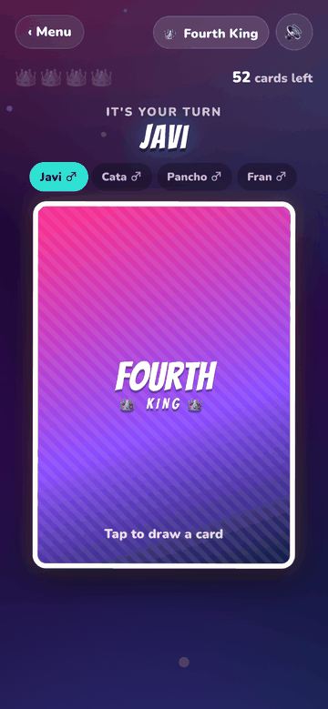<br><sub>Table in English</sub></td>
    <td></td>
    <td></td>
  </tr>
</table>
<!-- /generado -->

## Owner dashboard

`/panel/` is a private page that shows how much the app is played and from where: live rooms and
connected phones, games by title and mode, players per game, time zone, language and time of day.
You sign in with Google, and only the owner of the Firebase project can read it. These are
usage signals, not tracking: an IP or a secret never leave the phone. Offline games send the
game, mode and country, plus the name the player already typed somewhere in the app (if any) and how
the game ended (D-210). A room also records the country of each phone and who won, which is what the room
log at the bottom of the dashboard shows. Live rooms show **plays and chat messages separately**:
only what a person did counts as a play (a shot, a guess, a bid), never the automatic answers, and
of the chat only the number of messages is shown, never what they say (D-138).

It is navigated like a small site (D-207): six sections, **Now**, **La Copa**, **Games**,
**Traffic**, **Audience** and **Health**, and a page for each thing that exists. Traffic counts visits even when
nobody plays: pages viewed, where visitors come from (the domain only), which shared link brought
them, first-time or returning, device, country, and how many visits end up playing (D-208). A cup's page has its full standings, a grid of
every player and day (score, time, points, left unfinished, wildcard) and its history, event by
event. A game's page has its modes, how long its rooms last, its rooms and its offline games; a
room's page has its players, winner and duration. Every number opens the list that adds up to it,
every player's name carries the flag of their country, and each view lives in the URL, so Back and
a saved link return to it. Times are Pacific time, the same clock La Copa uses for its days.
La Copa's section also measures the phone notifications (D-233): phones subscribed, notifications
sent and tapped by type, opens from the installed app, and when the scheduled workflow last ran,
in red if it stopped.
Health (D-251) shows what goes wrong for players: page loads that never started, uncaught errors
grouped by what they are (page, browser family, version, days seen), and how long each page takes
until it can be played. A tiny classic script, `public/assets/js/vigia.js`, loads before everything
else on every page, so it still reports when the app's own modules fail to load.

One range selector drives the whole page: 7, 30, 60 or 90 days, one year, or the year so far. Test
rooms run in the development environment, so they are out by default; test cups show up with the
rest, since they are not split by environment.

It keeps no lists of its own. Games and modes are read from the registry in `public/assets/js/games.js`,
so a new game shows up there by itself, and anything it does not recognize yet is drawn anyway,
keyed by name instead of thrown away. See [docs/PANEL.md](docs/PANEL.md).

## Stack

Plain HTML, CSS and JavaScript (ES modules). No build step, no npm dependencies. The site is the `public/` folder, published as a static site on GitHub Pages by a workflow on every merge to `main`, once the tests pass (D-192). Everything else in the repo (docs, tools, marketing) is the workshop, and is not published. The two-phone mode uses **Firebase Realtime Database** (free plan) as a live room. See [firebase/README.md](firebase/README.md).

## Running it locally

```bash
python3 -m http.server 8765 -d public
```

Then open http://localhost:8765 (ES modules have to be served over HTTP). Tests for the engines, the languages and the shared modules:

<!-- generado: pruebas · written by python3 tools/release/readme.py actualizar -->
```bash
node public/battleship/engine.test.mjs
node public/bulls-and-cows/engine.test.mjs
node public/cup/engine.test.mjs
node public/fourth-king/engine.test.mjs
node public/generala/engine.test.mjs
node public/hangman/engine.test.mjs
node public/julep/engine.test.mjs
node public/labs/case/engine.test.mjs
node public/liars-dice/engine.test.mjs
node public/timeline/engine.test.mjs
node public/assets/js/arrastre.test.mjs
node public/assets/js/compartir.test.mjs
node public/assets/js/favoritos.test.mjs
node public/assets/js/games.test.mjs
node public/assets/js/i18n.test.mjs
node public/assets/js/instalable.test.mjs
node public/assets/js/instalar.test.mjs
node public/assets/js/push.test.mjs
node public/assets/js/records.test.mjs
node public/assets/js/transport/cleanup.test.mjs
node public/assets/js/transport/dispose.test.mjs
node public/assets/js/transport/errors.test.mjs
node public/assets/js/transport/ratelimit.test.mjs
node public/assets/js/transport/stats.test.mjs
node public/assets/js/uno-al-dia-avisos.test.mjs
node public/assets/js/uno-al-dia-jugador.test.mjs
node public/assets/js/uno-al-dia.test.mjs
node public/assets/js/vigia.test.mjs
node public/cup/games/juegos.test.mjs
node public/cup/planilla.test.mjs
node public/cup/reportes.test.mjs
node public/cup/store.test.mjs
node public/panel/adapta.test.mjs
node public/panel/aggregate.test.mjs
node public/panel/copas.test.mjs
node public/panel/rutas.test.mjs
node tools/agents/documentar.test.mjs
node tools/agents/limpiar-copias.test.mjs
node tools/agents/marketing.test.mjs
node tools/e2e/cambios.test.mjs
node tools/firebase/rankings-historia.test.mjs
node tools/push/avisar.test.mjs
node tools/push/calendario.test.mjs
node tools/push/uno-al-dia.test.mjs
node tools/push/webpush.test.mjs
node tools/release/version.test.mjs
```
<!-- /generado -->

## Looking at one screen

To check how a single screen turned out, without playing a whole game:

```bash
node tools/e2e/mirar.mjs ahorcado juego --ancho 320
node tools/e2e/mirar.mjs ahorcado resultado --idioma pt
node tools/e2e/mirar.mjs panel datos --ancho 900
```

It takes the screenshot and reports horizontal scroll, buttons under 44 px and anything that falls below the bottom edge, which is what the canon asks you to look at on every screen. The path to each screen lives in `tools/e2e/caminos.mjs`: adding one is adding an entry, not writing a new script, and the screen is then tested in every language too.

To look at **all** the screenshots in this README at once, before publishing them, the contact sheet puts them side by side at the size they will be seen:

```bash
node tools/e2e/contacto.mjs cuarto-rey --salida /tmp/contacto
```

Retaking them is not reviewing them. Together they show what a single image hides. That is how we found the Cuarto Rey player list photographed halfway through its entrance animation, with rows at different widths, as if the grid were broken (D-76).

To try it on a real phone, and to hand the link to someone else, serve the working tree over Tailscale without publishing anything (D-67):

```bash
tailscale serve --bg 8765          # with the server above running; served at https://<machine>.<tailnet>.ts.net/
tailscale serve --https=443 off    # and this takes it down
```

It is the whole app over HTTPS, so the modes that need a secure context work too. This used to be a `lab/` folder with a mirror of each game. The mirrors went stale, and this covers the same ground better.

## Publishing a version

The version is the top entry of `CHANGELOG.md`, written when a pull request is merged. Pages in git carry no version: the publish workflow stamps it into the copy it uploads (import maps, stylesheets and social card images get `?v=<version>-<commit>`), so the browser never mixes old and new files and two open pull requests never clash over it. To try the stamp locally, on a copy:

```bash
python3 tools/release/set-version.py --sitio /tmp/site
```

## Keeping this README current

This file states things the code already knows (how many games there are, what modes each one has, how many cards each theme carries, which tests run) and shows screenshots of screens that change. None of that announces when it goes stale, so there is a tool:

```bash
python3 tools/release/readme.py revisar          # did anything fall behind the code?
python3 tools/release/readme.py actualizar       # rewrites the generated blocks
python3 tools/release/readme.py capturas <section> [--sin-red]   # retakes the screenshots
python3 tools/release/readme.py sellar           # "I have read it again against these facts"
```

- **Anything derivable is generated.** Everything between `<!-- generado: ... -->` and
  `<!-- /generado -->` is written by `actualizar` from [`tools/release/hechos.mjs`](tools/release/hechos.mjs),
  which imports the real modules (`games.js`, the `rules.js` files, `decks/index.js`). Nothing in
  there is edited by hand: the games table, the themes, the names per language, the tests, the
  document index and the screenshot galleries.
- **Prose is written by a person**, and the tool does not touch it. It reports on it instead.
  `revisar` compares today's facts against the last seal (`docs/hechos.json`) and names what
  changed and which section to read again. Once it has been read, `sellar` records that.
- **Screenshots are retaken automatically.** [`docs/capturas.json`](docs/capturas.json) says which
  script in [`tools/e2e/`](tools/e2e/README.md) each image comes from and which shot it is.
  `capturas` runs the scripts in headless Chrome, copies the PNGs and saves them at twice the width
  they are shown at. The ones that need a Firebase room are marked and skipped with `--sin-red`.
  Look at them before publishing: design problems are seen, not asserted (C-12).
- **The hook that makes it happen** is the `pruebas` check on every pull request and before every
  publish (C-11): it runs `revisar` and stays red if the README fell behind.

To add a screen to this README: take the shot in the e2e script, add the entry to
`docs/capturas.json`, then run `capturas` and `actualizar`.

## Layout

The repo root is not the web root (D-192). `public/` is the site, exactly as it is served: folder =
URL, in English. Everything next to it is the workshop.

```
public/                     The site (juegosdesalon.cl/): the only folder that gets published
  index.html                  Main menu (generated from assets/js/games.js)
  en/ · pt/ · de/             Language doors: they set the language and send you to the menu
  cup/                        The Cup: tournament engine, avisos.js (the notifications bell and sheets, D-223), stores (Firebase and local test), desglose.js (score breakdown), planilla.js (final table as CSV), reportes.js (auth-free bug reports), demo.js (lab demos)
    games/                    The games: one folder each (engine.js + ui.js + its own word content in each language); solo.js mounts one as the play-alone mode of another game
  timeline/                   Timeline (engine.js + tests, game.js, rules.js, decks/)
  bulls-and-cows/             Bulls and Cows (engine.js + tests, game.js, rules.js)
  hangman/                    Hangman (engine.js + tests, game.js, rules.js, decks/)
  liars-dice/                 Liar's Dice (engine.js + tests, game.js, rules.js)
  generala/                   Generala (engine.js + tests, game.js, rules.js)
  battleship/                 Battleship (engine.js + tests, game.js, rules.js, flota.js: the pixel art)
  julep/                      Julep (engine.js + tests, game.js, rules.js)
  fourth-king/                Fourth King (engine.js + tests, game.js, rules.js)
  connections/ · queens/ …    The Cup's games played on their own, one page each (generated from cup/suelto/)
  labs/                       The lab: games being tested before they reach the menu (not linked, not indexed); today only El caso (D-262), which ends with a "What did you think?" form for the friends testing it (D-265)
    case/                     The Case: a mystery prototype in the style of Clues by Sam, Spanish only, for friends to try (D-256)
  records/                    Leaderboards: the All-Rounder, every game's table and The Cup's medal table (D-212)
  today/                      One a Day: today's game, your streak, a calendar and how you do in each game (D-230)
  panel/                      Private owner dashboard: now, The Cup, games, traffic, audience and health, with a page per cup, game and room (Google sign-in; see docs/PANEL.md)
  assets/css/                 Shared styles: base.css (party theme), linea.css (timeline), teclado.css (keypad), ranking.css (leaderboards)
  assets/js/                  Shared modules: games.js (game registry), i18n.js (ES/EN/PT/DE), labs-idioma.js (a new language in the lab, D-191), ui.js, sound.js, compartir.js (everything shared, D-165), compartir-portada.js (the home-page share sheet, with the promo video, in the languages that have one, D-253, D-254), handoff.js, chat.js, session.js, arrastre.js (drag and drop), teclado.js, azar.js, dado3d.js and llegada.js (Random game: the die, which stays on screen until the game is drawn, D-237), frases.js, records.js + jugador.js + ranking.js (players and leaderboards, D-212; jugador-firebase.js and jugador-local.js are their stores), instalable.js (registers the service worker, D-221), instalar.js (the home-page bubble that invites to add the app to the home screen, D-232), favoritos.js (the home-page favorites, kept in the browser, D-238), push.js + vapid.js (phone notifications: subscribing, D-223), uno-al-dia.js + uno-al-dia-ui.js + uno-al-dia-red.js + uno-al-dia-avisos.js (One a Day: a daily game, the same for everyone, with a streak, freezes, leaderboards, invitations and reminders; D-230), and vigia.js, a classic script (not a module) that every page loads first to report load failures, errors and start-up time to the dashboard (D-251)
  assets/js/transport/        Transports: local (same phone), firebase (room) and stats (usage signals)
  assets/og/                  The 1200×630 images shown when a link is shared
  manifest.webmanifest        PWA manifest (installable on the home screen), one per language (manifest.en.webmanifest …) so the app is named in the player's language (D-222); its PNG icons are in assets/icons/
  sw.js                       Service worker (D-221): it makes the app installable, caches nothing, and shows The Cup's and One a Day's notifications (D-223, D-230), with Play and Mute buttons on Android (D-229)
  ahorcado/ copa/ …           Bridge pages: the old Spanish URLs, forwarding to the new ones (generated, D-192)
docs/                       Requirements, decisions, canons, one spec per game (docs/games/) and the README screenshots
firebase/                   Realtime Database security rules and notes
tools/
  push/                       vapid.mjs (the notifications key pair, already run once: the public key is in assets/js/vapid.js, the private one a GitHub secret; D-223, D-225); avisar.mjs sends the La Copa notifications every 15 minutes from avisos.yml and leaves what it sent for the dashboard (D-233), with calendario.mjs (what is due: at most 2 a day per cup, overlapping deadlines in one, the new days of several cups together; D-229) and webpush.mjs (encryption and VAPID, no dependencies; D-224); uno-al-dia.mjs decides One a Day's, in the same run (D-230)
  release/                    Publishing: set-version.py (version stamp, at publish time), readme.py + hechos.mjs (this README), og.mjs (social cards and bridge pages), iconos.mjs (the app icons, from assets/icon.svg)
  firebase/                   reglas.mjs (publish the rules), reportes.mjs (The Cup bug reports), en-curso.mjs (anyone playing?), rankings-historia.mjs (The Cup's history into the leaderboards, and each player's cups)
  generators/                 mapa.mjs (the world of Where is it?), flota.py (the Battleship fleet)
  agents/                     dilemas.mjs (usability dilemmas as issues, D-132), documentar.mjs (the documentation agent, D-172), limpiar-copias.mjs (removes merged, empty and abandoned worktrees at session start, D-218, D-252)
  e2e/                        Full games in headless Chrome, one folder per game; the screenshots come from here
marketing/                  The promo video and its memory
.claude/                    The project's agents (usabilidad, documentacion) and skills
```

## Contributing

Fork the repo, work on a topic branch and open a pull request to `main`; the tests run on every
PR. `main` is protected and whatever lands there goes live at once, so nothing gets in without a
PR. Version numbers, the changelog and Firebase rules are handled by the owner when merging. The
guide, in Spanish like the rest of the docs, is [CONTRIBUTING.md](CONTRIBUTING.md) (D-189).

## License

[MIT](LICENSE).

## Documentation

These documents are in Spanish, like the rest of the project.

<!-- generado: documentacion · written by python3 tools/release/readme.py actualizar -->
- [Cánones y estándares de Juegos de Salón](docs/CANONES.md)
- [Requerimientos](docs/REQUERIMIENTOS.md)
- [Decisiones de diseño y arquitectura](docs/DECISIONES.md)
- [Cómo agregar un juego nuevo](docs/AGREGAR-JUEGO.md)
- [Panel del dueño](docs/PANEL.md)
- [Pruebas de punta a punta (Chrome headless por CDP)](tools/e2e/README.md)
- [Firebase](firebase/README.md)
- [Diseño: Batalla Naval](docs/games/battleship.md)
- [Toque y Fama: estudio de factibilidad y propuesta de mecánica](docs/games/bulls-and-cows-factibilidad.md)
- [Especificación: Toque y Fama](docs/games/bulls-and-cows.md)
- [Prototipo: El caso](docs/games/case.md)
- [La Copa](docs/games/cup.md)
- [Especificación: Cuarto Rey](docs/games/fourth-king.md)
- [Diseño: Generala](docs/games/generala.md)
- [Diseño: El Ahorcado](docs/games/hangman.md)
- [Diseño: Julepe](docs/games/julep.md)
- [Diseño: Dudo](docs/games/liars-dice.md)
- [Diseño: Línea de Tiempo](docs/games/timeline.md)
- [Changelog](CHANGELOG.md)
- [El alemán](docs/ALEMAN.md)
- [App instalable y avisos al celular (PWA + Web Push)](docs/PWA-NOTIFICACIONES.md)
- [Uno al día](docs/UNO-AL-DIA.md)
- [Guía de usabilidad](docs/USABILIDAD.md)
<!-- /generado -->
